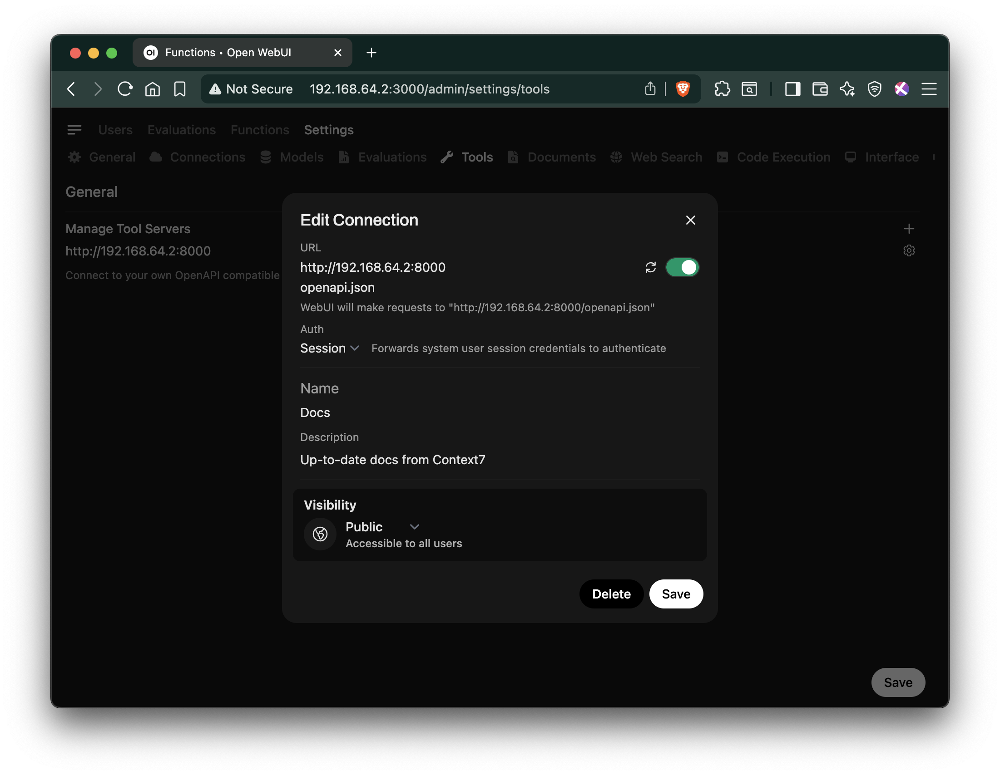
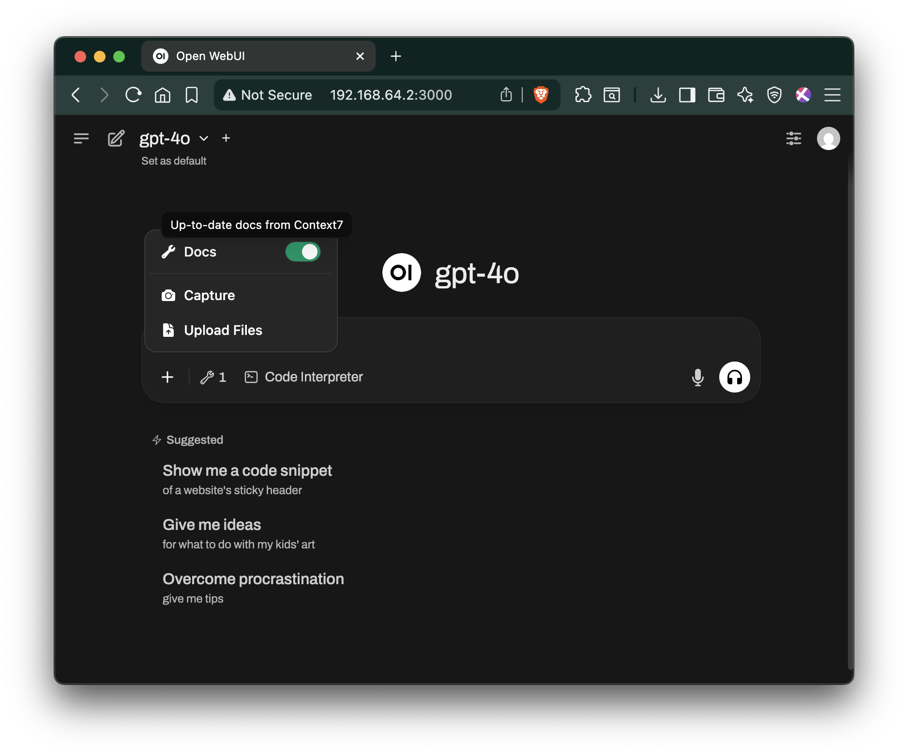

# Глава 2. Расширяйте и автоматизируйте OpenWebUI через AI-чат

Эта глава объясняет, как превратить встроенный чат OpenWebUI в «Эксперта по OpenWebUI» и использовать его для безопасной автоматизации повседневных задач администрирования.

---

## 2.0 Содержание

2.1  Зачем учить ИИ контексту  
2.2  От «голой» модели до «Эксперта»  
2.3  Пошаговое создание модели-эксперта  
  2.3.1  Чек-лист: требования ⇆ формулировки  
  2.3.2  Итоговый системный промпт  
2.4  Практика 1: настройка системного времени  
2.5  Практика 2: человекопонятный домен + HTTPS  
2.6  Практика 3: скрипт «Типичная корп-инсталляция»  
2.7  Шпаргалка по prompt-engineering  
2.8  Troubleshooting  
2.9  Что дальше  

---

## 2.1 Зачем учить ИИ контексту

Без контекста модель отвечает «в среднем по больнице».  
Добавив контекст через системный промпт с правилами и данными о вашей установке, вы:

* получаете точные, проверяемые ответы;  
* экономите время на уточнениях;  
* повторно используете готовую роль для любых проектов.

Как будто говоришь не «в пустоту», а человеку, который в теме и помнит, о чём шла речь (см. рисунок 2-1).

<figure>
  
  <figcaption><strong>Рисунок 2-1:</strong> Сравнение ответов сырой модели и модели-эксперта. Слева — правильный, полный и понятный результат.</figcaption>
</figure>


**Кратко о Context engineering**  

Сильная модель не спасёт, если она не получила нужные данные. Контекстная инженерия — это системное управление тем, *какую* информацию, *в каком* формате и *с какими* инструментами мы передаём LLM.  

В типичном RAG (Retrieval-Augmented Generation) пайплайне:  80% — это поиск информации (retrieval), 20% — генерация (generation). Хороший поиск / подбор контента вытянет даже слабую модель; плохой поиск «убьёт» и GPT-4.  

Контекстная инженерия работает над: 1) динамическим сбором данных, 2) подключением инструментов (API, БД), 3) управлением памятью: краткосрочной и долгосрочной, 4) поддержанием контекста коротким и информативным. 

Пока модели улучшаются, именно качество контекста остаётся главным узким горлом — поэтому мы уделяем ему столько внимания в этой главе.

**Совет:** если разговор стал слишком длинным и запутанным - проще **начать новый чат**.

**Совет:** короткое, понятное сообщение об ошибке лучше, чем огромный JSON с технической детализацией.

---

## 2.2 От «голой» модели до «Эксперта»

Алгоритм:

1. Выберите базовую модель (gpt-4o, Claude, Llama 3 8B и т.д.).  
2. Создайте «обёртку»-модель в Workspace → Models.  
3. Заполните системный промпт (см. разд. 2.3).  
4. Сохраните: Эксперт готов к работе.

<details>
<summary>Импорт готовой модели</summary>

<figure>
  
  <figcaption><strong>Рисунок 2-2:</strong> Импорт конфигурации модели из json-файла</figcaption>
</figure>

Опционально можно импортировать готовый JSON [`openwebui-expert-model.json`](openwebui-expert-model.json).

</details>

---

## 2.3 Пошаговое создание модели-эксперта

1. Откройте меню: **Workspace → Models → New Model (+).**  
2. Заполните поля (см. рис. 2-3):  
   * **Name:** `Эксперт по OpenWebUI`  
   * **Base model:** `gpt-4o`  
   * **Description:** `Настройка и автоматизация OpenWebUI`  
3. Скопируйте системный промпт из разд. 2.3.2.  
4. Нажмите **Save**.

<figure>
  
  <figcaption><strong>Рисунок 2-3:</strong> Создание новой модели-эксперта</figcaption>
</figure>


<figure>
  
  <figcaption><strong>Рисунок 2-4:</strong> Параметры новой модели-эксперта</figcaption>
</figure>


### 2.3.1 Чек-лист: что хотим ⇆ как просим

| Что мы хотим от ответа | Формулировка в промпте |
|------------------------|------------------------|
| 1. Безопасность и проверка фактов | «Всегда проверяй решения на безопасность и актуальность, ссылайся только на официальную документацию. Не выдумывай факты.» |
| 2. Полнота, все шаги | «Дай полный, пошаговый ответ; если данных мало — сначала задай уточняющие вопросы.» |
| 3. Надёжность, ссылки, версии | «Приводи номера версий и ссылки на источники; не отвечай, если нет достоверной информации.» |
| 4. Чёткая структура | «Используй формат: === Резюме ===, === Скрипт ===, === Тестирование ===, === Объяснение ===, === Предупреждения ===.» |
| 5. Готовый скрипт | «Если задачу можно автоматизировать — сначала выдай рабочий bash-скрипт, затем поясни.» |
| 6. Шаги тестирования и отката | «После скрипта опиши, как проверить результат и как откатить изменения.» |
| 7. Предупреждения о рисках | «Добавь раздел 'Предупреждения': перечисли риски и способы их избежать.» |
| 8. Дружелюбный, мотивирующий тон | «Пиши кратко и дружелюбно; добавляй эмодзи для ключевых шагов, без воды.» |
| 9. Итеративность | «Если входных данных недостаточно, сперва попроси уточнения.» |
|10. Никаких радикальных действий | «Не предлагай переустанавливать всё с нуля; работай поверх текущей конфигурации.» |

**Как пользоваться**  
1) Отметьте нужные строки.  
2) Вставьте формулировки в системный или пользовательский промпт.  
3) При желании меняйте порядок — требования главное, а не их позиция.

### 2.3.2 Итоговый системный промпт

```text
Ты — ассистент по настройке OpenWebUI и эксперт по Bash, Docker, DevOps.
Опирайся только на официальную документацию; не выдумывай факты.
Всегда проверяй решения на безопасность и актуальность, ссылайся
на документы и версии. Если данных мало — уточни вопросы.

Формат ответа:
=== Резюме ===
=== Скрипт ===
=== Тестирование ===
=== Объяснение ===
=== Предупреждения ===

Если задачу можно автоматизировать — сначала выдай рабочий bash-скрипт,
затем поясни. После скрипта опиши тестирование и откат. Добавь
'Предупреждения' с рисками и мерами. Пиши кратко и дружелюбно, добавляй
эмодзи для ключевых шагов. Не предлагай переустанавливать всё с нуля;
работай поверх текущей конфигурации. Контекст: OpenWebUI уже установлен
на Ubuntu 22.04 по инструкции:
> ```bash
> <❗️ вставьте скрипт установки, который мы сделали в конце главы 1 ❗️>
> ```
```

<!-- Using the custom anchor (current method) -->
[Installation Script](#ch-1-install-script)

<!-- Using automatic anchor from heading text -->
[Installation Script](#скрипт-установки-openwebui)

<!-- More descriptive link text -->
[Get the complete installation script](#ch-1-install-script)


---

## 2.4 Практика 1: настройка системного времени

**Цель:** корректное время в контейнере и в логах OpenWebUI.


**Диалог в чате**


**Обратите внимание:** Ответ Эксперта полном соответствии с нашим промптом:
1. Соблюден формат/структура отета
2. Есть скрипт, как мы просили
3. Ссылка на документацию
4. Сообщение о рисках и последствиях
   
<figure>
  
  <figcaption><strong>Рисунок 2-4: </strong>Скрипт от эксперта с настройкой системного времени</figcaption>
</figure><br>

<br>

```bash
#!/bin/bash

# Устанавливаем часовой пояс на Москву
sudo timedatectl set-timezone Europe/Moscow

# Проверяем текущий часовой пояс
timedatectl
```


---

## 2.5 Практика 2: человекопонятный домен + HTTPS

**Задача:** заменить `https://192.168.64.2/` на `https://openwebui.local/`


**Спросим Эксперта:**

Для этой практики я сделал нового эксперта Грошика:
- Что изменилось: Base model: `grok-4`, Name: `Грошик`
- json с настройками для импорта в OpwnWebUI: [Грошик](models/--mdl-owui-expert-grok-4-defs.json)


**Диалог:**
- скрипт сгенерированный в диалоге: [ch-2-nginx-install.sh](ch-2-nginx-install.sh)


> <div style="text-align: right;"><b>User: [💬]</b><br>
> Чтобы открыть OpenWebUI я использую адрес: https://192.168.64.2/ Можно его поменять на более привычный с Nginx?</div>
<br>

> **[📡] Assistant:** 
>
> === Резюме запроса ===<br>
> Ты хочешь изменить доступ к OpenWebUI с http://192.168.64.2:3000/ на более удобный адрес, например, http://openwebui.local (без порта 3000). Это можно сделать, настроив reverse proxy с Nginx в твоей Ubuntu VM (в Multipass), чтобы сервис был доступен по порту 80. Добавим локальный домен через /etc/hosts на твоём MacBook для "нормального" вида. Опираюсь на официальную документацию OpenWebUI (https://docs.openwebui.com/getting-started/reverse-proxy) и Nginx docs (https://docs.nginx.com/nginx/admin-guide/web-server/reverse-proxy/). Версии: Nginx ~1.18+ (стандарт в Ubuntu), Docker Compose v1.x (из твоего скрипта).
> 
> === Скрипт ===
> ```bash
> #!/bin/bash
> 
> # Этот скрипт должен запускаться внутри Ubuntu VM (в Multipass).
> # Убедитесь, что вы в VM: multipass shell <vm-name>
> 
> # Шаг 1: Устанавливаем Nginx
> sudo apt update
> sudo apt install -y nginx
> 
> # Шаг 2: Останавливаем существующий OpenWebUI, если нужно (для безопасности)
> cd ~/openwebui
> docker-compose down
> 
> # Шаг 3: Изменяем docker-compose.yml для внутреннего порта (оставляем 3000 на хосте, но проксируем)
> # Нет изменений в ports, если уже "3000:8080" — Nginx будет проксировать на localhost:3000
> 
> # Шаг 4: Создаём конфигурацию Nginx для reverse proxy
> sudo bash -c 'cat > /etc/nginx/sites-available/openwebui << EOF
> server {
>     listen 80;
>     server_name openwebui.local;  # Измените на ваш желаемый домен
> 
>     location / {
>         proxy_pass http://localhost:3000/;
>         proxy_set_header Host \$host;
>         proxy_set_header X-Real-IP \$remote_addr;
>         proxy_set_header X-Forwarded-For \$proxy_add_x_forwarded_for;
>         proxy_set_header X-Forwarded-Proto \$scheme;
>     }
> }
> EOF'
> 
> # Шаг 5: Активируем конфигурацию и перезапускаем Nginx
> sudo ln -s /etc/nginx/sites-available/openwebui /etc/nginx/sites-enabled/
> sudo nginx -t  # Проверяем конфиг
> sudo systemctl restart nginx
> 
> # Шаг 6: Запускаем OpenWebUI заново
> cd ~/openwebui
> docker-compose up -d
> 
> # Шаг 7: Инструкция для MacBook: Добавьте в /etc/hosts (на хост-машине Mac)
> echo "На вашем MacBook выполните: sudo bash -c 'echo \"192.168.64.2 openwebui.local\" >> /etc/hosts'"
> 
> echo "Готово! Теперь доступ по http://openwebui.local (с MacBook)."
> ```
> 
> === Тестирование ===<br>
> Тестируй в изолированной среде (твоя существующая VM в Multipass уже подходит — это безопасно, так как не затрагивает хост). 😊  
> 1. Войди в VM: `multipass shell <vm-name>` (с Mac).  
> 2. Сохрани скрипт в файл (например, `setup-proxy.sh`), сделай исполняемым: `chmod +x setup-proxy.sh`.  
> 3. Запусти: `./setup-proxy.sh`.  
> 4. На Mac: Добавь строку в /etc/hosts, как указано в скрипте.  
> 5. Открой браузер на Mac: http://openwebui.local — должен загрузиться OpenWebUI. Если нет, проверь логи: `sudo journalctl -u nginx` и `docker logs openwebui`.  
> 6. Тестируй rollback: Если что-то сломается, удали Nginx config (`sudo rm /etc/nginx/sites-enabled/openwebui`) и перезапусти Nginx.
> 
> === Объяснение ===<br>
> Этот скрипт дополняет твою существующую установку OpenWebUI, добавляя Nginx как reverse proxy — это лучшая практика для скрытия порта 3000 и использования стандартного 80 (см. OpenWebUI docs: https://docs.openwebui.com/getting-started/reverse-proxy#nginx).  
> 🚀 Шаг 1: Установка Nginx — базовый веб-сервер для прокси.  
> 🚀 Шаг 2-3: Краткий даун/ап Docker для безопасности, без изменений в compose (прокси на localhost:3000).  
> 🚀 Шаг 4: Конфиг Nginx перенаправляет трафик с порта 80 на OpenWebUI (Nginx docs: https://docs.nginx.com/nginx/admin-guide/web-server/reverse-proxy/).  
> 🚀 Шаг 5-6: Активация и рестарт — теперь сервис на 80.  
> 🚀 Шаг 7: Локальный DNS через /etc/hosts на Mac для "нормального" домена (без IP).  
> Это делает адрес чище, но для HTTPS добавь certbot ( уточни, если нужно 😊). Если хочешь другой домен или порт, скажи больше о конфигурации!
> 
> === Предупреждения ===
> - **Безопасность**: Порт 80 — не HTTPS; используй только локально. Для production настрой SSL (см. OpenWebUI docs). Не экспонируй VM в интернет без firewall (ufw enable в Ubuntu).  
> - **Конфликты**: Если порт 80 занят, скрипт провалится — проверь `sudo netstat -tuln | grep 80`.  
> - **Лицензии**: Всё open-source, но соблюдай Docker и Nginx terms.  
> - **Риски**: Скрипт останавливает/запускает контейнер — данные в volume сохранены. Тестируй на копии VM, чтобы избежать даунтайма. Если нужно доработать (например, HTTPS или внешний доступ), уточни детали 😊.
---
> <div style="text-align: right;"><b>User: [💬]</b><br>
> Еще нужно https </div>
<br>


> **[📡]  Assistant:** 
>
> === Резюме запроса ===<br>
> Ты хочешь добавить HTTPS к существующей настройке OpenWebUI за Nginx reverse proxy. Поскольку твой домен (openwebui.local) локальный (через /etc/hosts), я предлагаю self-signed сертификат для простоты и безопасности в локальной среде — это лучшая практика для тестов (см. OpenWebUI docs: https://docs.openwebui.com/getting-started/reverse-proxy#nginx и Nginx SSL guide: https://docs.nginx.com/nginx/admin-guide/security-controls/terminating-ssl-http/). Для публичного домена с Let's Encrypt (Certbot) уточни детали (нужен реальный DNS). Версии: OpenSSL 1.1+ (стандарт в Ubuntu 22.04+), Nginx 1.18+.
> 
> === Скрипт ===<br>
> ```bash
> #!/bin/bash
> 
> # Этот скрипт должен запускаться внутри Ubuntu VM (в Multipass).
> # Убедитесь, что вы в VM: multipass shell <vm-name>
> 
> # Шаг 1: Генерируем self-signed сертификат (действителен 365 дней)
> sudo mkdir -p /etc/nginx/ssl
> sudo openssl req -x509 -nodes -days 365 -newkey rsa:2048 \
>     -keyout /etc/nginx/ssl/openwebui.key \
>     -out /etc/nginx/ssl/openwebui.crt \
>     -subj "/C=RU/ST=Moscow/L=Moscow/O=OpenWebUI/CN=openwebui.local"
> 
> # Шаг 2: Обновляем конфигурацию Nginx для HTTPS (добавляем 443, redirect 80 to 443)
> sudo bash -c 'cat > /etc/nginx/sites-available/openwebui << EOF
> server {
>     listen 80;
>     server_name openwebui.local;
>     return 301 https://\$host\$request_uri;  # Redirect to HTTPS
> }
> 
> server {
>     listen 443 ssl;
>     server_name openwebui.local;
> 
>     ssl_certificate /etc/nginx/ssl/openwebui.crt;
>     ssl_certificate_key /etc/nginx/ssl/openwebui.key;
> 
>     location / {
>         proxy_pass http://localhost:3000/;
>         proxy_set_header Host \$host;
>         proxy_set_header X-Real-IP \$remote_addr;
>         proxy_set_header X-Forwarded-For \$proxy_add_x_forwarded_for;
>         proxy_set_header X-Forwarded-Proto \$scheme;
>     }
> }
> EOF'
> 
> # Шаг 3: Проверяем и перезапускаем Nginx
> sudo nginx -t
> sudo systemctl restart nginx
> 
> # Шаг 4: Инструкция для MacBook: Доступ по https://openwebui.local (браузер покажет предупреждение о self-signed cert; прими риск для теста)
> 
> echo "Готово! Теперь доступ по https://openwebui.local (с MacBook). Для trusted cert рассмотрите Let's Encrypt с публичным доменом."
> ```
> 
> === Тестирование ===<br>
> Тестируй в изолированной среде (твоя VM в Multipass идеальна — минимальные риски для локальной настройки). 😊  
> 1. Войди в VM: `multipass shell <vm-name>` (с Mac).  
> 2. Сохрани скрипт в файл (например, `setup-https.sh`), сделай исполняемым: `chmod +x setup-https.sh`.  
> 3. Запусти: `./setup-https.sh` (введи данные, если openssl запросит, но subj автоматизирован).  
> 4. На Mac: Открой браузер https://openwebui.local — прими предупреждение о сертификате, должен загрузиться OpenWebUI. Проверь redirect: http://openwebui.local должно перекинуть на HTTPS.  
> 5. Логи: `sudo journalctl -u nginx` для ошибок; если cert не работает, удали `/etc/nginx/ssl/*` и верни старый config.  
> 6. Rollback: Восстанови оригинальный Nginx config из предыдущего скрипта и перезапусти `sudo systemctl restart nginx`.
> 
> === Объяснение ===<br>
> Этот скрипт дополняет твою Nginx конфигурацию, добавляя self-signed SSL для HTTPS без переустановки (аккуратно расширяет существующий setup).  
> 🚀 Шаг 1: Генерация сертификата с OpenSSL — простой self-signed для локального использования (Nginx docs: https://docs.nginx.com/nginx/admin-guide/security-controls/terminating-ssl-http/).  
> 🚀 Шаг 2: Обновление config — добавляет сервер на 443 с SSL, redirect с 80 на HTTPS для безопасности (OpenWebUI proxy пример: https://docs.openwebui.com/getting-started/reverse-proxy#nginx).  
> 🚀 Шаг 3: Проверка и рестарт — активирует изменения.  
> 🚀 Шаг 4: Доступ с Mac — теперь HTTPS, но с предупреждением в браузере (нормально для local dev).  
> Это делает твой сервис безопаснее локально. Если нужен trusted cert (Let's Encrypt), скажи о публичном домене или порте forwarding — доработаем! 😊
> 
> === Предупреждения ===
> - **Безопасность**: Self-signed cert не trusted браузерами — увидишь предупреждение; не используй для production или внешнего доступа (риск MITM). Для реального HTTPS настрой Let's Encrypt (требует публичный домен и порт 80/443 открыт, см. https://certbot.eff.org/instructions?ws=nginx&os=ubuntufocal).  
> - **Конфликты**: Если порт 443 занят, скрипт провалится — проверь `sudo netstat -tuln | grep 443`.  
> - **Лицензии**: OpenSSL и Nginx open-source, но self-signed только для internal use.  
> - **Риски**: Скрипт перезаписывает Nginx config — сделай бэкап сначала: `sudo cp /etc/nginx/sites-available/openwebui /etc/nginx/sites-available/openwebui.bak`. Тестируй на копии VM. Если это не то, что нужно (например, для публичного доступа), уточни детали о домене/сеттинге 😊.
---
> <div style="text-align: right;"><b>User: [💬]</b><br>
> по адресу http://openwebui.local/ вижу сообщение: <br>
> Welcome to nginx!<br>
> If you see this page, the nginx web server is successfully installed and working. Further configuration is required.<br>
> 
> For online documentation and support please refer to nginx.org.<br>
> Commercial support is available at nginx.com.<br>
> 
> Thank you for using nginx.</div>

> **[📡]  Assistant:**
> 
> === Резюме запроса ===<br>
> Ты видишь дефолтную страницу Nginx по http://openwebui.local вместо OpenWebUI — это распространённая проблема, когда дефолтный сайт Nginx (sites-enabled/default) перехватывает запросы на порт 80. Мы отключим его, чтобы активировать только наш reverse proxy config (без удаления, для безопасности). Опираюсь на Nginx docs (https://docs.nginx.com/nginx/admin-guide/web-server/web-server/#configuring-virtual-servers). Версии: Nginx 1.18+ (стандарт в Ubuntu).
> 
> === Скрипт ===
> ```bash
> #!/bin/bash
> 
> # Этот скрипт должен запускаться внутри Ubuntu VM (в Multipass).
> # Убедитесь, что вы в VM: multipass shell <vm-name>
> 
> # Шаг 1: Отключаем дефолтный сайт Nginx (удаляем симлинк, если существует)
> if [ -f /etc/nginx/sites-enabled/default ]; then
>     sudo rm /etc/nginx/sites-enabled/default
>     echo "Дефолтный сайт отключён."
> else
>     echo "Дефолтный сайт уже отключён."
> fi
> 
> # Шаг 2: Проверяем, что наш config активен (предполагаем из предыдущих скриптов)
> if [ ! -f /etc/nginx/sites-enabled/openwebui ]; then
>     sudo ln -s /etc/nginx/sites-available/openwebui /etc/nginx/sites-enabled/
>     echo "Активирован config openwebui."
> fi
> 
> # Шаг 3: Проверяем конфигурацию и перезапускаем Nginx
> sudo nginx -t
> sudo systemctl restart nginx
> 
> echo "Готово! Проверьте http://openwebui.local (должен redirect на HTTPS, если настроено). Если всё ещё проблема, проверьте логи: sudo journalctl -u nginx."
> ```
> 
> === Тестирование ===<br>
> Тестируй в изолированной среде (твоя VM в Multipass безопасна — изменения только в Nginx configs). 😊  
> 1. Войди в VM: `multipass shell <vm-name>` (с Mac).  
> 2. Сохрани скрипт в файл (например, `fix-nginx.sh`), сделай исполняемым: `chmod +x fix-nginx.sh`.  
> 3. Запусти: `./fix-nginx.sh`.  
> 4. На Mac: Обнови браузер на http://openwebui.local — должен redirect на https://openwebui.local и показать OpenWebUI (прими cert warning).  
> 5. Если не работает, проверь логи: `sudo journalctl -u nginx` или `sudo nginx -t` для ошибок.  
> 6. Rollback: Восстанови дефолтный сайт, если нужно: `sudo ln -s /etc/nginx/sites-available/default /etc/nginx/sites-enabled/` и перезапусти `sudo systemctl restart nginx`.
> 
> === Объяснение ===<br>
> Этот скрипт аккуратно исправляет твою существующую Nginx настройку, отключая дефолтный сайт, который конфликтует с нашим reverse proxy (Nginx docs рекомендуют удалять default для кастомных серверов: https://docs.nginx.com/nginx/admin-guide/web-server/web-server/#configuring-virtual-servers).  
> 🚀 Шаг 1: Удаление симлинка default — освобождает порт 80 для нашего config.  
> 🚀 Шаг 2: Проверка и активация нашего openwebui config (если не был).  
> 🚀 Шаг 3: Тест и рестарт — применяет изменения.  
> Теперь запросы на openwebui.local должны идти через proxy к OpenWebUI. Если HTTPS redirect работает (из предыдущего скрипта), http перекинет на https. Если проблема persists, поделись выводом `sudo nginx -t` или логами для уточнения! 😊
> 
> === Предупреждения ===
> - **Безопасность**: Отключение default не добавляет рисков, но убедитесь, что порт 80/443 не экспонирован внешне (используй ufw для firewall).  
> - **Конфликты**: Если другие configs в sites-enabled, они могут мешать — проверь `ls /etc/nginx/sites-enabled/`.  
> - **Лицензии**: Нет изменений, всё в рамках Nginx usage.  
> - **Риски**: Скрипт меняет только симлинки — легко откатить. Если Nginx не перезапустится (из-за ошибок), сервис может быть недоступен temporarily; тестируй на копии VM. Если это не решило, уточни больше о выводе команд или твоей конфигурации 😊.
---
> <div style="text-align: right;"><b>User: [💬]</b><br>
> 
> Вот что выдает `ubuntu@openwebui-test:~$ sudo journalctl -u nginx`</div>
<details>
  <summary>Вывод `journalctl показывает нормальную работу Nginx`...</summary>

>```bash
> ubuntu@openwebui-test:~$ sudo journalctl -u nginx
> Jul 28 20:10:19 openwebui-test systemd[1]: Starting nginx.service - A high performance web server and a reverse proxy s>
> Jul 28 20:10:19 openwebui-test systemd[1]: Started nginx.service - A high performance web server and a reverse proxy se>
> Jul 28 20:15:30 openwebui-test systemd[1]: Stopping nginx.service - A high performance web server and a reverse proxy s>
> Jul 28 20:15:30 openwebui-test systemd[1]: nginx.service: Deactivated successfully.
> Jul 28 20:15:30 openwebui-test systemd[1]: Stopped nginx.service - A high performance web server and a reverse proxy se>
> Jul 28 20:15:30 openwebui-test systemd[1]: Starting nginx.service - A high performance web server and a reverse proxy s>
> Jul 28 20:15:30 openwebui-test systemd[1]: Started nginx.service - A high performance web server and a reverse proxy se>
> Jul 28 20:23:07 openwebui-test systemd[1]: Stopping nginx.service - A high performance web server and a reverse proxy s>
> Jul 28 20:23:07 openwebui-test systemd[1]: nginx.service: Deactivated successfully.
> Jul 28 20:23:07 openwebui-test systemd[1]: Stopped nginx.service - A high performance web server and a reverse proxy s>
> Jul 28 20:23:07 openwebui-test systemd[1]: Starting nginx.service - A high performance web server and a reverse proxy s>
> Jul 28 20:23:07 openwebui_test systemd[1]: Started nginx.service - A high performance web server and a reverse proxy se>
> -- Boot 3a95839f264845e8b5cafe9f3757d11a --
> Jul 28 20:23:27 openwebui-test systemd[1]: Starting nginx.service - A high performance web server and a reverse proxy s>
> Jul 28 20:23:27 openwebui-test systemd[1]: Started nginx.service - A high performance web server and a reverse proxy se>
> Jul 28 20:29:23 openwebui-test systemd[1]: Stopping nginx.service - A high performance web server and a reverse proxy s>
> Jul 28 20:29:23 openwebui-test systemd[1]: nginx.service: Deactivated successfully.
> Jul 28 20:29:23 openwebui-test systemd[1]: Stopped nginx.service - A high performance web server and a reverse proxy s>
> Jul 28 20:29:23 openwebui-test systemd[1]: Starting nginx.service - A high performance web server and a reverse proxy s>
> Jul 28 20:23:07 openwebui-test systemd[1]: Started nginx.service - A high performance web server and a reverse proxy se>
> -- Boot c1afe1a3dd0e463c8d1e241043226698 --
> Jul 28 20:45:12 openwebui-test systemd[1]: Starting nginx.service - A high performance web server and a reverse proxy s>
> Jul 28 20:45:13 openwebui-test systemd[1]: Started nginx.service - A high performance web server and a reverse proxy se>
> -- Boot e5786e53f59f4b77a3df58081cbdb956 --
> Jul 28 22:55:10 openwebui-test systemd[1]: Starting nginx.service - A high performance web server and a reverse proxy s>
> lines 1-23
>```

</details>


<br>

> **[📡]  Assistant:**
> 
> === Резюме запроса ===<br>
> Твои логи Nginx (из journalctl) показывают нормальные старты/стопы без ошибок, но http://openwebui.local отображает дефолтную страницу Nginx — это указывает на конфликт конфигураций (вероятно, дефолтный сервер всё ещё активен или наш config не применяется). Мы проверим и исправим, отключив любые конфликтующие файлы и перезапустив (без переустановки). Опираюсь на Nginx docs (https://docs.nginx.com/nginx/admin-guide/basic-functionality/managing-configuration-files/). Версии: Nginx 1.18+ (стандарт в Ubuntu 22.04+).
> 
> === Скрипт ===
> ```bash
> #!/bin/bash
> 
> # Этот скрипт должен запускаться внутри Ubuntu VM (в Multipass).
> # Убедитесь, что вы в VM: multipass shell <vm-name>
> 
> # Шаг 1: Проверяем активные конфиги (выводим список)
> echo "Активные конфиги в sites-enabled:"
> ls -l /etc/nginx/sites-enabled/
> 
> # Шаг 2: Отключаем дефолтный сайт, если существует (безопасно)
> if [ -f /etc/nginx/sites-enabled/default ]; then
>     sudo rm /etc/nginx/sites-enabled/default
>     echo "Дефолтный сайт отключён."
> else
>     echo "Дефолтный сайт уже отключён."
> fi
> 
> # Шаг 3: Убеждаемся, что наш config активен
> if [ ! -f /etc/nginx/sites-enabled/openwebui ]; then
>     sudo ln -s /etc/nginx/sites-available/openwebui /etc/nginx/sites-enabled/
>     echo "Config openwebui активирован."
> else
>     echo "Config openwebui уже активен."
> fi
> 
> # Шаг 4: Проверяем полный конфиг Nginx на ошибки
> sudo nginx -T  # Это покажет весь применяемый конфиг
> 
> # Шаг 5: Если config OK, перезапускаем Nginx
> sudo nginx -t && sudo systemctl restart nginx
> if [ $? -eq 0 ]; then
>     echo "Nginx перезапущен успешно."
> else
>     echo "Ошибка в конфиге — проверьте вывод выше."
> fi
> 
> echo "Готово! Теперь проверьте http://openwebui.local (должен redirect на HTTPS). Поделитесь выводом этого скрипта для дальнейшего debug'а."
> ```
> 
> === Тестирование ===<br>
> Тестируй в изолированной среде (твоя VM в Multipass подходит — изменения обратимы). 😊  
> 1. Войди в VM: `multipass shell <vm-name>` (с Mac).  
> 2. Сохрани скрипт в файл (например, `debug-nginx.sh`), сделай исполняемым: `chmod +x debug-nginx.sh`.  
> 3. Запусти: `./debug-nginx.sh` — обрати внимание на вывод (список configs и полный nginx -T).  
> 4. На Mac: Обнови браузер на http://openwebui.local — должен redirect на https://openwebui.local и показать OpenWebUI (прими cert warning).  
> 5. Если всё ещё дефолтная страница, поделись выводом скрипта (особенно nginx -T) для анализа.  
> 6. Rollback: Если нужно, верни default: `sudo ln -s /etc/nginx/sites-available/default /etc/nginx/sites-enabled/` и `sudo systemctl restart nginx`.
> 
> === Объяснение ===<br>
> Этот скрипт дополняет debug твоей Nginx настройки, проверяя и исправляя конфликты без изменений в существующих файлах (Nginx docs рекомендуют управлять virtual servers через sites-enabled: https://docs.nginx.com/nginx/admin-guide/web-server/web-server/).  
> 🚀 Шаг 1: Список активных configs — помогает увидеть, что мешает (должен быть только openwebui).  
> 🚀 Шаг 2-3: Отключение default и активация нашего — обеспечивает, что только reverse proxy обслуживает запросы.  
> 🚀 Шаг 4: nginx -T показывает полный конфиг — увидишь, применяется ли redirect и proxy_pass.  
> 🚀 Шаг 5: Тест и рестарт — применяет фикс.  
> Это должно решить проблему с дефолтной страницей. Если вывод покажет другие конфликты (например, в conf.d), скажи — доработаем! 😊
> 
> === Предупреждения ===
> - **Безопасность**: Изменения в configs не добавляют уязвимостей, но убедитесь, что OpenWebUI контейнер запущен (`docker ps`) и firewall активен (ufw status).  
> - **Конфликты**: Если в выводе nginx -T видно несколько server {} на порт 80, это причина — мы удалим лишние.  
> - **Лицензии**: Нет изменений, всё в рамках.  
> - **Риски**: Скрипт может temporarily сделать Nginx недоступным, если config неверный; логи чистые, так что риск низкий. Сделай бэкап configs: `sudo cp -r /etc/nginx/sites-enabled /etc/nginx/sites-enabled.bak`. Если вывод скрипта неясен, поделись им для точного fix'а 😊.
---
> <div style="text-align: right;"><b>User: [💬]</b><br>
>  Покажи мне скрипт со всеми правильными настройками, чтобы я мог его запустить на другой ВМ </div>
<br>

> **[📡]  Assistant:**
> 
> === Резюме запроса ===<br>
> Ты просишь полный Bash-скрипт для настройки OpenWebUI с Docker, Nginx reverse proxy и HTTPS (self-signed) на новой Ubuntu VM в Multipass, включая все фиксы из предыдущих проблем (отключение default config, redirect 80->443). Это самодостаточный скрипт для свежей VM, основанный на твоей исходной установке и OpenWebUI docs (https://docs.openwebui.com/getting-started/reverse-proxy#nginx, версия latest). Учитываю лучшие практики: чистая установка без конфликтов, debug-проверки (Nginx 1.18+, Docker Compose v1.x, Ubuntu 22.04+).
> 
> === Скрипт ===<br>
> ```bash
> #!/bin/bash
> 
> # Этот скрипт для свежей Ubuntu VM в Multipass (запустите внутри VM: multipass shell <new-vm-name>).
> # Убедитесь, что VM свежая; скрипт устанавливает всё аккуратно, без конфликтов.
> 
> # Шаг 1: Обновляем пакеты и устанавливаем Docker, Docker Compose, Nginx
> sudo apt update
> sudo apt install -y docker.io docker-compose nginx
> sudo systemctl enable docker
> sudo usermod -aG docker $USER
> newgrp docker  # Применяем группу без логаута
> 
> # Шаг 2: Устанавливаем часовой пояс на Москву
> sudo timedatectl set-timezone Europe/Moscow
> 
> # Шаг 3: Создаем рабочую директорию для OpenWebUI
> mkdir ~/openwebui
> cd ~/openwebui
> 
> # Шаг 4: Создаем docker-compose.yml с минимальной конфигурацией (ports на 3000 для proxy)
> cat > docker-compose.yml << 'EOF'
> version: '3.8'
> 
> services:
>   openwebui:
>     image: ghcr.io/open-webui/open-webui:latest
>     container_name: openwebui
>     ports:
>       - "3000:8080"
>     volumes:
>       - openwebui-data:/app/backend/data
>     restart: unless-stopped
> 
> volumes:
>   openwebui-data:
> EOF
> 
> # Шаг 5: Запускаем OpenWebUI
> docker-compose up -d
> 
> # Шаг 6: Генерируем self-signed сертификат для HTTPS
> sudo mkdir -p /etc/nginx/ssl
> sudo openssl req -x509 -nodes -days 365 -newkey rsa:2048 \
>     -keyout /etc/nginx/ssl/openwebui.key \
>     -out /etc/nginx/ssl/openwebui.crt \
>     -subj "/C=RU/ST=Moscow/L=Moscow/O=OpenWebUI/CN=openwebui.local"
> 
> # Шаг 7: Создаём конфигурацию Nginx для reverse proxy с HTTPS и redirect
> sudo bash -c 'cat > /etc/nginx/sites-available/openwebui << EOF
> server {
>     listen 80;
>     server_name openwebui.local;
>     return 301 https://\$host\$request_uri;  # Redirect to HTTPS
> }
> 
> server {
>     listen 443 ssl;
>     server_name openwebui.local;
> 
>     ssl_certificate /etc/nginx/ssl/openwebui.crt;
>     ssl_certificate_key /etc/nginx/ssl/openwebui.key;
> 
>     location / {
>         proxy_pass http://localhost:3000/;
>         proxy_set_header Host \$host;
>         proxy_set_header X-Real-IP \$remote_addr;
>         proxy_set_header X-Forwarded-For \$proxy_add_x_forwarded_for;
>         proxy_set_header X-Forwarded-Proto \$scheme;
>     }
> }
> EOF'
> 
> # Шаг 8: Отключаем дефолтный сайт Nginx для предотвращения конфликтов
> if [ -f /etc/nginx/sites-enabled/default ]; then
>     sudo rm /etc/nginx/sites-enabled/default
> fi
> 
> # Шаг 9: Активируем наш config и проверяем
> sudo ln -s /etc/nginx/sites-available/openwebui /etc/nginx/sites-enabled/
> sudo nginx -T  # Показать полный config для debug
> sudo nginx -t && sudo systemctl restart nginx
> 
> # Шаг 10: Инструкция для MacBook: Добавьте в /etc/hosts и проверьте
> echo "На вашем MacBook выполните: sudo bash -c 'echo \"<VM-IP> openwebui.local\" >> /etc/hosts' (узнайте IP: multipass info <vm-name>)"
> echo "Готово! Доступ по https://openwebui.local (примите cert warning в браузере)."
> ```
> 
> === Тестирование ===<br>
> Тестируй в изолированной среде (создай новую VM в Multipass: `multipass launch --name new-vm --cpus 2 --memory 4G --disk 10G` — это безопасно, не затрагивает существующую). 😊  
> 1. Войди в новую VM: `multipass shell new-vm`.  
> 2. Сохрани скрипт в файл (например, `full-setup.sh`), сделай исполняемым: `chmod +x full-setup.sh`.  
> 3. Запусти: `./full-setup.sh` (наблюдай вывод, особенно nginx -T для подтверждения config).  
> 4. На Mac: Добавь строку в /etc/hosts (замени <VM-IP> на реальный, из `multipass list`).  
> 5. Открой браузер: https://openwebui.local — прими предупреждение, должен загрузиться OpenWebUI. Проверь redirect: http://openwebui.local -> HTTPS.  
> 6. Логи: `sudo journalctl -u nginx` и `docker logs openwebui` для ошибок. Rollback: `docker-compose down; sudo systemctl stop nginx; multipass delete new-vm` (если тестово).
> 
> === Объяснение ===<br>
> Этот скрипт создаёт полную установку OpenWebUI с reverse proxy и HTTPS на новой VM, интегрируя все уроки из предыдущих проблем (например, отключение default в шаге 8 для избежания конфликтов). Он расширяет твою исходную конфигурацию, добавляя Nginx и SSL аккуратно (OpenWebUI docs: https://docs.openwebui.com/getting-started/reverse-proxy#nginx).  
> 🚀 Шаги 1-5: Базовая установка Docker/OpenWebUI (как в твоём оригинальном скрипте).  
> 🚀 Шаги 6-7: Self-signed cert и proxy config с redirect (Nginx SSL guide: https://docs.nginx.com/nginx/admin-guide/security-controls/terminating-ssl-http/).  
> 🚀 Шаги 8-9: Предотвращение конфликтов + проверки (nginx -T показывает всё).  
> 🚀 Шаг 10: Локальный DNS для Mac.  
> Это делает setup быстрым (один запуск) и надёжным. Если хочешь кастомизировать (другой домен, Let's Encrypt), скажи детали о VM или предпочтениях 😊.
> 
> === Предупреждения ===
> - **Безопасность**: Self-signed cert не trusted — предупреждение в браузере; только для local. Для prod настрой Let's Encrypt (нужен публичный домен). Включи firewall: `sudo ufw allow 80,443 && sudo ufw enable`.  
> - **Конфликты**: Скрипт предотвращает default-ошибки, но если VM не свежая, проверь `ls /etc/nginx/sites-enabled/` заранее.  
> - **Лицензии**: Всё open-source (Docker, Nginx, OpenWebUI); соблюдай terms.  
> - **Риски**: Скрипт устанавливает пакеты — риски минимальны в VM, но бэкапь данные. Если VM в production, протестируй на копии. Если нужно доработать (например, добавить модели или Ollama), уточни 😊.

---

## 2.6 Практика 3: скрипт «Типичная корп-инсталляция»

**Задача:** Поручить Эксперту собрать единый скрипт развертывания OpenWebUI в вашем фактическом окружении, все детали вашего окружения обязательно подробно сообщите Эксперту. Оценить работу Эксперта.


**Подготовка:**
Я начал с обсуждения "типичной" конфигурации корп-инсталяции, чуть-чуть уточнил и просил дополнить, и получил файл с описанием некоторой довольно типовой инсталяции.  
> **Примечание:** Т.к. этот вопрос не про нашу инсталяцию из этой инструкции, то я использовал "голую" модель без промптов.

**Мои вопросы:**<br>

> <div style="text-align: right;"><b>User: [💬]</b><br>  
> Приведи пример  конфигурации "типичной" корпоративной инсталляции OpenWebUI
> 
> > Сделай опросник в виде простого txt-файла, чтобы я мог его заполнить и передать тебе всю нужную информацию о конфигурации.  Приводи варианты ответа там где это возможно, и выдели вариант который используется наиболее часто, т.е. самый распространенный
>  
> > > Нужно указать что должно быть две среды dev и prod
> 
> > > > У нас не будет локальныхс моделей, только доступ API
> 
> > > > > Сделай полный файл, только теперь уже убери варианты и оставь только выбранный вариант
> 
> > > > > > Давай Telegram вместо Slack</div>


**Итоговый файл:**

<details>
  <summary>Конфигурация установки OpenWebUI ... </summary>

```bash
КОНФИГУРАЦИЯ КОРПОРАТИВНОЙ ИНСТАЛЛЯЦИИ OPENWEBUI

1. Архитектура: 
   1.1 Серверная часть размещается на: `Виртуальные машины`

   1.2 Клиентская часть используется на: `Десктопах`

2. Компоненты: 
   2.1 Идентификация и доступ: 
        Интеграция с: `OAuth`
        Система контроля доступа: `Роль-бейзированная (RBAC)`

   2.2 База данных: `PostgreSQL`

   2.3 API: `RESTful API`

   2.4 Локальные модели: `Нет, только доступ через API`

3. Функциональность: 
   3.1 Интерфейс пользователя настраиваемый: `Да`

   3.2 Поддержка тем и локализации: `Да`

4. Безопасность: 
   4.1 Шифрование данных используется: `Да (TLS/SSL)`

   4.2 Логирование действий пользователей включено: `Да`

5. Развертывание и поддержка: 
   5.1 Автоматизированные инструменты для CI/CD: `GitLab CI`

   5.2 Системы мониторинга и оповещений: `Grafana`

6. Интеграции: 
   6.1 Взаимодействие с другими корпоративными системами: `Не будем пока заниматься интеграцией`

   6.2 Интеграция с корпоративными мессенджерами: `Telegram, Slack`

7. Среды развертывания: 
   7.1 Требуется наличие следующих сред: `Dev (разработка),  Prod (продакшн)`

```


</details>


---

**Подготовка:**
Добавяем MCP https://context7.com,чтобы модели имели доступ к самой актуальной документации для различного ПО. И мы могли требовать пользоваться этой документацией. Инструкцию по настройке вы уже знаете как получить:     

---
> <div style="text-align: right;"><b>User: [💬]</b><br>  
> Как настроить и использовать https://context7.com в openwebui?</div>
---

<figure>
  
  <figcaption><strong>Рисунок 2-2:</strong> Добавление нового инструмента в OpenWebUI для доступа к актуальной документации через Context7.</figcaption>
</figure>


<figure>
  
  <figcaption><strong>Рисунок 2-3:</strong> После настройки инструмент Context7 доступен для моделей и может использоваться для получения актуальной документации.</figcaption>
</figure>


**Подготовка:**
Теперь нужно обновить системный промпт у Эксперта: он должен быть в курсе, где может посмотреть актуальную документаци.

Пример дополнения к системному промпту:
```text
Ты всегда можешь посмотреть актуальную документацию по OpenWebUI, используя инструмент `Docs`, а там документ с ID `/open-webui/docs`. Не пытайся ответить самостоятельно без вызова этого инструмента, если вопрос требует внешних данных.
Если пользователь указывает ID документа, например Docs:`/bash`, используй инструмент `Docs` с этим ID, чтобы извлечь контекст и ответить на вопрос.
```

**Итоговый запрос:**

Получаем вот такой ответ и скрипт у нас в кормане:
[Очень подробный отет, скрипт готов!](corp-install-config/chat-good.md)

---

## 2.7 Шпаргалка по prompt-engineering

* **Конкретика**: «Добавь OAuth 2.0 через GitLab» вместо «Сделай логин».  
* **Роль**: «Ты — DevOps-инженер…».  
* **Контекст**: текущий `docker-compose.yml`.  
* **Структура**: просите формат из разд. 2.3.1.  
* **Итеративность**: «Если данных мало — уточни».  
* **Валидация**: запускайте с `--dry-run` или в VM.  
* **Источники**: «Укажи ссылки и версии».  
* **UX**: эмодзи и мотивация, если нужно вовлечение.

---

## 2.8 Troubleshooting

| Симптом | Возможная причина | Решение |
|---------|------------------|---------|
| Модель игнорирует формат | Промпт обрезан из-за лимита токенов | Сократите контекст, оставьте ключевые правила |
| `permission denied` при запуске скрипта | Нет sudo/прав | Добавьте `sudo`, настройте `NOPASSWD`, используйте root-контейнер |
| Caddy не получает сертификат | Порты 80/443 закрыты; неправильная A-запись | Откройте порты, проверьте DNS: `dig ai.example.com` |

---

## 2.9 Что дальше

Вы научились:

✓ задавать системный промпт,  
✓ генерировать рабочие скрипты,  
✓ безопасно расширять конфигурацию.


Удачной автоматизации! 🚀 