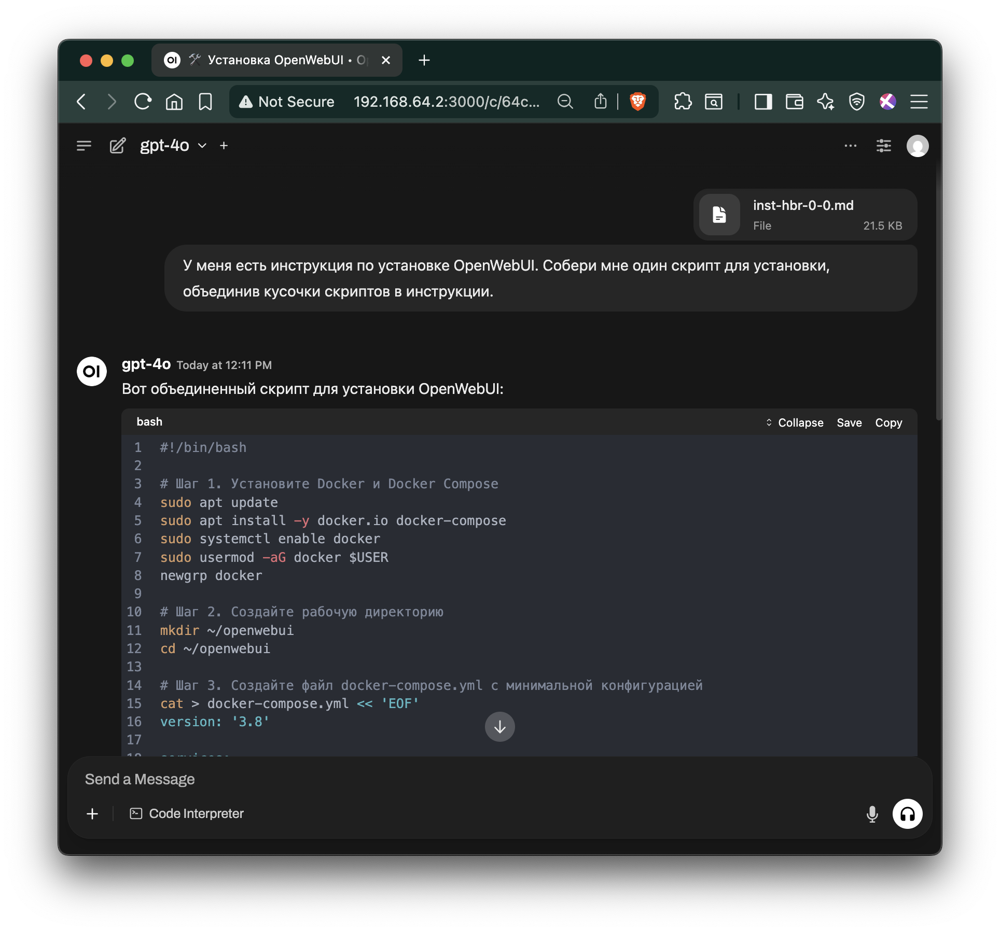

# Глава 1. Быстрый старт ИИ

## 1.0 Содержание

1.1 Введение  
 1.1.1 Для кого эта инструкция  
 1.1.2 Наш опыт  
 1.1.3 Как пользоваться инструкцией  
1.2 STEP-BY-STEP установка OpenWebUI  
 1.2.1 Шаг 1. Установите Docker и Docker Compose  
 1.2.2 Шаг 2. Создайте рабочую директорию  
 1.2.3 Шаг 3. Создайте docker-compose.yml  
 1.2.4 Шаг 4. Запустите контейнер  
 1.2.5 Шаг 5. Откройте веб-интерфейс  
 1.2.6 Шаг 6. Настройте доступ к модели GPT-4o  
1.3 Результаты установки  

---

## 1.1 Введение

Это практическая инструкция по развёртыванию OpenWebUI — корпоративного «ChatGPT» для вашей компании. Другими словами, мы покажем, как создать внутренний AI-чат, доступный всем сотрудникам без ограничений и рисков.

### 1.1.1 Для кого эта инструкция
Для IT-специалистов и системных администраторов, которым нужен быстрый путь к корпоративному AI-решению. Мы сознательно сделали **минимальную версию** для быстрого старта; все дополнительные настройки вынесены в отдельные разделы.

### 1.1.2 Наш опыт
Инструкция основана на реальном проекте в российской IT-компании. Результат — внутренний AI-помощник, который заменил индивидуальные подписки ChatGPT Plus и решил проблемы с:
- **Безопасностью данных** — всё остается внутри компании
- **Удобством работы** — больше не нужно копировать-вставлять между устройствами  
- **Управлением затратами** — одно решение вместо десятков индивидуальных подписок
- **Доступностью** — работает с рабочих ПК без VPN и блокировок

### 1.1.3 Как пользоваться инструкцией
1. **Основной блок** - Глава 1 — минимальная установка: 6 шагов.  
2. **Настройка модели** - Глава 2 — пример настройки модели под задачу: генерация скрипта установки OpenWebUI в заданной конфигурации.


Мы писали эту инструкцию с пониманием реальных корпоративных потребностей: когда нужно "просто чтобы работало", но с возможностью масштабирования и усиления безопасности по мере необходимости.

> **Время на базовую установку:** 15–20 мин   
> **Уровень сложности:** начальный (нужны базовые навыки Linux)   
> **Что понадобится:** VM/сервер с Docker, открыт порт 3000 должен быть доступен во внутренней сети.
[Подробные требования](https://github.com/open-webui/open-webui/discussions/736#discussioncomment-8474297)  

---

## 1.2 STEP-BY-STEP инструкция по установке OpenWebUI

### 1.2.1 Шаг 1. Установите Docker и Docker Compose
```bash
sudo apt update
sudo apt install -y docker.io docker-compose
…
```


### 1.2.2 Шаг 2. Создайте рабочую директорию
```bash
mkdir ~/openwebui && cd ~/openwebui
```
<details> <summary>Show Output</summary>
  
```console
# no output 
```
  
</details> 

### 1.2.3 Шаг 3. Создайте файл docker-compose.yml

Создайте файл с именем docker-compose.yml и вставьте в него:

```bash
cat > docker-compose.yml << 'EOF'
version: '3.8'

services:
  openwebui:
    image: ghcr.io/open-webui/open-webui:latest
    container_name: openwebui
    ports:
      - "3000:8080"
    volumes:
      - openwebui-data:/app/backend/data
    restart: unless-stopped

volumes:
  openwebui-data:
EOF

# Проверить, что файл создался
ls -la docker-compose.yml
```

<details> <summary>Show Output</summary>
  
```console
-rw-rw-r-- 1 ubuntu docker 258 Jul 19 14:37 docker-compose.yml
```
  
</details> 

### 1.2.4 Шаг 4. Запустите контейнер


```bash
docker-compose up -d
```

<details> <summary>Show Output</summary>
  
```console
Creating network "openwebui_default" with the default driver
Creating volume "openwebui_openwebui-data" with default driver
Pulling openwebui (ghcr.io/open-webui/open-webui:latest)...
latest: Pulling from open-webui/open-webui
3da95a905ed5: Pull complete
483d0dd37518: Pull complete
02a5d22e0d6f: Pull complete
471797cdda8c: Pull complete
d735c6810219: Pull complete
4f4fb700ef54: Pull complete
eb54bd960342: Pull complete
1e80ef81ce95: Pull complete
dc06c47d3f8d: Pull complete
b055ad624eb2: Pull complete
7748b270741b: Pull complete
b22bc807a44a: Pull complete
93ac078ec3dd: Pull complete
b7c32b689474: Pull complete
07aa94a3888a: Pull complete
Digest: sha256:bebab5869f7964143b7189e6b890e571f1553c428af6d3afb77bf25c9e0cc582
Status: Downloaded newer image for ghcr.io/open-webui/open-webui:latest
Creating openwebui ... done
```
  
</details> 

### 1.2.5 Шаг 5. Откройте веб-интерфейс

Откройте веб-интерфейс: `http://<IP-адрес-сервера>:3000`

Узнаем <IP-адрес-сервера>

```bash
# Показать все сетевые интерфейсы
ip addr show
```

<details> <summary>Show Output</summary>
  
```console
1: lo: <LOOPBACK,UP,LOWER_UP> mtu 65536 qdisc noqueue state UNKNOWN group default qlen 1000
    link/loopback 00:00:00:00:00:00 brd 00:00:00:00:00:00
    inet 127.0.0.1/8 scope host lo
       valid_lft forever preferred_lft forever
    inet6 ::1/128 scope host noprefixroute 
       valid_lft forever preferred_lft forever
2: ens3: <BROADCAST,MULTICAST,UP,LOWER_UP> mtu 1500 qdisc fq_codel state UP group default qlen 1000
    link/ether 52:54:00:24:e0:65 brd ff:ff:ff:ff:ff:ff
    altname enp0s3
    inet 192.168.64.2/24 metric 100 brd 192.168.64.255 scope global dynamic ens3
       valid_lft 80989sec preferred_lft 80989sec
    inet6 fdf4:ff6e:943d:451d:5054:ff:fe24:e065/64 scope global dynamic mngtmpaddr noprefixroute 
       valid_lft 2591926sec preferred_lft 604726sec
    inet6 fe80::5054:ff:fe24:e065/64 scope link 
       valid_lft forever preferred_lft forever
3: docker0: <NO-CARRIER,BROADCAST,MULTICAST,UP> mtu 1500 qdisc noqueue state DOWN group default 
    link/ether 02:42:ab:c1:76:b1 brd ff:ff:ff:ff:ff:ff
    inet 172.17.0.1/16 brd 172.17.255.255 scope global docker0
       valid_lft forever preferred_lft forever
4: br-c8c39ab07966: <BROADCAST,MULTICAST,UP,LOWER_UP> mtu 1500 qdisc noqueue state UP group default 
    link/ether 02:42:76:d8:8e:9e brd ff:ff:ff:ff:ff:ff
    inet 172.18.0.1/16 brd 172.18.255.255 scope global br-c8c39ab07966
       valid_lft forever preferred_lft forever
    inet6 fe80::42:76ff:fed8:8e9e/64 scope link 
       valid_lft forever preferred_lft forever
6: veth64026f0@if5: <BROADCAST,MULTICAST,UP,LOWER_UP> mtu 1500 qdisc noqueue master br-c8c39ab07966 state UP group default 
    link/ether 76:d7:a2:11:c5:12 brd ff:ff:ff:ff:ff:ff link-netnsid 0
    inet6 fe80::74d7:a2ff:fe11:c512/64 scope link 
       valid_lft forever preferred_lft forever
```
  
</details> 

Что искать в выводе:

```console

#  ...
# 2: ... 
    inet `192.168.64.2`/24 metric 100 brd 192.168.64.255 scope global dynamic ens3
       valid_lft 80989sec preferred_lft 80989sec
#  ...
```

Видим ip-адрес: 192.168.64.2, значит в этом случае веб-интерфейс доступен по адресу: http://192.168.64.2:3000/

Первый пользователь, который зарегистрируется — станет администратором ... и выполнит следующий пункт инструкции.


### 1.2.6 Шаг 6. Настройте доступ к модели GPT-4o


1. **Войдите как администратор** в веб-интерфейс OpenWebUI
2. **Перейдите в настройки:** Нажмите на иконку профиля → Settings → Admin Panel
3. **Добавьте подключение к OpenAI:**
   - Откройте раздел "Connections" или "Models"
   - Нажмите "Add OpenAI API"
   - Введите следующие параметры:
     - **API Base URL:** `https://api.ai-mediator.ru/v1`
     - **API Key:** Ваш корпоративный API-ключ созданный в личном кабинете на `https://ai-mediator.ru/`
     - **Model Name:** `gpt-4o`
4. **Сохраните настройки** и проверьте подключение
5. **Активируйте модель для пользователей:**
   - В Admin Panel перейдите в раздел "Models"
   - Найдите модель `gpt-4o` в списке
   - Включите переключатель рядом с ней (статус должен стать "Active")
   - Теперь модель будет доступна всем пользователям в выпадающем списке
6. **Задайте первый вопрос:**
   - В левом боковом меню нажмите "New Chat"
   - В открывшемся чате введите свой первый вопрос. И наблюдайте как генерируется ответ.
   - Ваши идеи для первого вопроса.
  
<figure>
  
  <figcaption><strong>Рисунок 1:</strong> Первый вопрос к ИИ</figcaption>
</figure>


Готово! Поздравляем! Теперь у вашей компании есть собственный AI-помощник — полный аналог ChatGPT, но развернутый на внутренних серверах под вашим контролем.

Передайте ссылку сотрудникам для внутреннего использования. В нашем случае: http://192.168.1.100:3000

---

## 1.3 Результаты установки
Что получили ваши сотрудники:
AI-помощник для повседневных задач  
   — Генерация текстов, переводы, анализ документов  
   — Помощь с кодом, формулами, презентациями  
   — Быстрые ответы на профессиональные вопросы  

AI-наставник для обучения и развития  
   — Объяснение сложных концепций простым языком  
   — Помощь в изучении новых технологий  
   — Тренировка навыков через интерактивный диалог  

Все это в привычном чат-интерфейсе прямо на рабочем месте — как любой другой внутренний корпоративный портал. Никаких VPN, регистраций или дополнительных приложений.


**Забегая вперед:** я хочу иметь один скрипт этой установки, поэтому я скопирую эту инструкцию в чат и попрошу собрать мне такой скрипт.


<figure>
  
  <figcaption><strong>Рисунок 2:</strong> Скрипт установки собран - он нам еще понадобится ...</figcaption>
</figure>

[Глава 2](inst-hbr-0-extend-ai-short-fast.md)


