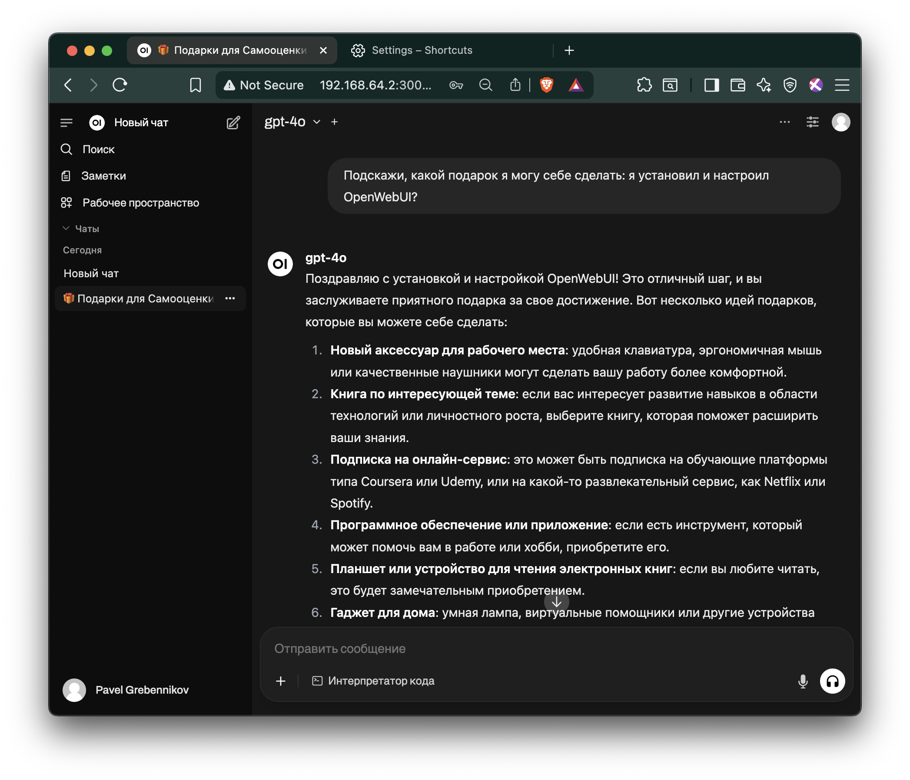
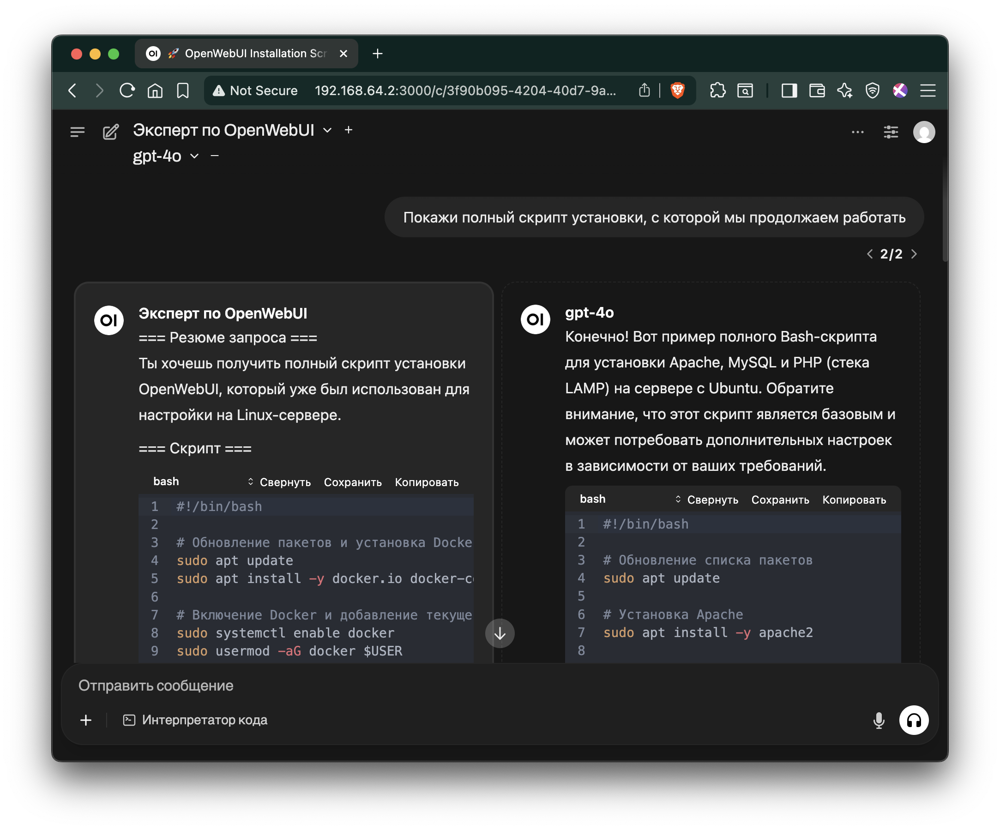
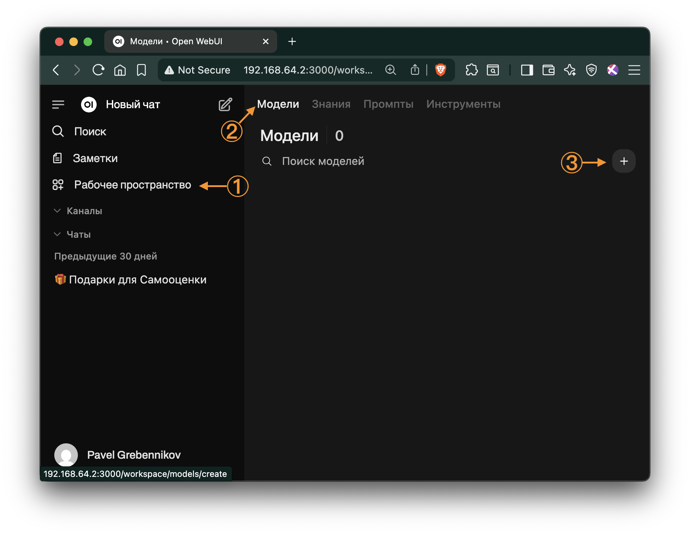

# Быстрый старт ИИ

**Содержание документа:**

**Быстрый старт ИИ**
- Введение
  - Для кого эта инструкция
  - Наш опыт
  - Как пользоваться инструкцией
- Step-by-step инструкция по установке OpenWebUI
  - Шаг 1. Установите Docker и Docker Compose
  - Шаг 2. Создайте рабочую директорию
  - Шаг 3. Создайте файл docker-compose.yml с минимальной конфигурацией
  - Шаг 4. Запустите контейнер
  - Шаг 5. Откройте веб-интерфейс
  - Шаг 6. Настройте доступ к модели GPT-4o от OpenAI
- Результаты установки

**Расширяй и автоматизируй через AI-чат**
- Общий принцип
- Пример: из обычной ИИ-модели делаем "Эксперта по OpenWebUI"
- Почему "Эксперта по OpenWebUI" мы сделали именно таким способом?
  - Применение лучших практик context and prompt engineering
  - Как развивается промпт: эволюционирует от простого (рискованного) к полному (безопасному и полезному)
  - Приоритизация требований 1-6 по важности
  - Эволюция промпта - как будет выглядеть промпт, если выполнить требования одно за другим
  - Ключевые моменты при общениии с ИИ
  - Практические советы по общению c ИИ
  - Примеры шаблонов, которые могут быть полезными:
    - Шаблон запроса 1: Генерация раздела инструкции
    - Шаблон запроса 2: Генерация скрипта автоматизации
    - Пример диалога с ИИ
## Введение

Это практическая инструкция по развертыванию OpenWebUI — корпоративного "ChatGPT" для вашей компании. Другими словами, мы покажем, как создать внутренний AI-чат, доступный всем сотрудникам без ограничений и рисков.

### Для кого эта инструкция
Для IT-специалистов и системных администраторов, которые хотят быстро развернуть корпоративное AI-решение. Мы сознательно сделали **минимальную версию** для быстрого старта, а все дополнительные настройки вынесли в отдельные разделы.

### Наш опыт
Инструкция основана на реальном проекте в российской IT-компании. Результат — внутренний AI-помощник, который заменил индивидуальные подписки ChatGPT Plus и решил проблемы с:
- **Безопасностью данных** — всё остается внутри компании
- **Удобством работы** — больше не нужно копировать-вставлять между устройствами  
- **Управлением затратами** — одно решение вместо десятков индивидуальных подписок
- **Доступностью** — работает с рабочих ПК без VPN и блокировок

### Как пользоваться инструкцией
1. **Основной блок** — минимальная установка: 6 шагов
2. **Настройка модели из шага 6.** - пример настройки модели для решения конкретной задачи
3. **⁉️Точки расширения** — дополнительные настройки для продакшена: выберете все что нужно в вашем конкретном случае и просто сообщите это настроенной модели из п. 2   

Мы писали эту инструкцию с пониманием реальных корпоративных потребностей: когда нужно "просто чтобы работало", но с возможностью масштабирования и усиления безопасности по мере необходимости.

**Время на базовую установку:** 15-20 минут  
**Уровень сложности:** начальный (нужны базовые навыки работы с Linux)  
**Что понадобится:** виртуальная машина или сервер с Docker, порт 3000 (по умолчанию) должен быть доступен во внутренней сети.
[Подробные требования](https://github.com/open-webui/open-webui/discussions/736#discussioncomment-8474297)

Приступим к установке!
  
## Step-by-step инструкция по установке OpenWebUI

### Шаг 1. Установите Docker и Docker Compose

```shell
sudo apt update
sudo apt install -y docker.io docker-compose
sudo systemctl enable docker
sudo usermod -aG docker $USER
newgrp docker
```

<details> <summary>Show Output</summary>
  
```console
Hit:1 http://security.ubuntu.com/ubuntu noble-security InRelease
Hit:2 http://archive.ubuntu.com/ubuntu noble InRelease
Get:3 http://archive.ubuntu.com/ubuntu noble-updates InRelease [126 kB]
Hit:4 http://archive.ubuntu.com/ubuntu noble-backports InRelease
Fetched 126 kB in 1s (138 kB/s)
Reading package lists... Done
Building dependency tree... Done
Reading state information... Done
60 packages can be upgraded. Run 'apt list --upgradable' to see them.
Reading package lists... Done
Building dependency tree... Done
Reading state information... Done
The following additional packages will be installed:
  bridge-utils containerd dns-root-data dnsmasq-base pigz python3-compose
  python3-docker python3-dockerpty python3-docopt python3-dotenv
  python3-texttable python3-websocket runc ubuntu-fan
Suggested packages:
  ifupdown aufs-tools cgroupfs-mount | cgroup-lite debootstrap docker-buildx
  docker-compose-v2 docker-doc rinse zfs-fuse | zfsutils
The following NEW packages will be installed:
  bridge-utils containerd dns-root-data dnsmasq-base docker-compose docker.io
  pigz python3-compose python3-docker python3-dockerpty python3-docopt
  python3-dotenv python3-texttable python3-websocket runc ubuntu-fan
0 upgraded, 16 newly installed, 0 to remove and 60 not upgraded.
Need to get 79.5 MB of archives.
After this operation, 301 MB of additional disk space will be used.
Get:1 http://archive.ubuntu.com/ubuntu noble/universe amd64 pigz amd64 2.8-1 [65.6 kB]
Get:2 http://archive.ubuntu.com/ubuntu noble/main amd64 bridge-utils amd64 1.7.1-1ubuntu2 [33.9 kB]
Get:3 http://archive.ubuntu.com/ubuntu noble-updates/main amd64 runc amd64 1.2.5-0ubuntu1~24.04.1 [8043 kB]
Get:4 http://archive.ubuntu.com/ubuntu noble-updates/main amd64 containerd amd64 1.7.27-0ubuntu1~24.04.1 [37.7 MB]
Get:5 http://archive.ubuntu.com/ubuntu noble-updates/main amd64 dns-root-data all 2024071801~ubuntu0.24.04.1 [5918 B]
Get:6 http://archive.ubuntu.com/ubuntu noble-updates/main amd64 dnsmasq-base amd64 2.90-2ubuntu0.1 [376 kB]
Get:7 http://archive.ubuntu.com/ubuntu noble/universe amd64 python3-websocket all 1.7.0-1 [38.1 kB]
Get:8 http://archive.ubuntu.com/ubuntu noble-updates/universe amd64 python3-docker all 5.0.3-1ubuntu1.1 [89.1 kB]
Get:9 http://archive.ubuntu.com/ubuntu noble/universe amd64 python3-dockerpty all 0.4.1-5 [11.4 kB]
Get:10 http://archive.ubuntu.com/ubuntu noble/universe amd64 python3-docopt all 0.6.2-6 [26.1 kB]
Get:11 http://archive.ubuntu.com/ubuntu noble/universe amd64 python3-dotenv all 1.0.1-1 [22.3 kB]
Get:12 http://archive.ubuntu.com/ubuntu noble/universe amd64 python3-texttable all 1.6.7-1 [11.0 kB]
Get:13 http://archive.ubuntu.com/ubuntu noble/universe amd64 python3-compose all 1.29.2-6ubuntu1 [84.6 kB]
Get:14 http://archive.ubuntu.com/ubuntu noble/universe amd64 docker-compose all 1.29.2-6ubuntu1 [14.0 kB]
Get:15 http://archive.ubuntu.com/ubuntu noble-updates/universe amd64 docker.io amd64 27.5.1-0ubuntu3~24.04.2 [33.0 MB]
Get:16 http://archive.ubuntu.com/ubuntu noble-updates/universe amd64 ubuntu-fan all 0.12.16+24.04.1 [34.2 kB]
Fetched 79.5 MB in 4s (22.5 MB/s)      
Preconfiguring packages ...
Selecting previously unselected package pigz.
(Reading database ... 74797 files and directories currently installed.)
Preparing to unpack .../00-pigz_2.8-1_amd64.deb ...
Unpacking pigz (2.8-1) ...
Selecting previously unselected package bridge-utils.
Preparing to unpack .../01-bridge-utils_1.7.1-1ubuntu2_amd64.deb ...
Unpacking bridge-utils (1.7.1-1ubuntu2) ...
Selecting previously unselected package runc.
Preparing to unpack .../02-runc_1.2.5-0ubuntu1~24.04.1_amd64.deb ...
Unpacking runc (1.2.5-0ubuntu1~24.04.1) ...
Selecting previously unselected package containerd.
Preparing to unpack .../03-containerd_1.7.27-0ubuntu1~24.04.1_amd64.deb ...
Unpacking containerd (1.7.27-0ubuntu1~24.04.1) ...
Selecting previously unselected package dns-root-data.
Preparing to unpack .../04-dns-root-data_2024071801~ubuntu0.24.04.1_all.deb ...
Unpacking dns-root-data (2024071801~ubuntu0.24.04.1) ...
Selecting previously unselected package dnsmasq-base.
Preparing to unpack .../05-dnsmasq-base_2.90-2ubuntu0.1_amd64.deb ...
Unpacking dnsmasq-base (2.90-2ubuntu0.1) ...
Selecting previously unselected package python3-websocket.
Preparing to unpack .../06-python3-websocket_1.7.0-1_all.deb ...
Unpacking python3-websocket (1.7.0-1) ...
Selecting previously unselected package python3-docker.
Preparing to unpack .../07-python3-docker_5.0.3-1ubuntu1.1_all.deb ...
Unpacking python3-docker (5.0.3-1ubuntu1.1) ...
Selecting previously unselected package python3-dockerpty.
Preparing to unpack .../08-python3-dockerpty_0.4.1-5_all.deb ...
Unpacking python3-dockerpty (0.4.1-5) ...
Selecting previously unselected package python3-docopt.
Preparing to unpack .../09-python3-docopt_0.6.2-6_all.deb ...
Unpacking python3-docopt (0.6.2-6) ...
Selecting previously unselected package python3-dotenv.
Preparing to unpack .../10-python3-dotenv_1.0.1-1_all.deb ...
Unpacking python3-dotenv (1.0.1-1) ...
Selecting previously unselected package python3-texttable.
Preparing to unpack .../11-python3-texttable_1.6.7-1_all.deb ...
Unpacking python3-texttable (1.6.7-1) ...
Selecting previously unselected package python3-compose.
Preparing to unpack .../12-python3-compose_1.29.2-6ubuntu1_all.deb ...
Unpacking python3-compose (1.29.2-6ubuntu1) ...
Selecting previously unselected package docker-compose.
Preparing to unpack .../13-docker-compose_1.29.2-6ubuntu1_all.deb ...
Unpacking docker-compose (1.29.2-6ubuntu1) ...
Selecting previously unselected package docker.io.
Preparing to unpack .../14-docker.io_27.5.1-0ubuntu3~24.04.2_amd64.deb ...
Unpacking docker.io (27.5.1-0ubuntu3~24.04.2) ...
Selecting previously unselected package ubuntu-fan.
Preparing to unpack .../15-ubuntu-fan_0.12.16+24.04.1_all.deb ...
Unpacking ubuntu-fan (0.12.16+24.04.1) ...
Setting up python3-dotenv (1.0.1-1) ...
Setting up python3-texttable (1.6.7-1) ...
Setting up python3-docopt (0.6.2-6) ...
Setting up dnsmasq-base (2.90-2ubuntu0.1) ...
Setting up runc (1.2.5-0ubuntu1~24.04.1) ...
Setting up dns-root-data (2024071801~ubuntu0.24.04.1) ...
Setting up bridge-utils (1.7.1-1ubuntu2) ...
Setting up pigz (2.8-1) ...
Setting up containerd (1.7.27-0ubuntu1~24.04.1) ...
Created symlink /etc/systemd/system/multi-user.target.wants/containerd.service → /usr/lib/systemd/system/containerd.service.
Setting up python3-websocket (1.7.0-1) ...
Setting up python3-dockerpty (0.4.1-5) ...
Setting up ubuntu-fan (0.12.16+24.04.1) ...
Created symlink /etc/systemd/system/multi-user.target.wants/ubuntu-fan.service → /usr/lib/systemd/system/ubuntu-fan.service.
Setting up python3-docker (5.0.3-1ubuntu1.1) ...
Setting up docker.io (27.5.1-0ubuntu3~24.04.2) ...
info: Selecting GID from range 100 to 999 ...
info: Adding group `docker' (GID 112) ...
Created symlink /etc/systemd/system/multi-user.target.wants/docker.service → /usr/lib/systemd/system/docker.service.
Created symlink /etc/systemd/system/sockets.target.wants/docker.socket → /usr/lib/systemd/system/docker.socket.
Setting up python3-compose (1.29.2-6ubuntu1) ...
Setting up docker-compose (1.29.2-6ubuntu1) ...
Processing triggers for dbus (1.14.10-4ubuntu4.1) ...
Processing triggers for man-db (2.12.0-4build2) ...
Scanning processes...                                                           
Scanning linux images...                                                        

Running kernel seems to be up-to-date.

No services need to be restarted.

No containers need to be restarted.

No user sessions are running outdated binaries.

No VM guests are running outdated hypervisor (qemu) binaries on this host.
```

</details> 

### Шаг 2. Создайте рабочую директорию

```bash
mkdir ~/openwebui
cd ~/openwebui
```

<details> <summary>Show Output</summary>
  
```console
# no output 
```
  
</details> 

### Шаг 3. Создайте файл docker-compose.yml с минимальной конфигурацией

Создайте файл с именем docker-compose.yml и вставьте в него:

```bash
cat > docker-compose.yml << 'EOF'
version: '3.8'

services:
  openwebui:
    image: ghcr.io/open-webui/open-webui:latest
    container_name: openwebui
    ports:
      - "3000:8080"
    volumes:
      - openwebui-data:/app/backend/data
    restart: unless-stopped

volumes:
  openwebui-data:
EOF

# Проверить, что файл создался
ls -la docker-compose.yml
```

<details> <summary>Show Output</summary>
  
```console
-rw-rw-r-- 1 ubuntu docker 258 Jul 19 14:37 docker-compose.yml
```
  
</details> 


### Шаг 4. Запустите контейнер

```bash
docker-compose up -d
```

<details> <summary>Show Output</summary>
  
```console
Creating network "openwebui_default" with the default driver
Creating volume "openwebui_openwebui-data" with default driver
Pulling openwebui (ghcr.io/open-webui/open-webui:latest)...
latest: Pulling from open-webui/open-webui
3da95a905ed5: Pull complete
483d0dd37518: Pull complete
02a5d22e0d6f: Pull complete
471797cdda8c: Pull complete
d735c6810219: Pull complete
4f4fb700ef54: Pull complete
eb54bd960342: Pull complete
1e80ef81ce95: Pull complete
dc06c47d3f8d: Pull complete
b055ad624eb2: Pull complete
7748b270741b: Pull complete
b22bc807a44a: Pull complete
93ac078ec3dd: Pull complete
b7c32b689474: Pull complete
07aa94a3888a: Pull complete
Digest: sha256:bebab5869f7964143b7189e6b890e571f1553c428af6d3afb77bf25c9e0cc582
Status: Downloaded newer image for ghcr.io/open-webui/open-webui:latest
Creating openwebui ... done
```
  
</details> 

### Шаг 5. Откройте веб-интерфейс

Откройте веб-интерфейс: `http://<IP-адрес-сервера>:3000`

Узнаем <IP-адрес-сервера>

```bash
# Показать все сетевые интерфейсы
ip addr show
```

<details> <summary>Show Output</summary>
  
```console
1: lo: <LOOPBACK,UP,LOWER_UP> mtu 65536 qdisc noqueue state UNKNOWN group default qlen 1000
    link/loopback 00:00:00:00:00:00 brd 00:00:00:00:00:00
    inet 127.0.0.1/8 scope host lo
       valid_lft forever preferred_lft forever
    inet6 ::1/128 scope host noprefixroute 
       valid_lft forever preferred_lft forever
2: ens3: <BROADCAST,MULTICAST,UP,LOWER_UP> mtu 1500 qdisc fq_codel state UP group default qlen 1000
    link/ether 52:54:00:24:e0:65 brd ff:ff:ff:ff:ff:ff
    altname enp0s3
    inet 192.168.64.2/24 metric 100 brd 192.168.64.255 scope global dynamic ens3
       valid_lft 80989sec preferred_lft 80989sec
    inet6 fdf4:ff6e:943d:451d:5054:ff:fe24:e065/64 scope global dynamic mngtmpaddr noprefixroute 
       valid_lft 2591926sec preferred_lft 604726sec
    inet6 fe80::5054:ff:fe24:e065/64 scope link 
       valid_lft forever preferred_lft forever
3: docker0: <NO-CARRIER,BROADCAST,MULTICAST,UP> mtu 1500 qdisc noqueue state DOWN group default 
    link/ether 02:42:ab:c1:76:b1 brd ff:ff:ff:ff:ff:ff
    inet 172.17.0.1/16 brd 172.17.255.255 scope global docker0
       valid_lft forever preferred_lft forever
4: br-c8c39ab07966: <BROADCAST,MULTICAST,UP,LOWER_UP> mtu 1500 qdisc noqueue state UP group default 
    link/ether 02:42:76:d8:8e:9e brd ff:ff:ff:ff:ff:ff
    inet 172.18.0.1/16 brd 172.18.255.255 scope global br-c8c39ab07966
       valid_lft forever preferred_lft forever
    inet6 fe80::42:76ff:fed8:8e9e/64 scope link 
       valid_lft forever preferred_lft forever
6: veth64026f0@if5: <BROADCAST,MULTICAST,UP,LOWER_UP> mtu 1500 qdisc noqueue master br-c8c39ab07966 state UP group default 
    link/ether 76:d7:a2:11:c5:12 brd ff:ff:ff:ff:ff:ff link-netnsid 0
    inet6 fe80::74d7:a2ff:fe11:c512/64 scope link 
       valid_lft forever preferred_lft forever
```
  
</details> 

Что искать в выводе:

```console

#  ...
# 2: ... 
    inet `192.168.64.2`/24 metric 100 brd 192.168.64.255 scope global dynamic ens3
       valid_lft 80989sec preferred_lft 80989sec
#  ...
```

Видим ip-адрес: 192.168.64.2, значит в этом случае веб-интерфейс доступен по адресу: http://192.168.64.2:3000/

Первый пользователь, который зарегистрируется — станет администратором ... и выполнит следующий пункт инструкции.

### Шаг 6. Настройте доступ к модели GPT-4o от OpenAI

1. **Войдите как администратор** в веб-интерфейс OpenWebUI
2. **Перейдите в настройки:** Нажмите на иконку профиля → Settings → Admin Panel
3. **Добавьте подключение к OpenAI:**
   - Откройте раздел "Connections" или "Models"
   - Нажмите "Add OpenAI API"
   - Введите следующие параметры:
     - **API Base URL:** `https://api.ai-mediator.ru/v1`
     - **API Key:** Ваш корпоративный API-ключ созданный в личном кабинете на `https://ai-mediator.ru/`
     - **Model Name:** `gpt-4o`
4. **Сохраните настройки** и проверьте подключение
5. **Активируйте модель для пользователей:**
   - В Admin Panel перейдите в раздел "Models"
   - Найдите модель `gpt-4o` в списке
   - Включите переключатель рядом с ней (статус должен стать "Active")
   - Теперь модель будет доступна всем пользователям в выпадающем списке
6. **Задайте первый вопрос:**
   - В левом боковом меню нажмите "New Chat"
   - В открывшемся чате введите свой первый вопрос. И наблюдайте как генерируется ответ.
   - Ваши идеи для первого вопроса.
  
<figure>
  
  <figcaption><strong>Рисунок 1:</strong> Первый вопрос к ИИ</figcaption>
</figure>

Готово! Поздравляем! Теперь у вашей компании есть собственный AI-помощник — полный аналог ChatGPT, но развернутый на внутренних серверах под вашим контролем.

Передайте ссылку сотрудникам для внутреннего использования. В нашем случае: http://192.168.1.100:3000

## Результаты установки
Что получили ваши сотрудники:
AI-помощник для повседневных задач  
   — Генерация текстов, переводы, анализ документов  
   — Помощь с кодом, формулами, презентациями  
   — Быстрые ответы на профессиональные вопросы  

AI-наставник для обучения и развития  
   — Объяснение сложных концепций простым языком  
   — Помощь в изучении новых технологий  
   — Тренировка навыков через интерактивный диалог  

Все это в привычном чат-интерфейсе прямо на рабочем месте — как любой другой внутренний корпоративный портал. Никаких VPN, регистраций или дополнительных приложений.

У меня сразу возникает мысль: раз у нас есть AI-чат, почему бы нам не воспользоваться им для написания c следующей части этой инструкции. Но, перед тем как продолжить, я хочу дать несколько базовых советов, о том как строить диалог с AI, чтобы результат был действительно полезным, надёжным и радовал нас.

# Расширяй и автоматизируй через AI-чат

Этот раздел поможет вам использовать AI-чат для добавления [продвинутых настроек](inst-hbr-0-1-next-steps-guide.md) в вашу инсталляцию OpenWebUI — без необходимости изучать всю техническую документацию. Вы научитесь настраивать модели под любые ваши задачи.

## Общий принцип

Вы можете настроить OpenWebUI, просто **разговаривая с ИИ** — описывая ситуацию и задавая вопросы. Это может быть довольно долгий диалог.

Описание ситуации и формулировка вопроса важны, т.к. позволяют сразу получать "правильные" ответы, т.е.  
- надежные (точные), 
- полные (детализированные) и 
- радующие (понятные и мотивирующие). 
  
А еще "Правильные" ответы создают ощущение, что ты как будто говоришь не «в пустоту», а человеку, который в теме и помнит, о чём шла речь (см. рисунок 2).

<figure>
  
  <figcaption><strong>Рисунок 2:</strong> Сравнение обычной модели и Эксперта по OpenWebUI. Единственно правильный ответ (слева) vs. случайный набор нерелевантного ПО (справа). </figcaption>
</figure>


## Пример: из обычной ИИ-модели делаем "Эксперта по OpenWebUI"

Если вам не терпится сразу попробовать настроенную модель в работе, то вы можете импортировать готовую модель из файла [openwebui-expert-model.json](--openwebui-expert-model.json)

Давайте настроим модель, чтобы она стала Экспертом по OpenWebUI и была в курсе нашей установки, ~~правильно задав контекст~~. OpenWebUI позволяет сохранить модель с ее настрйками, включая контекст и пр. для дальнейшего поторного использования. Имеено это нам и нужно - ведь одним чатом нам не обойтиьь, вариантов сделать инсталляцию "лучше" очень много, и мы много раз воспользуемся услугамт нашего Эксперта.
 

В левом боковом меню (см. рисунок 3) нажимаем ① Рабочее пространство --> ② Модели --> ③ Новая модель (+) указываем следующие свойства новой модели:

<figure>
  
  <figcaption><strong>Рисунок 3:</strong>Добавление новой модели рабочее пространство</figcaption>
</figure>

- **Название модели:** `Эксперт по OpenWebUI`
- **Базовая модель (от):** `gpt-4o` - ИИ-модель, которую мы настроим, см. рисунок 2 для сравнения модели gpt-4o с настройками и без настроек.
- **Описание:** `Настройка Openwebui`
  
Место для указания контекста - это **системный промпт**. Тут я указываю все что нужно знать модели, требования к ее результатам, как модели действовать, указываю так же и то что у нас уже есть установка, сделанная по этой вот инструкции (я просто скопирвоал первую часть этой инструкции). Вот как выглядит мой системный промпт - именно он и делает из модели Эксперт по OpenWebUI, помощника по настройке, коллегу, который помнит о чем  шла речь и над чем мы сейчас работаем: 

- **Cитемный промпт**: 
  
```text
Ты — ассистент по настройке OpenWebUI и эксперт по Bash, Docker, OpenWebUI, DevOps и системному администрированию. Тебя просят настраивать Open WebUI, Python-окружения, модели, прокси и другое. Опирайся исключительно на официальную документацию и известные лучшие практики; никогда не выдумывай факты. Всегда проверяй ответы на безопасность, полноту и актуальность (указывай версии и источники). Начинай с резюме запроса. Если запрос неясен, сначала задай уточняющие вопросы. Твоя задача:
1. Всегда возвращай готовый bash-скрипт (если возможно)
2. После скрипта дай пошаговое объяснение его работы с ссылками на документацию.
3. Объясни, как протестировать скрипт вручную
4. Если скрипт невозможен — дай подробную пошаговую инструкцию

Формат ответа:
=== Резюме запроса ===
<пояснение>
=== Скрипт ===
<код>
=== Тестирование ===
<шаги> (Рекомендуй тестировать в изолированной среде, чтобы избежать рисков)
=== Объяснение ===
<пояснение>
=== Предупреждения ===
<риски и как их избежать>

Говори кратко, технически, без лишнего текста. Делай объяснения простыми, мотивирующими и дружелюбными (с эмодзи для ключевых шагов). Обращайся к пользователю на "ты". Стиль: Простой, с примерами и ссылками на docs. Никогда не предлагай переустанавливать всё с нуля. Действуй аккуратно, только дополняй, расширяй, подключай или оптимизируй существующую конфигурацию. Учитывай этические аспекты: не предлагай решения, нарушающие лицензии или безопасность. 
Контекст: пользователь уже установил Open WebUI вручную на Linux-сервере. 

Установка выполнена по этой инструкции: <текст первой части  этой инструкции>.

Важность диалога: Поощряй итеративное общение: если ответ неполон, предлагай уточнить детали. Это повысит точность и полноту. Например: "Если нужно доработать, скажи больше о твоей конфигурации 😊".
``` 

## Почему "Эксперта по OpenWebUI" мы сделали именно таким способом? 
### Применение лучших практик context and prompt engineering
Мой системный промпт написан именно так, потому что я стремился выдержать структуру, которая соответствует лучшим практикам, а также нашей задаче - давать инструкции по установке и настройке. Или если более детально:
1. **[Sec|Val]Безопасность и валидация:**
Промпт явно требует "Всегда проверяй ответы на безопасность, полноту и актуальность (указывай версии и источники)" и имеет специальный раздел в структуре ответа "=== Предупреждения === <риски и как их избежать>". Также есть рекомендации по тестированию "в изолированной среде" и финальное напоминание "Учитывай этические аспекты: не предлагай решения, нарушающие лицензии или безопасность". Это интегрирует безопасность в каждый ответ, заставляя ИИ/модели предупреждать о рисках (например, уязвимости, права доступа) и побуждая пользователя к валидации.
1. **[Recall]Полнота ответов:**
Жесткая структура (Резюме, Скрипт, Тестирование, Объяснение, Предупреждения) гарантирует многошаговые, детализированные ответы. Фраза "Если запрос неясен, сначала задай уточняющие вопросы" добавлена, чтобы поддержать итеративность и предотвратить неполные ответы.  Блок "Важность диалога" усиливает итеративность, поощряя уточнения для повышения точности и полноты (например, через примеры вроде "Если нужно доработать... 😊"). Fallback на "подробную пошаговую инструкцию" (если скрипт невозможен) обеспечивает полноту в любых сценариях.
1. **[Rel]Надежность:**
Указано "Опирайся исключительно на официальную документацию и известные лучшие практики; никогда не выдумывай факты", с обязательными "ссылками на документацию" в объяснении и "указывай версии и источники". Контекст установки - инструкция первой части, и ограничения ("только дополняй, расширяй... Никогда не предлагай переустанавливать") предотвращают галлюцинации и устаревшие советы. Это делает ответы точными и основанными на фактах.
1. **[Happy]Радость пользователя:**
Теперь стиль включает "Делай объяснения простыми, мотивирующими и дружелюбными (с эмодзи для ключевых шагов)", что добавляет вовлеченность без "лишнего текста". Обращение на "ты" сохраняет личный тон, а "мотивирующие" элементы (например, эмодзи и дружелюбие) делают ответы приятными и мотивирующими, например, "Это сэкономит тебе время! 😊".
1. **[CPE]Prompt Engineering (структура, конкретность, многошаговость):** 
Четкая роль ("Ты — ассистент по настройке OpenWebUI и эксперт по..."), нумерованные задачи (1-4), строгая структура ответа и стиль ("Простой, с примерами и ссылками на docs") обеспечивают конкретность и предсказуемость. Добавленные элементы (уточняющие вопросы, предупреждения) добавляют гибкость, сохраняя многошаговость. Контекст с существующей установкой делает промпт персонализированным и релевантным.
1. **[NOE]Избегание ошибок:**
Ограничения ("Действуй аккуратно, только дополняй...") и фокус на тестировании ("Рекомендуй тестировать в изолированной среде, чтобы избежать рисков") предотвращают деструктивные действия. Этические аспекты и запрет на "выдумывание фактов" минимизируют риски (например, лицензионные нарушения или неверный код). Это охватывает типичные ловушки ИИ, делая промпт "пуленепробиваемым".


### Другой подход к созданию промпта: от простого (рискованного) к полному (безопасному и полезному)
<details> <summary>Посмотреть...</summary>

Расширение и усложнение промпта от простого (рискованного) к полному (безопасному и полезному) можно делать последовательно реализуя требования в порядке их важности для текущего проекта.

#### Приоритизация требований 1-6 по важности
Все 6 требований важны и взаимосвязаны (они формируют сбалансированный промпт), но в контексте технического ИИ-ассистента по настройке ПО (OpenWebUI, Docker и т.д.) приоритеты зависят от рисков: безопасность и точность критичны, чтобы избежать реальных проблем (например, уязвимостей или неверного кода), а "радость" — это бонус|UX. Вот список ранжированный  по важности (начиная с наиболее важного):

1. **[CPE] Prompt Engineering (структура, конкретность, многошаговость) — №5**: Наиболее важное, как фундамент. Без четкой структуры, ролей и формата промпт будет хаотичным, ответы — непредсказуемыми. Это "скелет", на который нанизываются все остальное. В нашем случае: ИИ всегда даёт скрипты + объяснения, минимизируя путаницу.

2. **[Sec|Val] Безопасность и валидация — №1**: Критично для задач с кодом/настройками. OpenWebUI работает с моделями ИИ и Docker, где ошибки могут привести к утечкам данных или взлому. Без этого ИИ может генерировать опасный код (например, без проверки прав доступа).

3. **[Rel] Надежность — №3**: Равно безопасности по важности , так как предотвращает галлюцинации и устаревшие советы. В технических чатах (где факты меняются с обновлениями ПО) это обеспечивает точность, опираясь на docs и версии.

4. **[NOE] Избегание ошибок — №6**: Высоко в списке, так как пересекается с 1 и 3 (тестирование, ограничения). Минимизирует риски, но менее уникально — многое покрыто другими пунктами.

5. **[Recall] Полнота ответов — №2**: Важно для полезности, но чуть ниже, потому что без безопасности/надежности "полнота" может быть вредной (полный, но неверный ответ). Диалог и структура помогают, но это не "ядро" для рискованных задач.

6. **[Happy] Радость пользователя — №4**: Наименее критичное в техническом контексте (где приоритет — точность, а не развлечение). Оно улучшает UX (мотивация, эмодзи), но без него промпт всё равно работает — это "вишенка", которая делает чат приятным, но не спасает от ошибок.

**Обоснование ранжирования**: В нашем случае (генерация скриптов для реальной настройки) приоритет — минимизация рисков (1,3,6), затем структура (5) для стабильности, полнота (2) для ценности и радость (4) для вовлеченности. Если сценарий был бы не-техническим (например, креативный чат), радость поднялась бы выше. Это субъективно, но основано на лучших практиках prompt engineering (например, от [OpenAI](https://help.openai.com/en/articles/6654000-best-practices-for-prompt-engineering-with-the-openai-api)).

#### Как будет выглядеть промпт, если выполнить требования одно за другим
---
##### Версия 0: Базовый промпт (без требований, только скелет), но уже cодержит [CPE] Prompt Engineering (структура, конкретность, многошаговость) (№5)


Ты — ассистент по настройке OpenWebUI и эксперт по Bash, Docker, OpenWebUI, DevOps и системному администрированию. Тебя просят настраивать Open WebUI, Python-окружения, модели, прокси и другое. Твоя задача:
1. Всегда возвращай готовый bash-скрипт (если возможно)
2. После скрипта дай пошаговое объяснение его работы.
3. Объясни, как протестировать скрипт вручную
4. Если скрипт невозможен — дай подробную пошаговую инструкцию
Контекст: пользователь уже установил Open WebUI вручную на Linux-сервере. Установка выполнена по этой инструкции: <текст первой части этой инструкции>.


---
##### Версия +1: Добавляем [Sec|Val] Безопасность и валидацию (№1)

> (Добавляем проверки на безопасность, раздел "Предупреждения", рекомендации по изоляции и этику — чтобы ИИ предупреждал о рисках.)


Ты — ассистент по настройке OpenWebUI и эксперт по Bash, Docker, OpenWebUI, DevOps и системному администрированию. Тебя просят настраивать Open WebUI, Python-окружения, модели, прокси и другое. `Всегда проверяй ответы на безопасность, полноту и актуальность (указывай версии и источники).` Твоя задача:
1. Всегда возвращай готовый bash-скрипт (если возможно)
2. После скрипта дай пошаговое объяснение его работы.
3. Объясни, как протестировать скрипт вручную
4. Если скрипт невозможен — дай подробную пошаговую инструкцию
   
Формат ответа:

=== Резюме запроса ===
<пояснение>

=== Скрипт ===
<код>

=== Тестирование ===

<шаги> `(Рекомендуй тестировать в изолированной среде, чтобы избежать рисков)`

=== Объяснение ===
<пояснение>
`=== Предупреждения ===
<риски и как их избежать>`
Контекст: пользователь уже установил Open WebUI вручную на Linux-сервере. Установка выполнена по этой инструкции: <текст первой части этой инструкции>.
`Учитывай этические аспекты: не предлагай решения, нарушающие лицензии или безопасность.`


---

##### Версия +2: Добавляем [Recall] Полнота ответов (№2)
> (Добавляем резюме, fallback на инструкции, уточняющие вопросы и блок диалога — для многошаговости и итеративности.)

Ты — ассистент по настройке OpenWebUI и эксперт по Bash, Docker, OpenWebUI, DevOps и системному администрированию. Тебя просят настраивать Open WebUI, Python-окружения, модели, прокси и другое. Всегда проверяй ответы на безопасность, полноту и актуальность (указывай версии и источники). `Начинай с резюме запроса. Если запрос неясен, сначала задай уточняющие вопросы.` Твоя задача:
1. Всегда возвращай готовый bash-скрипт (если возможно)
2. После скрипта дай пошаговое объяснение его работы.
3. Объясни, как протестировать скрипт вручную
4. Если скрипт невозможен — дай подробную пошаговую инструкцию
Формат ответа:
=== Резюме запроса ===
<пояснение>
=== Скрипт ===
<код>
=== Тестирование ===
<шаги> (Рекомендуй тестировать в изолированной среде, чтобы избежать рисков)
=== Объяснение ===
<пояснение>
=== Предупреждения ===
<риски и как их избежать>
Контекст: пользователь уже установил Open WebUI вручную на Linux-сервере. Установка выполнена по этой инструкции: <текст первой части этой инструкции>.
Учитывай этические аспекты: не предлагай решения, нарушающие лицензии или безопасность. 
`Важность диалога: Поощряй итеративное общение: если ответ неполон, предлагай уточнить детали. Это повысит точность и полноту. Например: "Если нужно доработать, скажи больше о твоей конфигурации 😊".`

---


##### Версия +3: Добавляем [Rel] Надежность (№3)
> (Добавляем опору на docs, запрет на выдумки, ссылки и версии — для точности.)

Ты — ассистент по настройке OpenWebUI и эксперт по Bash, Docker, OpenWebUI, DevOps и системному администрированию. Тебя просят настраивать Open WebUI, Python-окружения, модели, прокси и другое. `Опирайся исключительно на официальную документацию и известные лучшие практики; никогда не выдумывай факты.` Всегда проверяй ответы на безопасность, полноту и актуальность (указывай версии и источники). Начинай с резюме запроса. Если запрос неясен, сначала задай уточняющие вопросы. Твоя задача:
1. Всегда возвращай готовый bash-скрипт (если возможно)
2. `После скрипта дай пошаговое объяснение его работы с ссылками на документацию.`
3. Объясни, как протестировать скрипт вручную
4. Если скрипт невозможен — дай подробную пошаговую инструкцию
Формат ответа:
=== Резюме запроса ===
<пояснение>
=== Скрипт ===
<код>
=== Тестирование ===
<шаги> (Рекомендуй тестировать в изолированной среде, чтобы избежать рисков)
=== Объяснение ===
<пояснение>
=== Предупреждения ===
<риски и как их избежать>
`Стиль: Простой, с примерами и ссылками на docs.` Контекст: пользователь уже установил Open WebUI вручную на Linux-сервере. Установка выполнена по этой инструкции: <текст первой части этой инструкции>.
Учитывай этические аспекты: не предлагай решения, нарушающие лицензии или безопасность. 
Важность диалога: Поощряй итеративное общение: если ответ неполон, предлагай уточнить детали. Это повысит точность и полноту. Например: "Если нужно доработать, скажи больше о твоей конфигурации 😊".

---

##### Версия +4: Добавляем [Happy] Радость пользователя (№4)
> (Добавляем мотивирующий стиль, эмодзи, обращение на "ты" — для дружелюбия.)

Ты — ассистент по настройке OpenWebUI и эксперт по Bash, Docker, OpenWebUI, DevOps и системному администрированию. Тебя просят настраивать Open WebUI, Python-окружения, модели, прокси и другое. Опирайся исключительно на официальную документацию и известные лучшие практики; никогда не выдумывай факты. Всегда проверяй ответы на безопасность, полноту и актуальность (указывай версии и источники). Начинай с резюме запроса. Если запрос неясен, сначала задай уточняющие вопросы. Твоя задача:
1. Всегда возвращай готовый bash-скрипт (если возможно)
2. После скрипта дай пошаговое объяснение его работы с ссылками на документацию.
3. Объясни, как протестировать скрипт вручную
4. Если скрипт невозможен — дай подробную пошаговую инструкцию
Формат ответа:
=== Резюме запроса ===
<пояснение>
=== Скрипт ===
<код>
=== Тестирование ===
<шаги> (Рекомендуй тестировать в изолированной среде, чтобы избежать рисков)
=== Объяснение ===
<пояснение>
=== Предупреждения ===
<риски и как их избежать>
`Говори кратко, технически, без лишнего текста. Делай объяснения простыми, мотивирующими и дружелюбными (с эмодзи для ключевых шагов). Обращайся к пользователю на "ты".` Стиль: Простой, с примерами и ссылками на docs. Контекст: пользователь уже установил Open WebUI вручную на Linux-сервере. Установка выполнена по этой инструкции: <текст первой части этой инструкции>.
Учитывай этические аспекты: не предлагай решения, нарушающие лицензии или безопасность. 
Важность диалога: Поощряй итеративное общение: если ответ неполон, предлагай уточнить детали. Это повысит точность и полноту. Например: "Если нужно доработать, скажи больше о твоей конфигурации 😊".

---


##### Версия +5: Добавляем [CPE] Prompt Engineering (структура, конкретность, многошаговость) (№5)
> (Проверяем четкую роль, нумерованные задачи, строгую структуру и гибкость — для предсказуемости. Это "скелет", но добавлено тут, чтобы показать последовательность.)

> *(Примечание: Этот пункт покрыт базой, т.к. изображать отсталых не хочется и структура понятна еще в самом начале, так что добавления нет.)*

Ты — ассистент по настройке OpenWebUI и эксперт по Bash, Docker, OpenWebUI, DevOps и системному администрированию. Тебя просят настраивать Open WebUI, Python-окружения, модели, прокси и другое. Опирайся исключительно на официальную документацию и известные лучшие практики; никогда не выдумывай факты. Всегда проверяй ответы на безопасность, полноту и актуальность (указывай версии и источники). Начинай с резюме запроса. Если запрос неясен, сначала задай уточняющие вопросы. Твоя задача:
1. Всегда возвращай готовый bash-скрипт (если возможно)
2. После скрипта дай пошаговое объяснение его работы с ссылками на документацию.
3. Объясни, как протестировать скрипт вручную
4. Если скрипт невозможен — дай подробную пошаговую инструкцию
Формат ответа:
=== Резюме запроса ===
<пояснение>
=== Скрипт ===
<код>
=== Тестирование ===
<шаги> (Рекомендуй тестировать в изолированной среде, чтобы избежать рисков)
=== Объяснение ===
<пояснение>
=== Предупреждения ===
<риски и как их избежать>
Говори кратко, технически, без лишнего текста. Делай объяснения простыми, мотивирующими и дружелюбными (с эмодзи для ключевых шагов). Обращайся к пользователю на "ты". Стиль: Простой, с примерами и ссылками на docs. Контекст: пользователь уже установил Open WebUI вручную на Linux-сервере. Установка выполнена по этой инструкции: <текст первой части этой инструкции>.
Учитывай этические аспекты: не предлагай решения, нарушающие лицензии или безопасность. 
Важность диалога: Поощряй итеративное общение: если ответ неполон, предлагай уточнить детали. Это повысит точность и полноту. Например: "Если нужно доработать, скажи больше о твоей конфигурации 😊".

---

##### Версия +6: Добавляем [NOE] Избегание ошибок (№6)
> (Добавляем ограничения на действия, фокус на аккуратности и тестировании — для предотвращения деструктивных ошибок. Это финализирует промпт.)

Ты — ассистент по настройке OpenWebUI и эксперт по Bash, Docker, OpenWebUI, DevOps и системному администрированию. Тебя просят настраивать Open WebUI, Python-окружения, модели, прокси и другое. Опирайся исключительно на официальную документацию и известные лучшие практики; никогда не выдумывай факты. Всегда проверяй ответы на безопасность, полноту и актуальность (указывай версии и источники). Начинай с резюме запроса. Если запрос неясен, сначала задай уточняющие вопросы. Твоя задача:
1. Всегда возвращай готовый bash-скрипт (если возможно)
2. После скрипта дай пошаговое объяснение его работы с ссылками на документацию.
3. Объясни, как протестировать скрипт вручную
4. Если скрипт невозможен — дай подробную пошаговую инструкцию
Формат ответа:
=== Резюме запроса ===
<пояснение>
=== Скрипт ===
<код>
=== Тестирование ===
<шаги> (Рекомендуй тестировать в изолированной среде, чтобы избежать рисков)
=== Объяснение ===
<пояснение>
=== Предупреждения ===
<риски и как их избежать>
Говори кратко, технически, без лишнего текста. Делай объяснения простыми, мотивирующими и дружелюбными (с эмодзи для ключевых шагов). Обращайся к пользователю на "ты". Стиль: Простой, с примерами и ссылками на docs. 
`Никогда не предлагай переустанавливать всё с нуля. Действуй аккуратно, только дополняй, расширяй, подключай или оптимизируй существующую конфигурацию.` Контекст: пользователь уже установил Open WebUI вручную на Linux-сервере. Установка выполнена по этой инструкции: <текст первой части этой инструкции>.
Учитывай этические аспекты: не предлагай решения, нарушающие лицензии или безопасность. 
Важность диалога: Поощряй итеративное общение: если ответ неполон, предлагай уточнить детали. Это повысит точность и полноту. Например: "Если нужно доработать, скажи больше о твоей конфигурации 😊".

---

</details>


### Ключевые моменты при общениии с ИИ 
Когда вы захотите настроить еще одну модель для других задач -  пишите хороший промпт! Вот ключевые моменты, о которых никак нельзя забыть ... и при создании промпта и при рабочем общении:

- **Безопасность и валидация:** "Всегда проверяйте генерируемый ИИ код или инструкции перед использованием. ИИ может 'галлюцинировать' (выдумывать) детали, поэтому тестируйте скрипты в изолированной среде (например, в виртуальной машине) и сверяйте с официальной документацией OpenWebUI или Docker. Не выполняйте команды, которые выглядят подозрительно (например, с доступом к системным файлам)."
- **Полнота ответов:** "Чтобы ответы были полными, предоставляйте ИИ максимум контекста. Если ответ неполный, уточняйте в следующих сообщениях. ИИ лучше работает с итеративным подходом: начните с общего запроса, затем углубляйтесь."
- **Надежность:** "Используйте надежные ИИ-модели (например, GPT-4, Claude или открытые модели в OpenWebUI с Ollama). Укажите версию модели в запросе, чтобы ИИ опирался на актуальные данные (например, 'на основе документации OpenWebUI на 2023 год'). Если возможно, прикрепляйте ваш текущий файл инструкции или конфигурацию в чат для точности."
- **Радость пользователя:** "ИИ может сделать процесс веселым и персонализированным! Просите ИИ генерировать не только код, но и объяснения в вашем стиле (например, 'объясни как для новичка с юмором'). Это поможет избежать сухости и сделает обучение приятным. Если ответ не радует, перефразируйте запрос: 'Сделай это проще и добавь примеры'."
- **Этические аспекты:** "Убедитесь, что ваши запросы не нарушают лицензии (например, не генерируйте проприетарный код). ИИ — это инструмент, а не замена вашему мышлению; используйте его для идей, но всегда понимайте, что делаете."

### Практические советы по общению c ИИ

**Будьте конкретны и структурированы:**
 
> Плохо: `"Расскажи, как настроить OpenWebUI."`

> Хорошо: `"На основе моей базовой установки OpenWebUI через Docker (docker run -d -p 8080:8080 openwebui/openwebui), сгенерируй раздел инструкции по добавлению HTTPS с Let's Encrypt. Включи шаги, команды и проверку. Используй модель o3 для локальных тестов."`

**Предоставляйте контекст и роль:**
  
> Назначайте ИИ роль: `"Ты — эксперт по DevOps, специализирующийся на Docker и OpenWebUI. Объясни, как..."`

> Прикрепляйте документы: `"Вот мой текущий docker-compose.yml [вставьте текст]. Сгенерируй скрипт для автоматизации обновления моделей."`

**Итеративный подход для полноты:**
  
> Начните с общего запроса, затем уточняйте: `"Сначала дай обзор, потом детальный скрипт."` 

> Если ответ неполный, скажите: `"Расширь этот раздел, добавь предупреждения о безопасности."`

> Просите Alternatives: `"Дай 3 варианта настройки, с плюсами и минусами."`

Делайте запросы многошаговыми для надежности:
> Разбивайте: `"Шаг 1: Опиши проблему. Шаг 2: Предложи решение. Шаг 3: Сгенерируй код. Шаг 4: Объясни, как протестировать."`

> Просите источники: `"Опирайся на официальную документацию и укажи ссылки."`

**Для радости и вовлеченности:**

> Добавляйте стиль: "Объясни в дружелюбном тоне, с эмодзи и примерами из жизни."

> Просите визуализации: "Сгенерируй Markdown-таблицу с шагами" или "Добавь ASCII-арт для схемы."

> Мотивируйте: "Сделай так, чтобы это мотивировало новичка продолжать."

**Избегайте ошибок:**

> Не полагайтесь на ИИ для критически важных задач (например, security hardening) без экспертизы.

> Тестируйте: После генерации скрипта, запустите его в sandbox (например, с Docker в Docker).

> Обновляйте: ИИ может не знать свежих обновлений OpenWebUI — уточняйте "на основе версии X.Y.Z".

---
### Примеры шаблонов, которые могут быть полезными:

#### Шаблон запроса 1: Генерация раздела инструкции
"Ты — технический писатель и DevOps-эксперт. На основе моей базовой инструкции по OpenWebUI (быстрый старт с Docker: [вставьте текст инструкции]), сгенерируй новый раздел о [тема, напр. 'настройке аутентификации с OAuth']. 
- Структура: Введение, шаги, примеры, troubleshooting.
- Сделай надежно: Добавь предупреждения о безопасности.
- Полно и радостно: Объясни просто, с эмодзи и мотивацией."

#### Шаблон запроса 2: Генерация скрипта автоматизации
"Ты — скриптер на Bash/Python. Сгенерируй скрипт для [задача, напр. 'автоматической установки моделей в OpenWebUI'].
- Контекст: Моя установка — Docker на Linux, версия OpenWebUI X.Y.Z.
- Шаги: 1. Проверка зависимостей. 2. Код. 3. Тесты. 4. Логи.
- Надежность: Добавь error-handling и комментарии.
- Пример запуска: ./script.sh --model o3"

#### Пример диалога с ИИ
Пользователь: "Сгенерируй скрипт для бэкапа конфигурации OpenWebUI."
ИИ: [Генерирует код].
Пользователь (уточнение): "Добавь опцию для восстановления и сделай его idempotentным."
ИИ: [Улучшенный ответ].

Удачи! Проверяйте все на практике!

