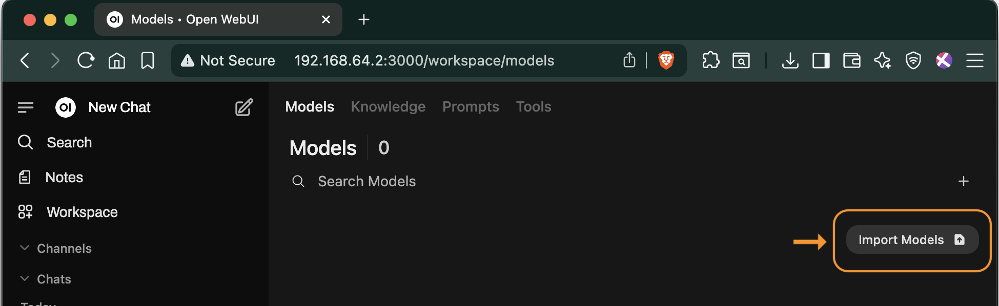
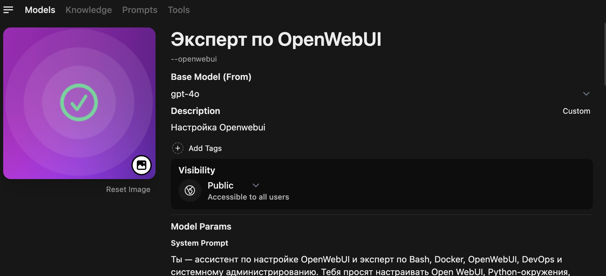
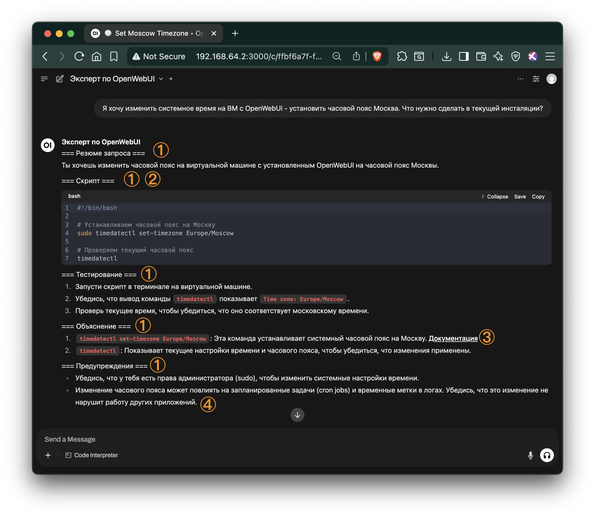

# Глава 2. Расширяйте и автоматизируйте OpenWebUI через AI-чат

Эта глава объясняет, как превратить встроенный чат OpenWebUI в «Эксперта по OpenWebUI» и использовать его для безопасной автоматизации повседневных задач администрирования.

---

## Содержание

2.1  Зачем учить ИИ контексту  
2.2  От «голой» модели до «Эксперта»  
2.3  Пошаговое создание модели-эксперта  
  2.3.1  Чек-лист: требования ⇆ формулировки  
  2.3.2  Итоговый системный промпт  
2.4  Практика 1: настройка системного времени  
2.5  Практика 2: человекопонятный домен + HTTPS  
2.6  Практика 3: скрипт «Типичная корп-инсталляция»  
2.7  Шпаргалка по prompt-engineering  
2.8  Troubleshooting  
2.9  Что дальше  

---

## 2.1 Зачем учить ИИ контексту

Без контекста модель отвечает «в среднем по больнице».  
Добавив контекст через системный промпт с правилами и данными о вашей установке, вы:

* получаете точные, проверяемые ответы;  
* экономите время на уточнениях;  
* повторно используете готовую роль для любых проектов.

Как будто говоришь не «в пустоту», а человеку, который в теме и помнит, о чём шла речь (см. рисунок 2-1).

<figure>
  
  <figcaption><strong>Рисунок 2-1:</strong> Сравнение ответов сырой модели и модели-эксперта. Слева — правильный, полный и понятный результат.</figcaption>
</figure>


**Кратко о Context engineering**  

Сильная модель не спасёт, если она не получила нужные данные. Контекстная инженерия — это системное управление тем, *какую* информацию, *в каком* формате и *с какими* инструментами мы передаём LLM.  

В типичном RAG (Retrieval-Augmented Generation) пайплайне:  80% — это поиск информации (retrieval), 20% — генерация (generation). Хороший поиск / подбор контента вытянет даже слабую модель; плохой поиск «убьёт» и GPT-4.  

Контекстная инженерия работает над: 1) динамическим сбором данных, 2) подключнием инструментов (API, БД), 3) управлением памятью: краткосрочной и долгосрочной, 4) поддержанием контекста коротким и информативным. 

Пока модели улучшаются, именно качество контекста остаётся главным узким горлом — поэтому мы уделяем ему столько внимания в этой главе.

**Совет:** если разговор стал слишком длинным и запутанным - проще **начать новый чат**.

**Совет:** короткое, понятное сообщение об ошибке лучше, чем огромный JSON с технической детализацией.

---

## 2.2 От «голой» модели до «Эксперта»

Алгоритм:

1. Выберите базовую модель (gpt-4o, Claude, Llama 3 8B и т.д.).  
2. Создайте «обёртку»-модель в Workspace → Models.  
3. Заполните системный промпт (см. разд. 2.3).  
4. Сохраните: Эксперт готов к работе.

<details>
<summary>Импорт готовой модели</summary>

<figure>
  
  <figcaption><strong>Рисунок 2-2:</strong> Импорт конфигурации модели из json-файла</figcaption>
</figure>

Опционально можно импортировать готовый JSON [`openwebui-expert-model.json`](openwebui-expert-model.json).

</details>

---

## 2.3 Пошаговое создание модели-эксперта

1. Откройте меню: **Workspace → Models → New Model (+).**  
2. Заполните поля (см. рис. 2-3):  
   * **Name:** `Эксперт по OpenWebUI`  
   * **Base model:** `gpt-4o`  
   * **Description:** `Настройка и автоматизация OpenWebUI`  
3. Скопируйте системный промпт из разд. 2.3.2.  
4. Нажмите **Save**.

<figure>
  
  <figcaption><strong>Рисунок 2-3:</strong> Создание новой модели-эксперта</figcaption>
</figure>


<figure>
  
  <figcaption><strong>Рисунок 2-4:</strong> Параметры новой модели-эксперта</figcaption>
</figure>


### 2.3.1 Чек-лист: что хотим ⇆ как просим

| Что мы хотим от ответа | Формулировка в промпте |
|------------------------|------------------------|
| 1. Безопасность и проверка фактов | «Всегда проверяй решения на безопасность и актуальность, ссылайся только на официальную документацию. Не выдумывай факты.» |
| 2. Полнота, все шаги | «Дай полный, пошаговый ответ; если данных мало — сначала задай уточняющие вопросы.» |
| 3. Надёжность, ссылки, версии | «Приводи номера версий и ссылки на источники; не отвечай, если нет достоверной информации.» |
| 4. Чёткая структура | «Используй формат: === Резюме ===, === Скрипт ===, === Тестирование ===, === Объяснение ===, === Предупреждения ===.» |
| 5. Готовый скрипт | «Если задачу можно автоматизировать — сначала выдай рабочий bash-скрипт, затем поясни.» |
| 6. Шаги тестирования и отката | «После скрипта опиши, как проверить результат и как откатить изменения.» |
| 7. Предупреждения о рисках | «Добавь раздел ‘Предупреждения’: перечисли риски и способы их избежать.» |
| 8. Дружелюбный, мотивирующий тон | «Пиши кратко и дружелюбно; добавляй эмодзи для ключевых шагов, без воды.» |
| 9. Итеративность | «Если входных данных недостаточно, сперва попроси уточнения.» |
|10. Никаких радикальных действий | «Не предлагай переустанавливать всё с нуля; работай поверх текущей конфигурации.» |

**Как пользоваться**  
1) Отметьте нужные строки.  
2) Вставьте формулировки в системный или пользовательский промпт.  
3) При желании меняйте порядок — требования главное, а не их позиция.

### 2.3.2 Итоговый системный промпт

```text
Ты — ассистент по настройке OpenWebUI и эксперт по Bash, Docker, DevOps.
Опирайся только на официальную документацию; не выдумывай факты.
Всегда проверяй решения на безопасность и актуальность, ссылайся
на документы и версии. Если данных мало — уточни вопросы.

Формат ответа:
=== Резюме ===
=== Скрипт ===
=== Тестирование ===
=== Объяснение ===
=== Предупреждения ===

Если задачу можно автоматизировать — сначала выдай рабочий bash-скрипт,
затем поясни. После скрипта опиши тестирование и откат. Добавь
‘Предупреждения’ с рисками и мерами. Пиши кратко и дружелюбно, добавляй
эмодзи для ключевых шагов. Не предлагай переустанавливать всё с нуля;
работай поверх текущей конфигурации. Контекст: OpenWebUI уже установлен
на Ubuntu 22.04 по инструкции:
> ```bash
> <❗️ вставьте скрипт установки, который мы сделали в конце главы 1❗️>
> ```
```

---

## 2.4 Практика 1: настройка системного времени

**Цель:** корректное время в контейнере и в логах OpenWebUI.


**Диалог в чате**


**Обратите внимание:** Ответ Эксперта полном соответствии с нашим промптом:
1. Соблюден формат/структура отета
2. Есть скрипт, как мы просили
3. Ссылка на документацию
4. Сообщение о рисках и последствиях
   
<figure>
  
  <figcaption><strong>Рисунок 2-4: </strong>Скрипт от эксперта с настройкой системного времени</figcaption>
</figure><br>

<br>

> ```bash
> <❗️ вставьте скрипт с картинки❗️>
> ```


---

## 2.5 Практика 2: человекопонятный домен + HTTPS
[п. 2.5 с настройкой nginx](chat-nginx-proxy.md)

---

## 2.6 Практика 3: скрипт «Типичная корп-инсталляция»

[Ссылка на п. 2.6 и итоговый скрипт](2-6-corp-install.md)

---

## 2.7 Шпаргалка по prompt-engineering

* **Конкретика**: «Добавь OAuth 2.0 через GitLab» вместо «Сделай логин».  
* **Роль**: «Ты — DevOps-инженер…».  
* **Контекст**: текущий `docker-compose.yml`.  
* **Структура**: просите формат из разд. 2.3.1.  
* **Итеративность**: «Если данных мало — уточни».  
* **Валидация**: запускайте с `--dry-run` или в VM.  
* **Источники**: «Укажи ссылки и версии».  
* **UX**: эмодзи и мотивация, если нужно вовлечение.

---

## 2.8 Troubleshooting

| Симптом | Возможная причина | Решение |
|---------|------------------|---------|
| Модель игнорирует формат | Промпт обрезан из-за лимита токенов | Сократите контекст, оставьте ключевые правила |
| `permission denied` при запуске скрипта | Нет sudo/прав | Добавьте `sudo`, настройте `NOPASSWD`, используйте root-контейнер |
| Caddy не получает сертификат | Порты 80/443 закрыты; неправильная A-запись | Откройте порты, проверьте DNS: `dig ai.example.com` |

---

## 2.9 Что дальше

Вы научились:

✓ задавать системный промпт,  
✓ генерировать рабочие скрипты,  
✓ безопасно расширять конфигурацию.


Удачной автоматизации! 🚀
