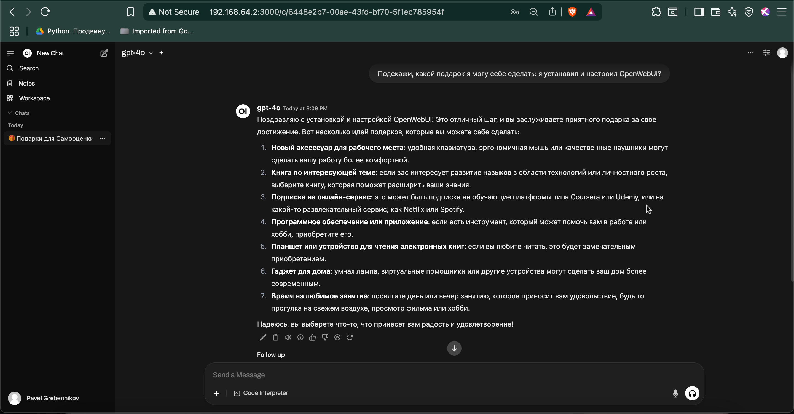

# 📖 Введение

Это практическая инструкция по развертыванию OpenWebUI — корпоративного "ChatGPT" для вашей компании. Другими словами, мы покажем, как создать внутренний AI-чат, доступный всем сотрудникам без ограничений и рисков.

### Для кого эта инструкция:
Для IT-специалистов и системных администраторов, которые хотят быстро развернуть корпоративное AI-решение. Мы сознательно сделали **минимальную версию** для быстрого старта, а все дополнительные настройки вынесли в отдельные разделы.

### Наш опыт:
Инструкция основана на реальном проекте в российской IT-компании. Результат — внутренний AI-помощник, который заменил индивидуальные подписки ChatGPT Plus и решил проблемы с:
- **Безопасностью данных** — всё остается внутри компании
- **Удобством работы** — больше не нужно копировать-вставлять между устройствами  
- **Управлением затратами** — одно решение вместо десятков индивидуальных подписок
- **Доступностью** — работает с рабочих ПК без VPN и блокировок

### Как пользоваться инструкцией:
1. **Основной блок** — минимальная установка
2. **Точки расширения** — дополнительные настройки для продакшена  
3. **Практические советы** — из нашего реального опыта внедрения

Мы писали эту инструкцию с пониманием реальных корпоративных потребностей: когда нужно "просто чтобы работало", но с возможностью масштабирования и усиления безопасности по мере необходимости.

**Время на базовую установку:** 15-20 минут  
**Уровень сложности:** начальный (нужны базовые навыки работы с Linux)  
**Что понадобится:** виртуальная машина или сервер с Docker, порт 3000 (по умолчанию) должен быть доступен во внутренней сети.
[Подробные требования](https://github.com/open-webui/open-webui/discussions/736#discussioncomment-8474297)

Приступим к установке! 🚀
  
# Step-by-step инструкция по установке OpenWebUI

## Шаг 1. Установите Docker и Docker Compose

```shell
sudo apt update
sudo apt install -y docker.io docker-compose
sudo systemctl enable docker
sudo usermod -aG docker $USER
newgrp docker
```

<details> <summary>📄 Show Output</summary>
  
```console
Hit:1 http://security.ubuntu.com/ubuntu noble-security InRelease
Hit:2 http://archive.ubuntu.com/ubuntu noble InRelease
Get:3 http://archive.ubuntu.com/ubuntu noble-updates InRelease [126 kB]
Hit:4 http://archive.ubuntu.com/ubuntu noble-backports InRelease
Fetched 126 kB in 1s (138 kB/s)
Reading package lists... Done
Building dependency tree... Done
Reading state information... Done
60 packages can be upgraded. Run 'apt list --upgradable' to see them.
Reading package lists... Done
Building dependency tree... Done
Reading state information... Done
The following additional packages will be installed:
  bridge-utils containerd dns-root-data dnsmasq-base pigz python3-compose
  python3-docker python3-dockerpty python3-docopt python3-dotenv
  python3-texttable python3-websocket runc ubuntu-fan
Suggested packages:
  ifupdown aufs-tools cgroupfs-mount | cgroup-lite debootstrap docker-buildx
  docker-compose-v2 docker-doc rinse zfs-fuse | zfsutils
The following NEW packages will be installed:
  bridge-utils containerd dns-root-data dnsmasq-base docker-compose docker.io
  pigz python3-compose python3-docker python3-dockerpty python3-docopt
  python3-dotenv python3-texttable python3-websocket runc ubuntu-fan
0 upgraded, 16 newly installed, 0 to remove and 60 not upgraded.
Need to get 79.5 MB of archives.
After this operation, 301 MB of additional disk space will be used.
Get:1 http://archive.ubuntu.com/ubuntu noble/universe amd64 pigz amd64 2.8-1 [65.6 kB]
Get:2 http://archive.ubuntu.com/ubuntu noble/main amd64 bridge-utils amd64 1.7.1-1ubuntu2 [33.9 kB]
Get:3 http://archive.ubuntu.com/ubuntu noble-updates/main amd64 runc amd64 1.2.5-0ubuntu1~24.04.1 [8043 kB]
Get:4 http://archive.ubuntu.com/ubuntu noble-updates/main amd64 containerd amd64 1.7.27-0ubuntu1~24.04.1 [37.7 MB]
Get:5 http://archive.ubuntu.com/ubuntu noble-updates/main amd64 dns-root-data all 2024071801~ubuntu0.24.04.1 [5918 B]
Get:6 http://archive.ubuntu.com/ubuntu noble-updates/main amd64 dnsmasq-base amd64 2.90-2ubuntu0.1 [376 kB]
Get:7 http://archive.ubuntu.com/ubuntu noble/universe amd64 python3-websocket all 1.7.0-1 [38.1 kB]
Get:8 http://archive.ubuntu.com/ubuntu noble-updates/universe amd64 python3-docker all 5.0.3-1ubuntu1.1 [89.1 kB]
Get:9 http://archive.ubuntu.com/ubuntu noble/universe amd64 python3-dockerpty all 0.4.1-5 [11.4 kB]
Get:10 http://archive.ubuntu.com/ubuntu noble/universe amd64 python3-docopt all 0.6.2-6 [26.1 kB]
Get:11 http://archive.ubuntu.com/ubuntu noble/universe amd64 python3-dotenv all 1.0.1-1 [22.3 kB]
Get:12 http://archive.ubuntu.com/ubuntu noble/universe amd64 python3-texttable all 1.6.7-1 [11.0 kB]
Get:13 http://archive.ubuntu.com/ubuntu noble/universe amd64 python3-compose all 1.29.2-6ubuntu1 [84.6 kB]
Get:14 http://archive.ubuntu.com/ubuntu noble/universe amd64 docker-compose all 1.29.2-6ubuntu1 [14.0 kB]
Get:15 http://archive.ubuntu.com/ubuntu noble-updates/universe amd64 docker.io amd64 27.5.1-0ubuntu3~24.04.2 [33.0 MB]
Get:16 http://archive.ubuntu.com/ubuntu noble-updates/universe amd64 ubuntu-fan all 0.12.16+24.04.1 [34.2 kB]
Fetched 79.5 MB in 4s (22.5 MB/s)      
Preconfiguring packages ...
Selecting previously unselected package pigz.
(Reading database ... 74797 files and directories currently installed.)
Preparing to unpack .../00-pigz_2.8-1_amd64.deb ...
Unpacking pigz (2.8-1) ...
Selecting previously unselected package bridge-utils.
Preparing to unpack .../01-bridge-utils_1.7.1-1ubuntu2_amd64.deb ...
Unpacking bridge-utils (1.7.1-1ubuntu2) ...
Selecting previously unselected package runc.
Preparing to unpack .../02-runc_1.2.5-0ubuntu1~24.04.1_amd64.deb ...
Unpacking runc (1.2.5-0ubuntu1~24.04.1) ...
Selecting previously unselected package containerd.
Preparing to unpack .../03-containerd_1.7.27-0ubuntu1~24.04.1_amd64.deb ...
Unpacking containerd (1.7.27-0ubuntu1~24.04.1) ...
Selecting previously unselected package dns-root-data.
Preparing to unpack .../04-dns-root-data_2024071801~ubuntu0.24.04.1_all.deb ...
Unpacking dns-root-data (2024071801~ubuntu0.24.04.1) ...
Selecting previously unselected package dnsmasq-base.
Preparing to unpack .../05-dnsmasq-base_2.90-2ubuntu0.1_amd64.deb ...
Unpacking dnsmasq-base (2.90-2ubuntu0.1) ...
Selecting previously unselected package python3-websocket.
Preparing to unpack .../06-python3-websocket_1.7.0-1_all.deb ...
Unpacking python3-websocket (1.7.0-1) ...
Selecting previously unselected package python3-docker.
Preparing to unpack .../07-python3-docker_5.0.3-1ubuntu1.1_all.deb ...
Unpacking python3-docker (5.0.3-1ubuntu1.1) ...
Selecting previously unselected package python3-dockerpty.
Preparing to unpack .../08-python3-dockerpty_0.4.1-5_all.deb ...
Unpacking python3-dockerpty (0.4.1-5) ...
Selecting previously unselected package python3-docopt.
Preparing to unpack .../09-python3-docopt_0.6.2-6_all.deb ...
Unpacking python3-docopt (0.6.2-6) ...
Selecting previously unselected package python3-dotenv.
Preparing to unpack .../10-python3-dotenv_1.0.1-1_all.deb ...
Unpacking python3-dotenv (1.0.1-1) ...
Selecting previously unselected package python3-texttable.
Preparing to unpack .../11-python3-texttable_1.6.7-1_all.deb ...
Unpacking python3-texttable (1.6.7-1) ...
Selecting previously unselected package python3-compose.
Preparing to unpack .../12-python3-compose_1.29.2-6ubuntu1_all.deb ...
Unpacking python3-compose (1.29.2-6ubuntu1) ...
Selecting previously unselected package docker-compose.
Preparing to unpack .../13-docker-compose_1.29.2-6ubuntu1_all.deb ...
Unpacking docker-compose (1.29.2-6ubuntu1) ...
Selecting previously unselected package docker.io.
Preparing to unpack .../14-docker.io_27.5.1-0ubuntu3~24.04.2_amd64.deb ...
Unpacking docker.io (27.5.1-0ubuntu3~24.04.2) ...
Selecting previously unselected package ubuntu-fan.
Preparing to unpack .../15-ubuntu-fan_0.12.16+24.04.1_all.deb ...
Unpacking ubuntu-fan (0.12.16+24.04.1) ...
Setting up python3-dotenv (1.0.1-1) ...
Setting up python3-texttable (1.6.7-1) ...
Setting up python3-docopt (0.6.2-6) ...
Setting up dnsmasq-base (2.90-2ubuntu0.1) ...
Setting up runc (1.2.5-0ubuntu1~24.04.1) ...
Setting up dns-root-data (2024071801~ubuntu0.24.04.1) ...
Setting up bridge-utils (1.7.1-1ubuntu2) ...
Setting up pigz (2.8-1) ...
Setting up containerd (1.7.27-0ubuntu1~24.04.1) ...
Created symlink /etc/systemd/system/multi-user.target.wants/containerd.service → /usr/lib/systemd/system/containerd.service.
Setting up python3-websocket (1.7.0-1) ...
Setting up python3-dockerpty (0.4.1-5) ...
Setting up ubuntu-fan (0.12.16+24.04.1) ...
Created symlink /etc/systemd/system/multi-user.target.wants/ubuntu-fan.service → /usr/lib/systemd/system/ubuntu-fan.service.
Setting up python3-docker (5.0.3-1ubuntu1.1) ...
Setting up docker.io (27.5.1-0ubuntu3~24.04.2) ...
info: Selecting GID from range 100 to 999 ...
info: Adding group `docker' (GID 112) ...
Created symlink /etc/systemd/system/multi-user.target.wants/docker.service → /usr/lib/systemd/system/docker.service.
Created symlink /etc/systemd/system/sockets.target.wants/docker.socket → /usr/lib/systemd/system/docker.socket.
Setting up python3-compose (1.29.2-6ubuntu1) ...
Setting up docker-compose (1.29.2-6ubuntu1) ...
Processing triggers for dbus (1.14.10-4ubuntu4.1) ...
Processing triggers for man-db (2.12.0-4build2) ...
Scanning processes...                                                           
Scanning linux images...                                                        

Running kernel seems to be up-to-date.

No services need to be restarted.

No containers need to be restarted.

No user sessions are running outdated binaries.

No VM guests are running outdated hypervisor (qemu) binaries on this host.
```

</details> 

## Шаг 2. Создайте рабочую директорию

```bash
mkdir ~/openwebui
cd ~/openwebui
```

<details> <summary>📄 Show Output</summary>
  
```console
# no output 
```
  
</details> 

## Шаг 3. Создайте файл docker-compose.yml с минимальной конфигурацией

Создайте файл с именем docker-compose.yml и вставьте в него:

```bash
cat > docker-compose.yml << 'EOF'
version: '3.8'

services:
  openwebui:
    image: ghcr.io/open-webui/open-webui:latest
    container_name: openwebui
    ports:
      - "3000:8080"
    volumes:
      - openwebui-data:/app/backend/data
    restart: unless-stopped

volumes:
  openwebui-data:
EOF

# Проверить, что файл создался
ls -la docker-compose.yml
```

<details> <summary>📄 Show Output</summary>
  
```console
-rw-rw-r-- 1 ubuntu docker 258 Jul 19 14:37 docker-compose.yml
```
  
</details> 


## Шаг 4. Запустите контейнер

```bash
docker-compose up -d
```

<details> <summary>📄 Show Output</summary>
  
```console
Creating network "openwebui_default" with the default driver
Creating volume "openwebui_openwebui-data" with default driver
Pulling openwebui (ghcr.io/open-webui/open-webui:latest)...
latest: Pulling from open-webui/open-webui
3da95a905ed5: Pull complete
483d0dd37518: Pull complete
02a5d22e0d6f: Pull complete
471797cdda8c: Pull complete
d735c6810219: Pull complete
4f4fb700ef54: Pull complete
eb54bd960342: Pull complete
1e80ef81ce95: Pull complete
dc06c47d3f8d: Pull complete
b055ad624eb2: Pull complete
7748b270741b: Pull complete
b22bc807a44a: Pull complete
93ac078ec3dd: Pull complete
b7c32b689474: Pull complete
07aa94a3888a: Pull complete
Digest: sha256:bebab5869f7964143b7189e6b890e571f1553c428af6d3afb77bf25c9e0cc582
Status: Downloaded newer image for ghcr.io/open-webui/open-webui:latest
Creating openwebui ... done
```
  
</details> 

## Шаг 5. Откройте веб-интерфейс

Откройте веб-интерфейс: `http://<IP-адрес-сервера>:3000`

Узнаем <IP-адрес-сервера>

```bash
# Показать все сетевые интерфейсы
ip addr show
```

<details> <summary>📄 Show Output</summary>
  
```console
1: lo: <LOOPBACK,UP,LOWER_UP> mtu 65536 qdisc noqueue state UNKNOWN group default qlen 1000
    link/loopback 00:00:00:00:00:00 brd 00:00:00:00:00:00
    inet 127.0.0.1/8 scope host lo
       valid_lft forever preferred_lft forever
    inet6 ::1/128 scope host noprefixroute 
       valid_lft forever preferred_lft forever
2: ens3: <BROADCAST,MULTICAST,UP,LOWER_UP> mtu 1500 qdisc fq_codel state UP group default qlen 1000
    link/ether 52:54:00:24:e0:65 brd ff:ff:ff:ff:ff:ff
    altname enp0s3
    inet 192.168.64.2/24 metric 100 brd 192.168.64.255 scope global dynamic ens3
       valid_lft 80989sec preferred_lft 80989sec
    inet6 fdf4:ff6e:943d:451d:5054:ff:fe24:e065/64 scope global dynamic mngtmpaddr noprefixroute 
       valid_lft 2591926sec preferred_lft 604726sec
    inet6 fe80::5054:ff:fe24:e065/64 scope link 
       valid_lft forever preferred_lft forever
3: docker0: <NO-CARRIER,BROADCAST,MULTICAST,UP> mtu 1500 qdisc noqueue state DOWN group default 
    link/ether 02:42:ab:c1:76:b1 brd ff:ff:ff:ff:ff:ff
    inet 172.17.0.1/16 brd 172.17.255.255 scope global docker0
       valid_lft forever preferred_lft forever
4: br-c8c39ab07966: <BROADCAST,MULTICAST,UP,LOWER_UP> mtu 1500 qdisc noqueue state UP group default 
    link/ether 02:42:76:d8:8e:9e brd ff:ff:ff:ff:ff:ff
    inet 172.18.0.1/16 brd 172.18.255.255 scope global br-c8c39ab07966
       valid_lft forever preferred_lft forever
    inet6 fe80::42:76ff:fed8:8e9e/64 scope link 
       valid_lft forever preferred_lft forever
6: veth64026f0@if5: <BROADCAST,MULTICAST,UP,LOWER_UP> mtu 1500 qdisc noqueue master br-c8c39ab07966 state UP group default 
    link/ether 76:d7:a2:11:c5:12 brd ff:ff:ff:ff:ff:ff link-netnsid 0
    inet6 fe80::74d7:a2ff:fe11:c512/64 scope link 
       valid_lft forever preferred_lft forever
```
  
</details> 

Что искать в выводе:

```console

#  ...
# 2: ... 
#    inet 192.168.64.2/24 metric 100 brd 192.168.64.255 scope global dynamic ens3
#       valid_lft 80989sec preferred_lft 80989sec
#  ...
```

Видим ip-адрес: `192.168.64.2`, значит в этом случае веб-интерфейс доступен по адресу: `http://192.168.64.2:3000/`

Первый пользователь, который зарегистрируется — станет администратором ... и выполнит следующий пункт инструкции.

## Шаг 6. Настройте доступ к модели GPT-4o от OpenAI

1. **Войдите как администратор** в веб-интерфейс OpenWebUI
2. **Перейдите в настройки:** Нажмите на иконку профиля → Settings → Admin Panel
3. **Добавьте подключение к OpenAI:**
   - Откройте раздел "Connections" или "Models"
   - Нажмите "Add OpenAI API"
   - Введите следующие параметры:
     - **API Base URL:** `https://api.ai-mediator.ru/v1`
     - **API Key:** Ваш корпоративный API-ключ созданный в личном кабинете на `https://ai-mediator.ru/`
     - **Model Name:** `gpt-4o`
4. **Сохраните настройки** и проверьте подключение
5. **Активируйте модель для пользователей:**
   - В Admin Panel перейдите в раздел "Models"
   - Найдите модель `gpt-4o` в списке
   - Включите переключатель рядом с ней (статус должен стать "Active")
   - Теперь модель будет доступна всем пользователям в выпадающем списке

   
## Шаг 7. Первый вопрос...

1. В левом боковом меню нажмите "New Chat"
2. В открывшемся чате введите свой первый вопрос. И наблюдайте как генерируется ответ.





🎯 Готово! Передайте ссылку сотрудникам для внутреннего использования. В нашем случае: `http://192.168.1.100:3000`


# 🎯 Заключение

Поздравляем! Теперь у вашей компании есть собственный AI-помощник — полный аналог ChatGPT, но развернутый на внутренних серверах под вашим контролем.

### Что получили ваши сотрудники:
✅ **AI-помощник для повседневных задач**  
   — Генерация текстов, переводы, анализ документов  
   — Помощь с кодом, формулами, презентациями  
   — Быстрые ответы на профессиональные вопросы  

✅ **AI-наставник для обучения и развития**  
   — Объяснение сложных концепций простым языком  
   — Помощь в изучении новых технологий  
   — Тренировка навыков через интерактивный диалог  

Все это в привычном чат-интерфейсе прямо на рабочем месте — как любой другой внутренний корпоративный портал. Никаких VPN, регистраций или дополнительных приложений.

### Что дальше:
Рекомендуем постепенно внедрять дополнительные настройки из **точек расширения**, особенно:
- Настройку безопасности и аутентификации  
- Мониторинг использования  
- Интеграцию с корпоративными системами  
