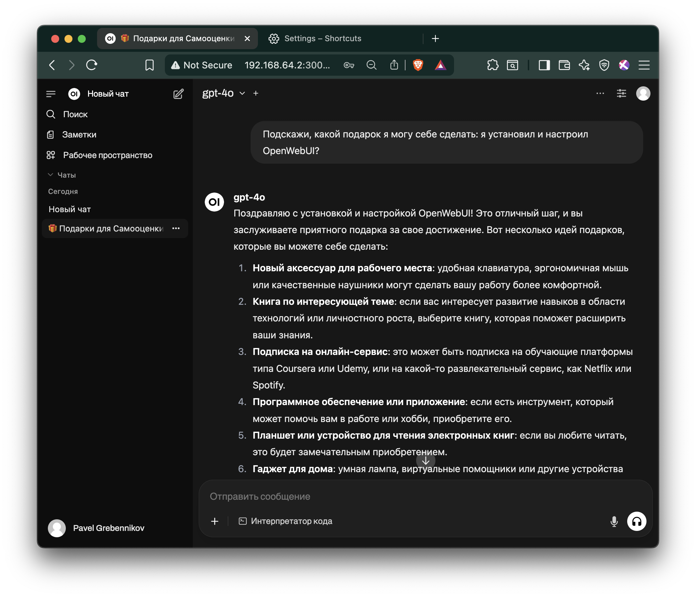
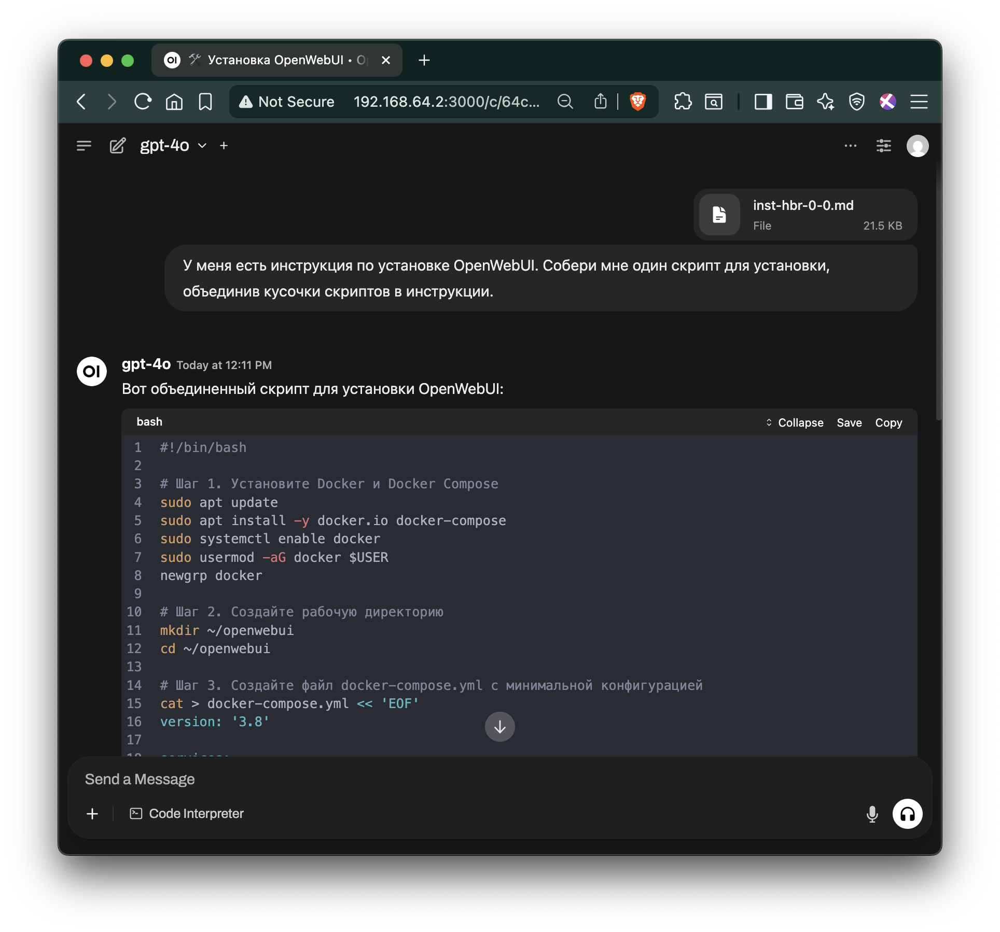

# Глава 1. Быстрый старт ИИ

## 1.0 Содержание

1.1 Введение  
 1.1.1 Для кого эта инструкция  
 1.1.2 Наш опыт  
 1.1.3 Как пользоваться инструкцией  

1.2 Пошаговая установка OpenWebUI  
 1.2.1 Установите Docker и Docker Compose  
 1.2.2 Создайте рабочую директорию  
 1.2.3 Сконфигурируйте docker-compose.yml и Caddy с HTTPS и OAuth с Keycloak  
 1.2.4 Добавьте корпоративную аутентификацию (OAuth)  
  1.2.4.1 Настройка OAuth с Keycloak  
  1.2.4.2 Другие провайдеры (Microsoft AD, Okta, Google Workspace)  
 1.2.5 Запустите контейнеры  
 1.2.6 Откройте веб-интерфейс и зарегистрируйтесь  
 1.2.7 Выполните базовые административные настройки  
  1.2.7.2 Настройка моделей и системных промптов  
 1.2.8 Подключите модели через ai-mediator  

1.3 Результаты установки  
1.4 Скрипт установки OpenWebUI  

---

## 1.1 Введение

Это практическая инструкция по развёртыванию OpenWebUI — корпоративного «ChatGPT» для вашей компании. Другими словами, мы покажем, как создать внутренний AI-чат, доступный всем сотрудникам без ограничений и рисков.

### 1.1.1 Для кого эта инструкция
Для IT-специалистов и системных администраторов, которым нужен быстрый путь к корпоративному AI-решению. Мы сознательно сделали **минимальную версию** для быстрого старта; все дополнительные настройки вынесены в отдельные разделы.

### 1.1.2 Наш опыт
Инструкция основана на реальном проекте в российской IT-компании. Результат — внутренний AI-помощник, который заменил индивидуальные подписки ChatGPT Plus и решил проблемы с:
- **Безопасностью данных** — всё остается внутри компании
- **Удобством работы** — больше не нужно копировать-вставлять между устройствами  
- **Управлением затратами** — одно решение вместо десятков индивидуальных подписок
- **Доступностью** — работает с рабочих ПК без VPN и блокировок

### 1.1.3 Как пользоваться инструкцией
1. **Основной блок** - Глава 1 — базовая установка с HTTPS: 6 шагов + административные настройки.  
2. **Корпоративная аутентификация** - Настройка OAuth для единого входа.  
3. **Расширенные возможности** ... в следующих сериях  ...


Мы писали эту инструкцию с пониманием реальных корпоративных потребностей: когда нужно "просто чтобы работало", но с возможностью масштабирования и усиления безопасности по мере необходимости.

> **Время на базовую установку:** 15–20 мин   
> **Уровень сложности:** начальный (нужны базовые навыки Linux)   
> **Что понадобится:** VM/сервер с Docker, открытые порты 80 и 443 для HTTPS, домен или IP-адрес сервера.
[Подробные требования](https://github.com/open-webui/open-webui/discussions/736#discussioncomment-8474297)  

---

## 1.2 Установка OpenWebUI (пошагово)

**8 шагов до работающего корпоративного ИИ:**

1. **Установите Docker и Docker Compose**  
2. **Создайте рабочую директорию**  
3. **Сконфигурируйте `docker-compose.yml` и Caddy с HTTPS**  
4. **Добавьте корпоративную аутентификацию (OAuth через Keycloak, Google и др.)**  
5. **Запустите контейнеры**  
6. **Откройте веб-интерфейс и зарегистрируйтесь**  
7. **Выполните базовые административные настройки в интерфейсе**  
8. **Подключите модели через ai-mediator и активируйте их для пользователей**

---

### 1.2.1 Установите Docker и Docker Compose

```bash
sudo apt update
sudo apt install -y docker.io docker-compose
sudo systemctl enable docker
sudo usermod -aG docker $USER
newgrp docker
```

---

### 1.2.2 Создайте рабочую директорию

```bash
mkdir ~/openwebui && cd ~/openwebui
```

---
### 1.2.3 Сконфигурируйте docker-compose.yml и Caddy с HTTPS и OAuth с Keycloak

Создайте файл с именем docker-compose.yml: в разделе openwebui: environment: настройте переменные окружения в соответствии с настройками OAuth с Keycloak (см. следующий шаг);
добавьте раздел caddy: с конфигурацией Caddy для автоматического HTTPS  

**docker-compose.yml:**

```bash
cat > docker-compose.yml << 'EOF'
version: '3.8'

services:
  openwebui:
    environment:
      - ENABLE_OAUTH=true
      - OAUTH_PROVIDER=keycloak
      - OAUTH_CLIENT_ID=openwebui
      - OAUTH_CLIENT_SECRET=ваш_секрет_из_keycloak
      - OAUTH_AUTHORIZATION_URL=https://ваш_keycloak/auth/realms/ваш_realm/protocol/openid-connect/auth
      - OAUTH_TOKEN_URL=https://ваш_keycloak/auth/realms/ваш_realm/protocol/openid-connect/token
      - OAUTH_USERINFO_URL=https://ваш_keycloak/auth/realms/ваш_realm/protocol/openid-connect/userinfo
      - ENABLE_OAUTH_SIGNUP=true
      - OAUTH_MERGE_ACCOUNTS_BY_EMAIL=true
    image: ghcr.io/open-webui/open-webui:latest
    container_name: openwebui
    ports:
      - "8080:8080"
    volumes:
      - openwebui-data:/app/backend/data
    restart: unless-stopped
    networks:
      - openwebui-network

  caddy:
    image: caddy:2-alpine
    container_name: caddy
    ports:
      - "80:80"
      - "443:443"
    volumes:
      - ./Caddyfile:/etc/caddy/Caddyfile
      - caddy-data:/data
      - caddy-config:/config
    restart: unless-stopped
    networks:
      - openwebui-network

volumes:
  openwebui-data:
  caddy-data:
  caddy-config:

networks:
  openwebui-network:
    driver: bridge
EOF

# Создайте конфигурационный файл Caddy
cat > Caddyfile << EOF
\${SERVER_ADDRESS} {
    reverse_proxy openwebui:8080
    log {
        output file /var/log/caddy/openwebui.log
        format json
    }
}
EOF

# Проверить, что файлы создались
ls -la docker-compose.yml Caddyfile
```

<details> <summary>Show Output</summary>
  
```console
ubuntu@openwebui-di:~/openwebui$ ls -la docker-compose.yml Caddyfile
-rw-rw-r-- 1 ubuntu docker 138 Aug  5 03:34 Caddyfile
-rw-rw-r-- 1 ubuntu docker 662 Aug  5 03:33 docker-compose.yml
```
  
</details> 

---

### 1.2.4 Добавьте корпоративную аутентификацию (OAuth)

#### 1.2.4.1 Настройка OAuth с Keycloak  
Если у вас есть Keycloak, настройте OAuth аутентификацию:

1. **Создайте клиент в Keycloak:**
   - Войдите в админ-панель Keycloak
   - Перейдите в ваш Realm → Clients → Create
   - **Client ID:** `openwebui`
   - **Client Protocol:** openid-connect
   - **Access Type:** confidential
   - **Valid Redirect URIs:** `https://[адрес сервера]/*`

#### 1.2.4.2 Другие провайдеры (Microsoft AD, Okta, Google Workspace)

Аналогичным образом можно настроить OAuth с другими провайдерами:
- **Microsoft Active Directory** - для корпоративных доменов
- **Okta** - для облачной аутентификации
- **Google Workspace** - для Google-организаций

Конфигурация отличается только URL-адресами и параметрами конкретного провайдера.  

Создайте файл с именем docker-compose.yml: в разделе openwebui: environment: настройте переменные окружения в соответствии с настройками OAuth с Keycloak (см. предыдущий шаг);
добавьте раздел caddy: с конфигурацией Caddy для автоматического HTTPS  

2. ** docker-compose.yml:**

```bash
cat > docker-compose.yml << 'EOF'
version: '3.8'

services:
  openwebui:
    environment:
      - ENABLE_OAUTH=true
      - OAUTH_PROVIDER=keycloak
      - OAUTH_CLIENT_ID=openwebui
      - OAUTH_CLIENT_SECRET=ваш_секрет_из_keycloak
      - OAUTH_AUTHORIZATION_URL=https://ваш_keycloak/auth/realms/ваш_realm/protocol/openid-connect/auth
      - OAUTH_TOKEN_URL=https://ваш_keycloak/auth/realms/ваш_realm/protocol/openid-connect/token
      - OAUTH_USERINFO_URL=https://ваш_keycloak/auth/realms/ваш_realm/protocol/openid-connect/userinfo
      - ENABLE_OAUTH_SIGNUP=true
      - OAUTH_MERGE_ACCOUNTS_BY_EMAIL=true
    image: ghcr.io/open-webui/open-webui:latest
    container_name: openwebui
    ports:
      - "8080:8080"
    volumes:
      - openwebui-data:/app/backend/data
    restart: unless-stopped
    networks:
      - openwebui-network

  caddy:
    image: caddy:2-alpine
    container_name: caddy
    ports:
      - "80:80"
      - "443:443"
    volumes:
      - ./Caddyfile:/etc/caddy/Caddyfile
      - caddy-data:/data
      - caddy-config:/config
    restart: unless-stopped
    networks:
      - openwebui-network

volumes:
  openwebui-data:
  caddy-data:
  caddy-config:

networks:
  openwebui-network:
    driver: bridge
EOF

# Создайте конфигурационный файл Caddy
cat > Caddyfile << EOF
\${SERVER_ADDRESS} {
    reverse_proxy openwebui:8080
    log {
        output file /var/log/caddy/openwebui.log
        format json
    }
}
EOF

# Проверить, что файлы создались
ls -la docker-compose.yml Caddyfile
```

<details> <summary>Show Output</summary>
  
```console
ubuntu@openwebui-di:~/openwebui$ ls -la docker-compose.yml Caddyfile
-rw-rw-r-- 1 ubuntu docker 138 Aug  5 03:34 Caddyfile
-rw-rw-r-- 1 ubuntu docker 662 Aug  5 03:33 docker-compose.yml
```
  
</details> 


---

### 1.2.5 Запустите контейнеры

```bash
docker-compose up -d
```

---

### 1.2.6 Откройте веб-интерфейс и зарегистрируйтесь

Откройте веб-интерфейс: `https://[адрес сервера]`

Замените `[адрес сервера]` на ваш домен или IP-адрес сервера. Caddy автоматически получит SSL-сертификат от Let's Encrypt при первом обращении.

Первый пользователь, который зарегистрируется — станет администратором и сможет выполнить следующие настройки.

---

### 1.2.7 Выполните базовые административные настройки: безопасность и пользователи  

1. **Перейдите в Admin Panel:** Settings → Admin Panel
2. **Настройте безопасность:**
   - **Default User Role:** User (не Pending)
   - **Enable New Users Signup:** выключено

3. **Настройте пользователей:**
   - Перейдите в раздел "Users"
   - Управляйте ролями пользователей (Admin, User, Pending)
   - При необходимости создайте дополнительные административные аккаунты

---

### 1.2.8 Подключите модели через ai-mediator и активируйте их


1. **Войдите как администратор** в веб-интерфейс OpenWebUI
2. **Перейдите в настройки:** Нажмите на иконку профиля → Settings → Admin Panel
3. **Добавьте подключение к ai-mediator:**
   - Откройте раздел "Connections" или "Models"
   - Нажмите "Add OpenAI API"
   - Введите следующие параметры:
     - **API Base URL:** `https://api.ai-mediator.ru/v1`
     - **API Key:** Ваш корпоративный API-ключ созданный в личном кабинете на `https://ai-mediator.ru/`
     - **Model Name:** `claude-4-sonnet`
4. **Сохраните настройки** и проверьте подключение
5. **Активируйте модель для пользователей:**
   - В Admin Panel перейдите в раздел "Models"
   - Найдите модель `claude-4-sonnet` в списке
   - Включите переключатель рядом с ней (статус должен стать "Active")
   - Теперь модель будет доступна всем пользователям в выпадающем списке

**Рекомендуемые модели для добавления:**
- `claude-4-opus` - самая мощная модель Claude
- `gemini-2.5-pro` - Google Gemini Pro
- `gemini-2.5-flash` - быстрая модель Gemini
- `o3` - модель от O1
- `gpt-4o` - OpenAI GPT-4o
- `gpt-4.1-mini` - быстрая модель от OpenAI

#### 1.2.7.2 Настройка моделей и системных промптов  

1. **Добавьте описания для моделей:**
   - В Admin Panel → Models найдите активные модели
   - Нажмите на модель для редактирования
   - Добавьте понятное описание для пользователей
   - Загрузите иконку/логотип модели (не используйте крупные файлы)

2. **Настройте системные промпты:**
   - Для каждой модели можно задать системный промпт
   - Это поможет настроить поведение модели под ваши задачи
> Подробнее о системных промптах: ...В следующих сериях...


6. **Задайте первый вопрос:**
   - В левом боковом меню нажмите "New Chat"
   - В открывшемся чате введите свой первый вопрос и наблюдайте как генерируется ответ.
  
<figure>
  
  <figcaption><strong>Рисунок 1:</strong> Первый вопрос к ИИ</figcaption>
</figure>

Готово! Поздравляем! Теперь у вашей компании есть собственный AI-помощник — полный аналог ChatGPT, но развернутый на внутренних серверах под вашим контролем.

Передайте ссылку сотрудникам для внутреннего использования: `https://[адрес сервера]`


---

## 1.3 Результаты установки

Что получили ваши сотрудники:
AI-помощник для повседневных задач  
   — Генерация текстов, переводы, анализ документов  
   — Помощь с кодом, формулами, презентациями  
   — Быстрые ответы на профессиональные вопросы  

AI-наставник для обучения и развития  
   — Объяснение сложных концепций простым языком  
   — Помощь в изучении новых технологий  
   — Тренировка навыков через интерактивный диалог  

Все это в привычном чат-интерфейсе прямо на рабочем месте — как любой другой внутренний корпоративный портал. Никаких VPN, регистраций или дополнительных приложений.

**Что дальше:** В следующих сериях мы рассмотрим более продвинутые настройки, включая:
- Конфигурацию вариаций моделей в "Рабочем Пространстве"
- Настройку Инструментов (Tools) для расширения возможностей
- Создание Баз Знаний для RAG (Retrieval-Augmented Generation)
- Лучшие практики по управлению системными промптами
- Интеграцию с корпоративными системами

**Забегая вперед:** я хочу иметь один скрипт этой установки, поэтому я скопирую эту инструкцию в чат и попрошу собрать мне такой скрипт.


<figure>
  
  <figcaption><strong>Рисунок 2:</strong> Скрипт установки собран - он нам еще понадобится ...</figcaption>
</figure>

---

## 1.4 Скрипт установки OpenWebUI {#ch-1-install-script}

*(остается, как был — можно вставить ссылку прямо в 1.2 в конце пункта 1.2.8 как «если хотите всё сделать за один раз — см. скрипт»)*


<details>
  <summary>Скрипт установки OpenWebUI</summary>

```bash
#!/bin/bash

# Конфигурация
# Измените значение переменной SERVER_ADDRESS на ваш домен или IP-адрес сервера
SERVER_ADDRESS="[адрес сервера]"  # Например: "openwebui.company.com" или "192.168.1.100"

# Шаг 1. Установите Docker и Docker Compose
sudo apt update
sudo apt install -y docker.io docker-compose
sudo systemctl enable docker
sudo usermod -aG docker $USER
newgrp docker

# Шаг 2. Создайте рабочую директорию
mkdir ~/openwebui
cd ~/openwebui

# Шаг 3. Создайте файл docker-compose.yml с Caddy и HTTPS
cat > docker-compose.yml << 'EOF'
version: '3.8'

services:
  openwebui:
    image: ghcr.io/open-webui/open-webui:latest
    container_name: openwebui
    ports:
      - "8080:8080"
    volumes:
      - openwebui-data:/app/backend/data
    restart: unless-stopped
    networks:
      - openwebui-network

  caddy:
    image: caddy:2-alpine
    container_name: caddy
    ports:
      - "80:80"
      - "443:443"
    volumes:
      - ./Caddyfile:/etc/caddy/Caddyfile
      - caddy-data:/data
      - caddy-config:/config
    restart: unless-stopped
    networks:
      - openwebui-network

volumes:
  openwebui-data:
  caddy-data:
  caddy-config:

networks:
  openwebui-network:
    driver: bridge
EOF

# Создайте конфигурационный файл Caddy
cat > Caddyfile << EOF
\${SERVER_ADDRESS} {
    reverse_proxy openwebui:8080
    log {
        output file /var/log/caddy/openwebui.log
        format json
    }
}
EOF

# Проверка создания файлов
ls -la docker-compose.yml Caddyfile

# Шаг 4. Запустите контейнеры
docker-compose up -d

# Шаг 5. Откройте веб-интерфейс
echo "Open the web interface at: https://${SERVER_ADDRESS}"
echo "Первый пользователь, который зарегистрируется — станет администратором."

# Пошаговые инструкции заканчиваются здесь.
echo "Скрипт завершен. Теперь вы можете открыть веб-интерфейс и продолжить с настройкой моделей."
```

</details><br> 
