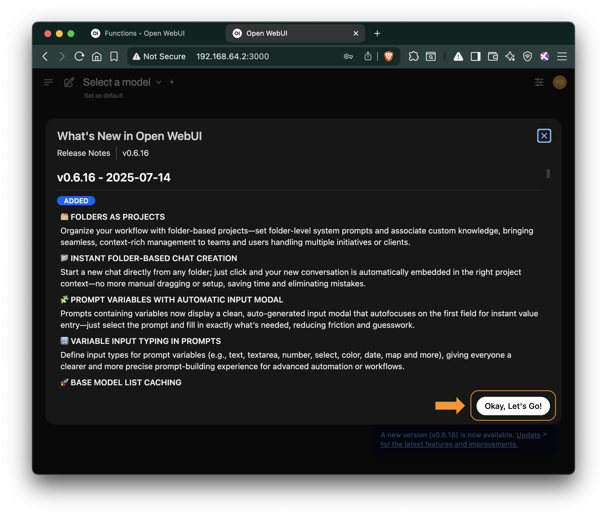

# Глава 1. Быстрый старт ИИ

## 1.0 Содержание

1.1 Введение  
 1.1.1 Для кого эта инструкция  
 1.1.2 Наш опыт  
 1.1.3 Как пользоваться инструкцией  

1.2 Пошаговая установка OpenWebUI  
 1.2.1 Установите Docker и Docker Compose  
 1.2.2 Установите системное время: часовой пояс Москва  
 1.2.3 Создайте рабочую директорию  
 1.2.4 Добавьте корпоративную аутентификацию (OAuth)  
  1.2.4.1 Настройка OAuth с Keycloak  
  1.2.4.2 Другие провайдеры (Microsoft AD, Okta, Google Workspace)  
  1.2.4.3 Создайте файл ocker-compose.yml  
 1.2.5 Запустите контейнеры  
 1.2.6 Откройте веб-интерфейс и зарегистрируйтесь  
 1.2.7 Выполните базовые административные настройки
 1.2.8 Подключите модели через ai-mediator и активируйте их  
  1.2.8.1 Настройка моделей  

1.3 Результаты установки  
1.4 Скрипт установки OpenWebUI  

---

## 1.1 Введение

Это практическая инструкция по развёртыванию OpenWebUI — корпоративного «ChatGPT» для вашей компании. Другими словами, мы покажем, как создать внутренний AI-чат, доступный всем сотрудникам без ограничений и рисков.

### 1.1.1 Для кого эта инструкция
Для IT-специалистов и системных администраторов, которым нужен быстрый путь к корпоративному AI-решению. Мы сознательно сделали **минимальную версию** для быстрого старта; все дополнительные настройки вынесены в отдельные разделы.

### 1.1.2 Наш опыт
Инструкция основана на реальном проекте в российской IT-компании. Результат — внутренний AI-помощник, который заменил индивидуальные подписки ChatGPT Plus и решил проблемы с:
- **Безопасностью данных** — всё остается внутри компании
- **Удобством работы** — больше не нужно копировать-вставлять между устройствами  
- **Управлением затратами** — одно решение вместо десятков индивидуальных подписок
- **Доступностью** — работает с рабочих ПК без VPN и блокировок

### 1.1.3 Как пользоваться инструкцией
1. **Основной блок** - Глава 1 — базовая установка с HTTPS: 6 шагов + административные настройки.  
2. **Корпоративная аутентификация** - Настройка OAuth для единого входа.  
3. **Расширенные возможности** ... в следующих сериях  ...


Мы писали эту инструкцию с пониманием реальных корпоративных потребностей: когда нужно "просто чтобы работало", но с возможностью масштабирования и усиления безопасности по мере необходимости.

> **Время на базовую установку:** 15–20 мин   
> **Уровень сложности:** начальный (нужны базовые навыки Linux)   
> **Что понадобится:** VM/сервер с Docker, открытые порты 80 и 443 для HTTPS, домен или IP-адрес сервера.
[Подробные требования](https://github.com/open-webui/open-webui/discussions/736#discussioncomment-8474297)  

---

## 1.2 Установка OpenWebUI (пошагово)

**8 шагов до работающего корпоративного ИИ:**

1. **Установите Docker и Docker Compose**  
2. **Создайте рабочую директорию**  
3. **Сконфигурируйте `docker-compose.yml` и Caddy с HTTPS**  
4. **Добавьте корпоративную аутентификацию (OAuth через Keycloak, Google и др.)**  
5. **Запустите контейнеры**  
6. **Откройте веб-интерфейс и зарегистрируйтесь**  
7. **Выполните базовые административные настройки в интерфейсе**  
8. **Подключите модели через ai-mediator и активируйте их для пользователей**

---

### 1.2.1 Установите Docker и Docker Compose

```bash
sudo apt update
sudo apt install -y docker.io docker-compose
sudo systemctl enable docker
sudo usermod -aG docker $USER
newgrp docker
```

```console
Hit:1 http://security.ubuntu.com/ubuntu noble-security InRelease
Hit:2 http://archive.ubuntu.com/ubuntu noble InRelease
Get:3 http://archive.ubuntu.com/ubuntu noble-updates InRelease [126 kB]
Hit:4 http://archive.ubuntu.com/ubuntu noble-backports InRelease
Fetched 126 kB in 1s (138 kB/s)
Reading package lists... Done
Building dependency tree... Done
Reading state information... Done
... more 237 lines ...
```

---

### 1.2.2 Установите системное время: часовой пояс Москва 

```bash
# Устанавливаем часовой пояс на Москву
sudo timedatectl set-timezone Europe/Moscow
# Проверяем текущий часовой пояс
timedatectl
```

```bash
               Local time: Tue 2025-08-05 20:03:05 MSK
           Universal time: Tue 2025-08-05 17:03:05 UTC
                 RTC time: Tue 2025-08-05 17:03:05
                Time zone: Europe/Moscow (MSK, +0300)
System clock synchronized: yes
              NTP service: active
          RTC in local TZ: no
```


---

### 1.2.3 Создайте рабочую директорию

```bash
mkdir ~/openwebui && cd ~/openwebui
```

---

### 1.2.4 Добавьте корпоративную аутентификацию (OAuth)

#### 1.2.4.1 Настройка OAuth с Keycloak  
Если у вас есть Keycloak, настройте OAuth аутентификацию:

1. **Создайте клиент в Keycloak:**
   - Войдите в админ-панель Keycloak
   - Перейдите в ваш Realm → Clients → Create
   - **Client ID:** `openwebui`
   - **Client Protocol:** openid-connect
   - **Access Type:** confidential
   - **Valid Redirect URIs:** `https://[адрес сервера]/*`

#### 1.2.4.2 Другие провайдеры (Microsoft AD, Okta, Google Workspace)

Аналогичным образом можно настроить OAuth с другими провайдерами:
- **Microsoft Active Directory** - для корпоративных доменов
- **Okta** - для облачной аутентификации
- **Google Workspace** - для Google-организаций

Конфигурация отличается только URL-адресами и параметрами конкретного провайдера.  

#### 1.2.4.3 Создайте файл docker-compose.yml

Создайте файл с именем docker-compose.yml:
-  в разделе openwebui: environment: настройте переменные окружения в соответствии с настройками OAuth с Keycloak (см. предыдущий шаг - 1.2.4.1 Настройка OAuth с Keycloak  );
- добавьте раздел caddy: с конфигурацией Caddy для автоматического HTTPS  


```bash
cat > docker-compose.yml << 'EOF'
version: '3.8'

services:
  openwebui:
    environment:
      - ENABLE_OAUTH=true
      - OAUTH_PROVIDER=keycloak
      - OAUTH_CLIENT_ID=openwebui
      - OAUTH_CLIENT_SECRET=ваш_секрет_из_keycloak
      - OAUTH_AUTHORIZATION_URL=https://ваш_keycloak/auth/realms/ваш_realm/protocol/openid-connect/auth
      - OAUTH_TOKEN_URL=https://ваш_keycloak/auth/realms/ваш_realm/protocol/openid-connect/token
      - OAUTH_USERINFO_URL=https://ваш_keycloak/auth/realms/ваш_realm/protocol/openid-connect/userinfo
      - ENABLE_OAUTH_SIGNUP=true
      - OAUTH_MERGE_ACCOUNTS_BY_EMAIL=true
    image: ghcr.io/open-webui/open-webui:latest
    container_name: openwebui
    ports:
      - "8080:8080"
    volumes:
      - openwebui-data:/app/backend/data
    restart: unless-stopped
    networks:
      - openwebui-network

  caddy:
    image: caddy:2-alpine
    container_name: caddy
    ports:
      - "80:80"
      - "443:443"
    volumes:
      - ./Caddyfile:/etc/caddy/Caddyfile
      - caddy-data:/data
      - caddy-config:/config
    restart: unless-stopped
    networks:
      - openwebui-network

volumes:
  openwebui-data:
  caddy-data:
  caddy-config:

networks:
  openwebui-network:
    driver: bridge
EOF

# Создайте конфигурационный файл Caddy
cat > Caddyfile << EOF
\${SERVER_ADDRESS} {
    reverse_proxy openwebui:8080
    log {
        output file /var/log/caddy/openwebui.log
        format json
    }
}
EOF

# Проверить, что файлы создались
ls -la docker-compose.yml Caddyfile
```


  
```console
ubuntu@openwebui-di:~/openwebui$ ls -la docker-compose.yml Caddyfile
-rw-rw-r-- 1 ubuntu docker 138 Aug  5 03:34 Caddyfile
-rw-rw-r-- 1 ubuntu docker 662 Aug  5 03:33 docker-compose.yml
```
  


---

### 1.2.5 Запустите контейнеры

```bash
docker-compose up -d
```

```console
Creating network "openwebui-network" with the default driver
Creating volume "openwebui_openwebui-data" with default driver
Pulling openwebui (ghcr.io/open-webui/open-webui:latest)...
... more 34 lines ...
Creating openwebui ... done
```

---

### 1.2.6 Откройте веб-интерфейс и зарегистрируйтесь

Откройте веб-интерфейс: `https://[адрес сервера]`

Замените `[адрес сервера]` на ваш домен или IP-адрес сервера. Caddy автоматически получит SSL-сертификат от Let's Encrypt при первом обращении.

Первый пользователь, который зарегистрируется — станет администратором и сможет выполнить следующие настройки.

<figure>
  
  <figcaption><strong>Рисунок 1: </strong>Веб-интерфейс OpenWebUI - Что нового?</figcaption>
</figure>

---

### 1.2.7 Выполните базовые административные настройки

1. **Перейдите в Admin Panel:** Settings → Admin Panel
2. **Настройте безопасность:**
   - **Default User Role:** User (не Pending)
   - **Enable New Users Signup:** выключено


<figure>
  
  <figcaption><strong>Рисунок 2: </strong>Настройка безопасности</figcaption>
</figure>

3. **Настройте пользователей:**
   - Перейдите в раздел "Users"
   - Управляйте ролями пользователей (Admin, User, Pending)
   - При необходимости создайте дополнительные административные аккаунты

---

### 1.2.8 Подключите модели через ai-mediator и активируйте их


1. **Войдите как администратор** в веб-интерфейс OpenWebUI
2. **Перейдите в настройки:** Нажмите на иконку профиля → Settings → Admin Panel
3. **Добавьте подключение к ai-mediator.ru:**
   - Откройте раздел "Connections" или "Models"
   - Нажмите "Add OpenAI API"
   - Введите следующие параметры:
     - **API Base URL:** `https://api.ai-mediator.ru/v1`
     - **API Key:** Ваш корпоративный API-ключ созданный в личном кабинете на `https://ai-mediator.ru/`
     - **Model Name:** `claude-4-sonnet`
4. **Сохраните настройки** и проверьте подключение

<figure>
  
  <figcaption><strong>Рисунок 3: </strong>Тип подключения: OpenAI-совместимый API ...</figcaption>
</figure>

<figure>
  
  <figcaption><strong>Рисунок 4: </strong>Подключение к ai-mediator.ru, добавление нескольких моделей...</figcaption>
</figure>

5. **Активируйте модель для пользователей:**
   - В Admin Panel перейдите в раздел "Models"
   - Найдите модель `claude-4-sonnet` в списке
   - Включите переключатель рядом с ней (статус должен стать "Active")
   - Теперь модель будет доступна всем пользователям в выпадающем списке


**Рекомендуемые модели для добавления:**
- `claude-4-opus` - самая мощная модель Claude
- `gemini-2.5-pro` - Google Gemini Pro
- `gemini-2.5-flash` - быстрая модель Gemini
- `o3` - модель от O1
- `gpt-4o` - OpenAI GPT-4o
- `gpt-4.1-mini` - быстрая модель от OpenAI

#### 1.2.8.1 Настройка моделей

1. **Добавьте описания для моделей:**
   - В Admin Panel → Models найдите активные модели
   - Нажмите на модель для редактирования
   - Добавьте понятное описание для пользователей
   - Загрузите иконку/логотип модели (не используйте тяжелые файлы)

2. **Настройте системные промпты:**
   - Для каждой модели можно задать системный промпт
   - Это поможет настроить поведение модели под ваши задачи
> Подробнее о системных промптах: ...В следующих сериях...


<figure>
  
  <figcaption><strong>Рисунок 5: </strong> Название и описание моделей для пользователей</figcaption>
</figure>

3. **Задайте первый вопрос:**
   - В левом боковом меню нажмите "New Chat"
   - В открывшемся чате введите свой первый вопрос и наблюдайте как генерируется ответ.
  
<figure>
  
  <figcaption><strong>Рисунок 6: </strong> Первый вопрос к ИИ</figcaption>
</figure>

Готово! Поздравляем! Теперь у вашей компании есть собственный AI-помощник — полный аналог ChatGPT, но развернутый на внутренних серверах под вашим контролем.

Передайте ссылку сотрудникам для внутреннего использования: `https://[адрес сервера]`


---

## 1.3 Результаты установки

Что получили ваши сотрудники:
AI-помощник для повседневных задач  
   — Генерация текстов, переводы, анализ документов  
   — Помощь с кодом, формулами, презентациями  
   — Быстрые ответы на профессиональные вопросы  

AI-наставник для обучения и развития  
   — Объяснение сложных концепций простым языком  
   — Помощь в изучении новых технологий  
   — Тренировка навыков через интерактивный диалог  

Все это в привычном чат-интерфейсе прямо на рабочем месте — как любой другой внутренний корпоративный портал. Никаких VPN, регистраций или дополнительных приложений.

**Что дальше:** В следующих сериях мы рассмотрим более продвинутые настройки, включая:
- Конфигурацию вариаций моделей в "Рабочем Пространстве"
- Лучшие практики по управлению системными промптами и контекстом моделей
- Настройку Инструментов (Tools) для расширения возможностей
- Создание Баз Знаний для RAG (Retrieval-Augmented Generation)
- Интеграцию с корпоративными системами

**Забегая вперед:** я хочу иметь один скрипт этой установки, поэтому я скопирую эту инструкцию в чат и попрошу собрать мне такой скрипт.


<figure>
  
  <figcaption><strong>Рисунок 7: </strong> Скрипт установки собран - он нам еще понадобится ...</figcaption>
</figure>

---

## 1.4 Скрипт установки OpenWebUI 


<details>
  <summary>Скрипт установки OpenWebUI</summary>

На основе вашей инструкции создам полный скрипт установки OpenWebUI с подробными комментариями:

```bash
#!/bin/bash

# ============================================
# Скрипт установки OpenWebUI
# Версия: 1.0
# Описание: Автоматическая установка корпоративного AI-чата
# ============================================

# ============================================
# КОНФИГУРАЦИОННЫЕ ПАРАМЕТРЫ
# Измените эти значения перед запуском скрипта
# ============================================

# Основные параметры
SERVER_ADDRESS="your-domain.com"  # Домен или IP-адрес сервера (например: openwebui.company.com)

# OAuth параметры (оставьте пустыми если не используете OAuth)
ENABLE_OAUTH="false"  # true/false - включить OAuth аутентификацию
OAUTH_PROVIDER="keycloak"  # keycloak/google/microsoft/okta
OAUTH_CLIENT_ID="openwebui"
OAUTH_CLIENT_SECRET=""  # Секретный ключ из вашего OAuth провайдера
OAUTH_KEYCLOAK_URL=""  # URL вашего Keycloak сервера (например: https://keycloak.company.com)
OAUTH_REALM=""  # Название realm в Keycloak

# Цвета для вывода
GREEN='\033[0;32m'
BLUE='\033[0;34m'
YELLOW='\033[1;33m'
RED='\033[0;31m'
NC='\033[0m' # No Color

# ============================================
# ФУНКЦИИ
# ============================================

print_step() {
    echo -e "\n${BLUE}==>${NC} $1"
}

print_success() {
    echo -e "${GREEN}✓${NC} $1"
}

print_warning() {
    echo -e "${YELLOW}⚠${NC} $1"
}

print_error() {
    echo -e "${RED}✗${NC} $1"
}

check_root() {
    if [[ $EUID -eq 0 ]]; then
        print_error "Этот скрипт не должен запускаться от root!"
        exit 1
    fi
}

# ============================================
# НАЧАЛО УСТАНОВКИ
# ============================================

clear
echo -e "${BLUE}╔══════════════════════════════════════════╗${NC}"
echo -e "${BLUE}║     Установка OpenWebUI - AI для всех    ║${NC}"
echo -e "${BLUE}╚══════════════════════════════════════════╝${NC}"
echo ""
echo "Этот скрипт установит:"
echo "• Docker и Docker Compose"
echo "• OpenWebUI - веб-интерфейс для AI"
echo "• Caddy - веб-сервер с автоматическим HTTPS"
if [[ "$ENABLE_OAUTH" == "true" ]]; then
    echo "• OAuth аутентификацию через $OAUTH_PROVIDER"
fi
echo ""
echo "Сервер будет доступен по адресу: https://$SERVER_ADDRESS"
echo ""
read -p "Продолжить установку? (y/n): " -n 1 -r
echo
if [[ ! $REPLY =~ ^[Yy]$ ]]; then
    exit 1
fi

# Проверка запуска не от root
check_root

# ============================================
# ШАГ 1: УСТАНОВКА DOCKER
# ============================================

print_step "Шаг 1: Установка Docker и Docker Compose"
echo "Docker позволит запускать приложения в изолированных контейнерах"

# Обновление пакетов
print_step "Обновление списка пакетов..."
sudo apt update

# Установка Docker
if command -v docker &> /dev/null; then
    print_success "Docker уже установлен (версия: $(docker --version))"
else
    print_step "Установка Docker..."
    sudo apt install -y docker.io
    print_success "Docker установлен"
fi

# Установка Docker Compose
if command -v docker-compose &> /dev/null; then
    print_success "Docker Compose уже установлен (версия: $(docker-compose --version))"
else
    print_step "Установка Docker Compose..."
    sudo apt install -y docker-compose
    print_success "Docker Compose установлен"
fi

# Настройка Docker
print_step "Настройка Docker..."
sudo systemctl enable docker
print_success "Docker добавлен в автозагрузку"

# Добавление пользователя в группу docker
if groups $USER | grep -q '\bdocker\b'; then
    print_success "Пользователь уже в группе docker"
else
    print_step "Добавление пользователя в группу docker..."
    sudo usermod -aG docker $USER
    print_warning "Добавлен в группу docker. Может потребоваться перелогиниться"
fi

# ============================================
# ШАГ 2: НАСТРОЙКА ВРЕМЕНИ
# ============================================

print_step "Шаг 2: Настройка системного времени"
echo "Установка часового пояса на Москву для корректной работы логов"

sudo timedatectl set-timezone Europe/Moscow
print_success "Часовой пояс установлен: $(timedatectl | grep "Time zone" | awk '{print $3, $4}')"

# ============================================
# ШАГ 3: СОЗДАНИЕ РАБОЧЕЙ ДИРЕКТОРИИ
# ============================================

print_step "Шаг 3: Создание рабочей директории"
echo "Все файлы конфигурации будут храниться в ~/openwebui"

if [ -d ~/openwebui ]; then
    print_warning "Директория ~/openwebui уже существует"
    read -p "Продолжить и перезаписать файлы? (y/n): " -n 1 -r
    echo
    if [[ ! $REPLY =~ ^[Yy]$ ]]; then
        exit 1
    fi
else
    mkdir ~/openwebui
    print_success "Создана директория ~/openwebui"
fi

cd ~/openwebui

# ============================================
# ШАГ 4: СОЗДАНИЕ КОНФИГУРАЦИИ
# ============================================

print_step "Шаг 4: Создание конфигурационных файлов"
echo "Создаем docker-compose.yml и Caddyfile для автоматического HTTPS"

# Создание docker-compose.yml
print_step "Создание docker-compose.yml..."

if [[ "$ENABLE_OAUTH" == "true" ]]; then
    # Версия с OAuth
    cat > docker-compose.yml << EOF
version: '3.8'

services:
  openwebui:
    image: ghcr.io/open-webui/open-webui:latest
    container_name: openwebui
    environment:
      - ENABLE_OAUTH=true
      - OAUTH_PROVIDER=$OAUTH_PROVIDER
      - OAUTH_CLIENT_ID=$OAUTH_CLIENT_ID
      - OAUTH_CLIENT_SECRET=$OAUTH_CLIENT_SECRET
EOF

    # Добавляем URL-ы в зависимости от провайдера
    if [[ "$OAUTH_PROVIDER" == "keycloak" ]]; then
        cat >> docker-compose.yml << EOF
      - OAUTH_AUTHORIZATION_URL=$OAUTH_KEYCLOAK_URL/auth/realms/$OAUTH_REALM/protocol/openid-connect/auth
      - OAUTH_TOKEN_URL=$OAUTH_KEYCLOAK_URL/auth/realms/$OAUTH_REALM/protocol/openid-connect/token
      - OAUTH_USERINFO_URL=$OAUTH_KEYCLOAK_URL/auth/realms/$OAUTH_REALM/protocol/openid-connect/userinfo
EOF
    fi

    cat >> docker-compose.yml << EOF
      - ENABLE_OAUTH_SIGNUP=true
      - OAUTH_MERGE_ACCOUNTS_BY_EMAIL=true
    ports:
      - "8080:8080"
    volumes:
      - openwebui-data:/app/backend/data
    restart: unless-stopped
    networks:
      - openwebui-network
EOF
else
    # Версия без OAuth
    cat > docker-compose.yml << EOF
version: '3.8'

services:
  openwebui:
    image: ghcr.io/open-webui/open-webui:latest
    container_name: openwebui
    ports:
      - "8080:8080"
    volumes:
      - openwebui-data:/app/backend/data
    restart: unless-stopped
    networks:
      - openwebui-network
EOF
fi

# Добавляем службу Caddy
cat >> docker-compose.yml << EOF

  caddy:
    image: caddy:2-alpine
    container_name: caddy
    ports:
      - "80:80"
      - "443:443"
    volumes:
      - ./Caddyfile:/etc/caddy/Caddyfile
      - caddy-data:/data
      - caddy-config:/config
    environment:
      - SERVER_ADDRESS=$SERVER_ADDRESS
    restart: unless-stopped
    networks:
      - openwebui-network

volumes:
  openwebui-data:
  caddy-data:
  caddy-config:

networks:
  openwebui-network:
    driver: bridge
EOF

print_success "docker-compose.yml создан"

# Создание Caddyfile
print_step "Создание Caddyfile..."
cat > Caddyfile << 'EOF'
{$SERVER_ADDRESS} {
    reverse_proxy openwebui:8080
    log {
        output file /var/log/caddy/openwebui.log
        format json
    }
}
EOF

print_success "Caddyfile создан"

# Проверка файлов
print_step "Проверка созданных файлов..."
ls -la docker-compose.yml Caddyfile
print_success "Конфигурационные файлы готовы"

# ============================================
# ШАГ 5: ЗАПУСК КОНТЕЙНЕРОВ
# ============================================

print_step "Шаг 5: Запуск контейнеров"
echo "Docker загрузит образы и запустит OpenWebUI и Caddy"

print_step "Проверка Docker..."
if ! docker info &> /dev/null; then
    print_warning "Docker daemon не запущен. Запускаем..."
    sudo systemctl start docker
    sleep 2
fi

print_step "Запуск контейнеров (это может занять несколько минут)..."
docker-compose up -d

# Проверка статуса
print_step "Проверка статуса контейнеров..."
sleep 5
docker-compose ps

# ============================================
# ЗАВЕРШЕНИЕ УСТАНОВКИ
# ============================================

echo ""
echo -e "${GREEN}╔══════════════════════════════════════════╗${NC}"
echo -e "${GREEN}║        Установка успешно завершена!      ║${NC}"
echo -e "${GREEN}╚══════════════════════════════════════════╝${NC}"
echo ""
echo -e "${BLUE}Что дальше:${NC}"
echo ""
echo "1. Откройте браузер и перейдите по адресу:"
echo -e "   ${GREEN}https://$SERVER_ADDRESS${NC}"
echo ""
echo "2. Зарегистрируйте первого пользователя"
echo "   ${YELLOW}Важно: первый зарегистрированный пользователь становится администратором!${NC}"
echo ""
echo "3. Настройте подключение к AI моделям:"
echo "   • Войдите в Admin Panel"
echo "   • Добавьте API подключение (например, ai-mediator.ru)"
echo "   • Активируйте нужные модели"
echo ""
echo -e "${BLUE}Полезные команды:${NC}"
echo "• Просмотр логов: docker-compose logs -f"
echo "• Остановка: docker-compose down"
echo "• Перезапуск: docker-compose restart"
echo "• Обновление: docker-compose pull && docker-compose up -d"
echo ""

if [[ "$ENABLE_OAUTH" == "true" ]]; then
    echo -e "${YELLOW}OAuth настроен для $OAUTH_PROVIDER${NC}"
    echo "Пользователи смогут входить через корпоративную учетную запись"
    echo ""
fi

print_warning "Если вы добавляли текущего пользователя в группу docker,"
print_warning "может потребоваться выйти и зайти снова или выполнить: newgrp docker"

echo ""
echo "Документация: https://github.com/open-webui/open-webui"
echo ""
```

Этот скрипт:

1. **Вынес все настраиваемые параметры в начало** - достаточно изменить только их
2. **Подробно комментирует каждый шаг** - пользователь видит, что происходит
3. **Использует цветной вывод** - для лучшей читаемости
4. **Проверяет условия** - не запускается от root, проверяет установленные компоненты
5. **Поддерживает OAuth** - автоматически настраивает если включено
6. **Дает инструкции после установки** - что делать дальше

Для запуска:
```bash
chmod +x install-openwebui.sh
./install-openwebui.sh
```

Перед запуском обязательно измените `SERVER_ADDRESS` и при необходимости настройте OAuth параметры в начале скрипта [1].
</details><br> 
