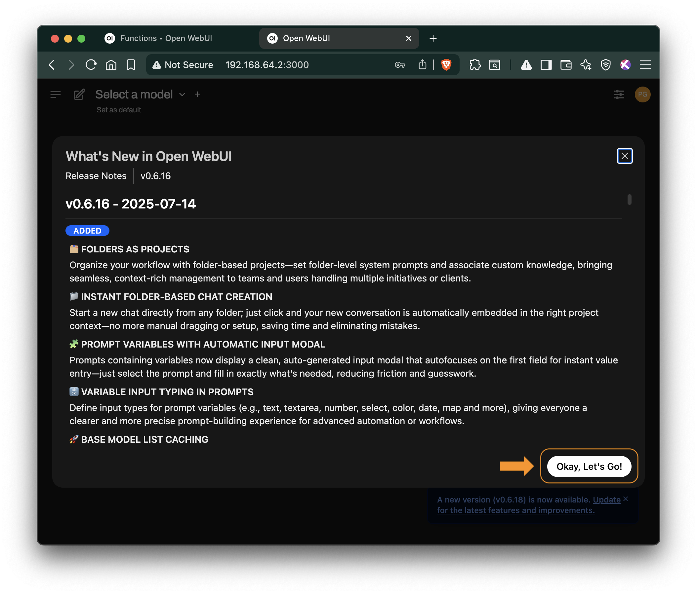
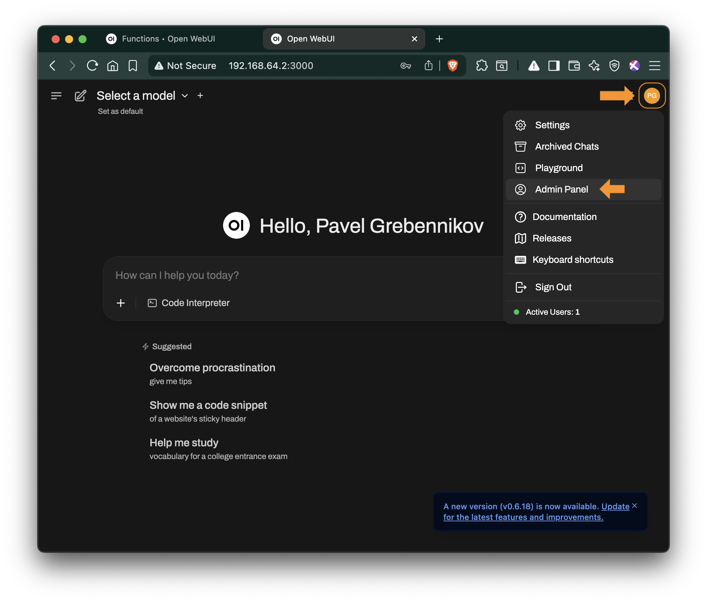
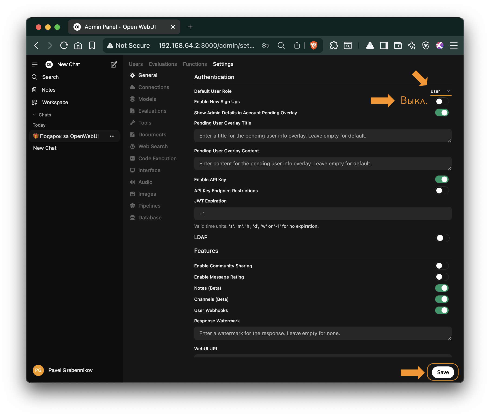
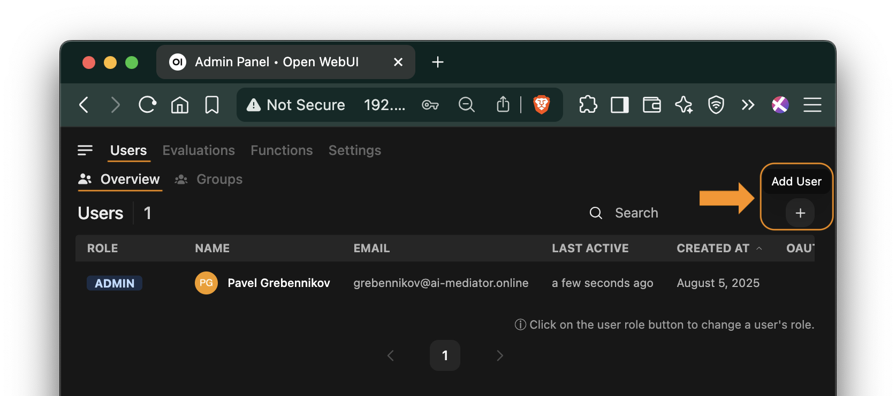
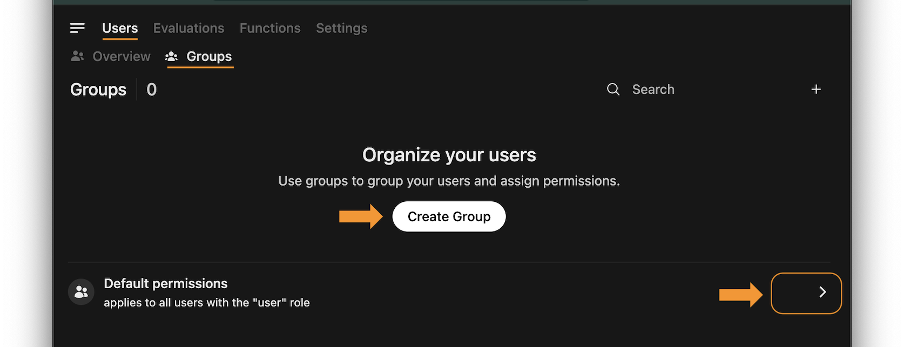
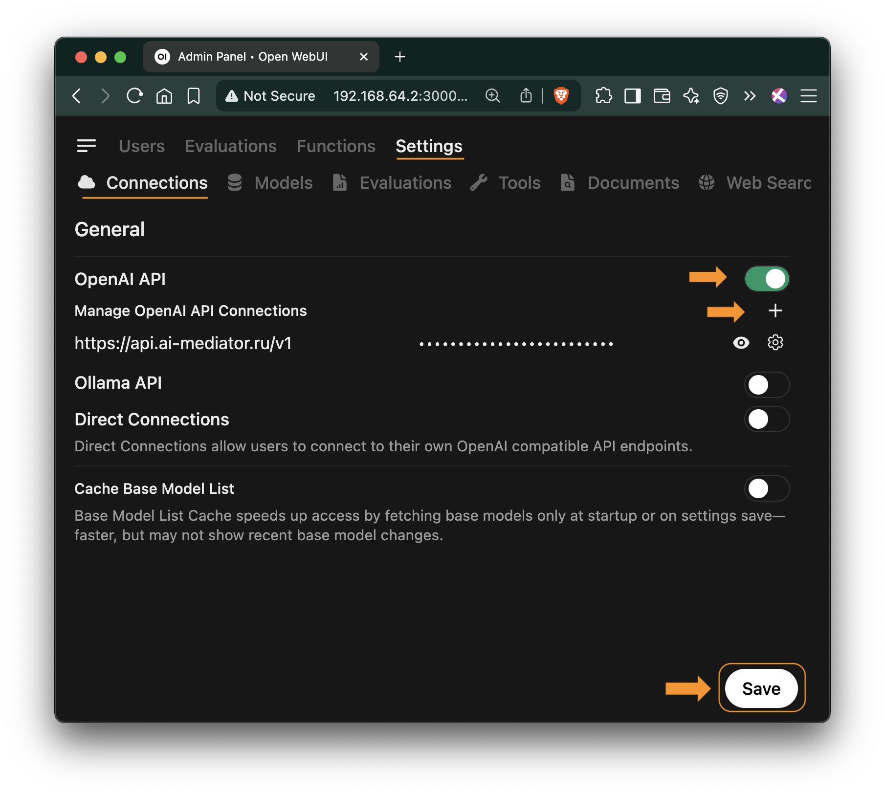
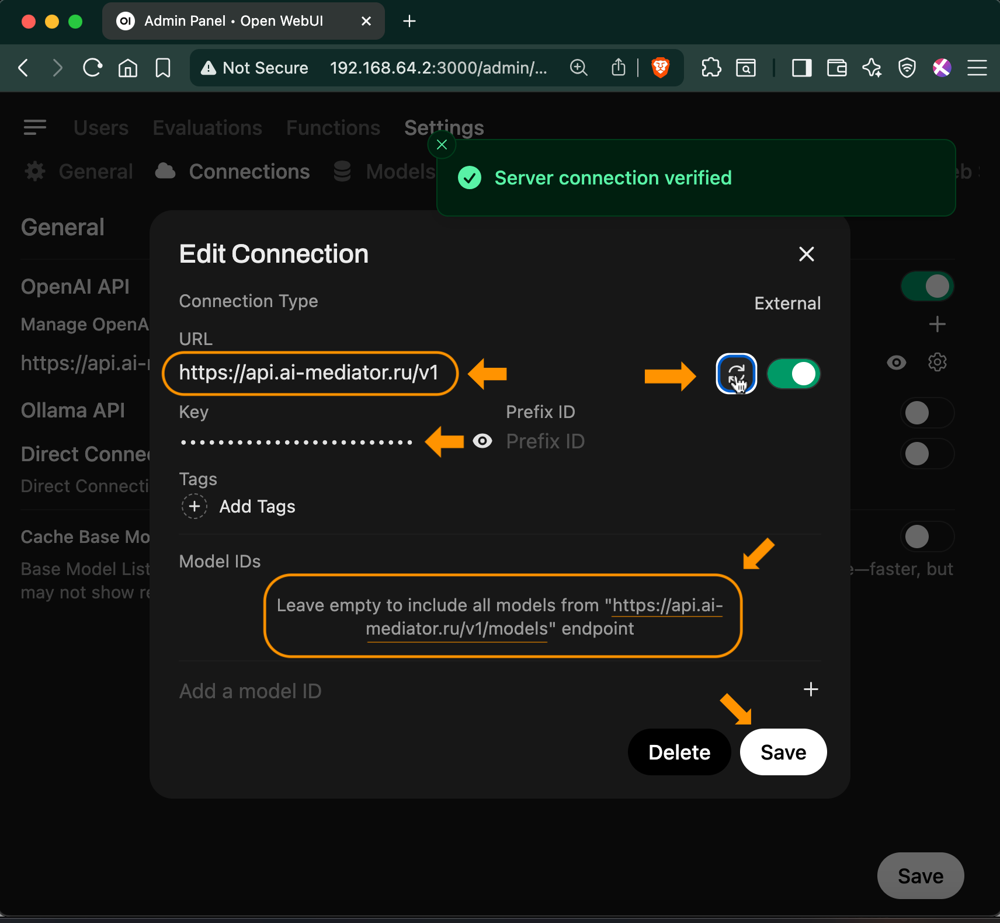
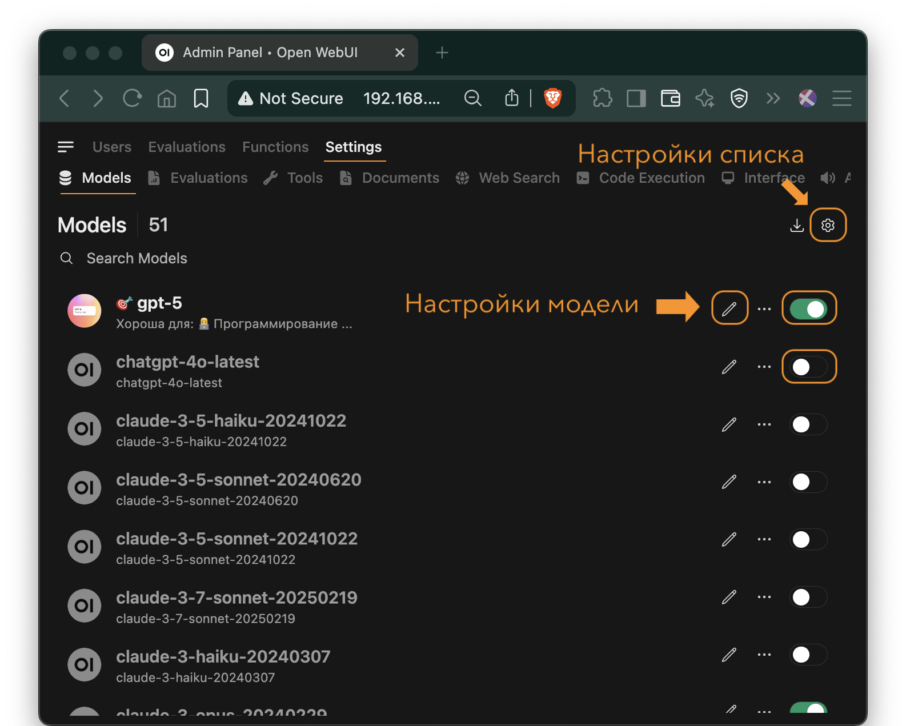
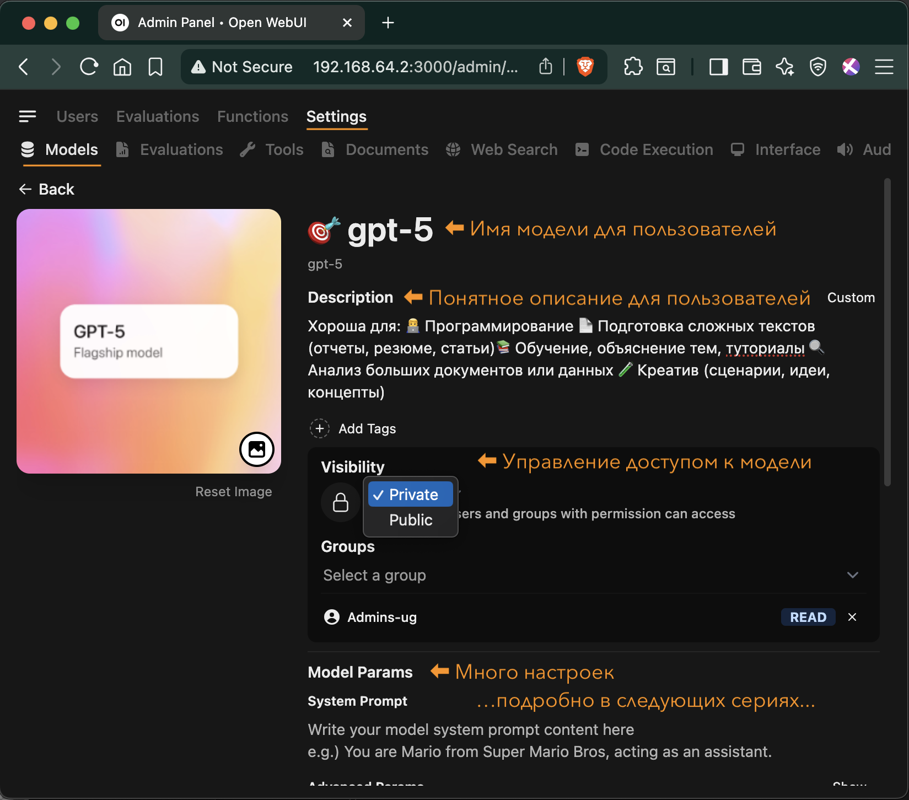
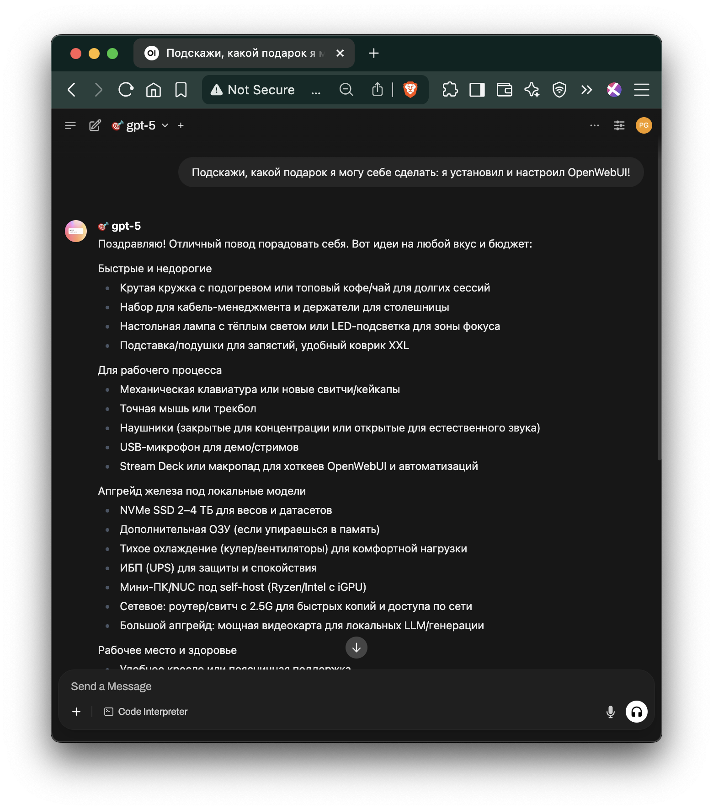

# Быстрый старт ИИ

## Содержание

1. Введение  
 1.1 Для кого эта инструкция  
 1.2 Наш опыт  

2. Установка OpenWebUI (пошагово)  
 2.1 Установите Docker и Docker Compose  
 2.2 Установите системное время: часовой пояс  
 2.3 Создайте рабочую директорию  
 2.4 Запустите контейнеры  
 2.5 Откройте веб-интерфейс и зарегистрируйте первого пользователя-администратора  
 2.6 Выполните базовые административные настройки  
 2.7 Подключите модели через ai-mediator и активируйте их  
  2.7.1 Войдите как администратор в OpenWebUI  
  2.7.2 Добавьте подключение к ai-mediator.ru  
  2.7.3 Сохраните настройки и проверьте подключение  
  2.7.4 Управление доступными моделями  
  2.7.5 Настройка моделей  
  2.7.6 Задайте первый вопрос  

3. Что дальше  

---

## 1. Введение

Это практическая инструкция по развёртыванию OpenWebUI — корпоративного «ChatGPT» для вашей компании. Мы покажем, как создать внутренний AI-чат, доступный всем сотрудникам без ограничений и рисков.

### 1.1 Для кого эта инструкция
Для IT-специалистов и системных администраторов, которым нужен быстрый путь к корпоративному AI-решению. Мы сознательно сделали минимальную версию для быстрого старта; все дополнительные настройки вынесены в отдельные статьи - следующие серии, которых пока что набралось еще две.

### 1.2 Наш опыт
Инструкция основана на реальном проекте в российской IT-компании. Результат — внутренний AI-помощник, который заменил индивидуальные подписки ChatGPT Plus и решил проблемы с:

- **Безопасностью данных** — всё остается внутри компании;
- **Удобством работы** — больше не нужно копировать-вставлять из приложения в приложение, а часто и между устройствами;
- **Управлением затратами** — одно решение вместо десятков индивидуальных подписок;
- **Доступностью** — на всех рабочих ПК без VPN и блокировок.

Мы писали эту инструкцию с пониманием реальных корпоративных потребностей: когда нужно "просто чтобы работало", но при этом не стало дырой в безопасноси, ну и чтобы были возможности масштабирования и усиления безопасности по мере необходимости.

> **Время на базовую установку:** 15–20 мин   
> **Уровень сложности:** начальный (нужны базовые навыки Linux)   
> **Что понадобится:** VM/сервер с Docker, открытые порты 80 и 443 для HTTPS, домен или IP-адрес сервера.
[Подробные требования](https://github.com/open-webui/open-webui/discussions/736#discussioncomment-8474297)  

---

## 2. Установка OpenWebUI (пошагово)

**7 шагов до работающего корпоративного ИИ:**

1. **Установите Docker и Docker Compose**  
2. **Установите системное время: часовой пояс**  
3. **Создайте рабочую директорию**  
4. **Запустите контейнеры**  
5. **Откройте веб-интерфейс и зарегистрируйте первого пользователя-администратора**  
6. **Выполните базовые административные настройки в интерфейсе**  
7. **Подключите модели через ai-mediator и активируйте их для пользователей**

---

### 2.1 Установите Docker и Docker Compose

```bash
sudo apt update
sudo apt install -y docker.io docker-compose
sudo systemctl enable docker
sudo usermod -aG docker $USER
newgrp docker
```

```console
Hit:1 http://security.ubuntu.com/ubuntu noble-security InRelease
Hit:2 http://archive.ubuntu.com/ubuntu noble InRelease
Get:3 http://archive.ubuntu.com/ubuntu noble-updates InRelease [126 kB]
Hit:4 http://archive.ubuntu.com/ubuntu noble-backports InRelease
Fetched 126 kB in 1s (138 kB/s)
Reading package lists... Done
Building dependency tree... Done
Reading state information... Done
... more 237 lines ...
```

---

### 2.2 Установите системное время: часовой пояс  

```bash
# Устанавливаем часовой пояс
sudo timedatectl set-timezone Europe/Moscow

# Проверяем текущий часовой пояс
timedatectl
```

```bash
               Local time: Tue 2025-08-05 20:03:05 MSK
           Universal time: Tue 2025-08-05 17:03:05 UTC
                 RTC time: Tue 2025-08-05 17:03:05
                Time zone: Europe/Moscow (MSK, +0300)
System clock synchronized: yes
              NTP service: active
          RTC in local TZ: no
```


---

### 2.3 Создайте рабочую директорию

```bash
mkdir ~/openwebui && cd ~/openwebui
```

Создайте файл docker-compose.yml:

```bash
cat > docker-compose.yml << 'EOF'
version: '3.8'

services:
  openwebui:
    image: ghcr.io/open-webui/open-webui:latest
    container_name: openwebui
    ports:
      - "8080:8080"
    volumes:
      - openwebui-data:/app/backend/data
    restart: unless-stopped

volumes:
  openwebui-data:
EOF

# Проверить, что файл создался
ls -la docker-compose.yml
```

```console
ubuntu@openwebui-di:~/openwebui$ ls -la docker-compose.yml
-rw-rw-r-- 1 ubuntu docker 285 Aug  5 03:33 docker-compose.yml
```

---

### 2.4 Запустите контейнеры

```bash
sudo docker-compose up -d
```

```console
Creating network "openwebui-network" with the default driver
Creating volume "openwebui_openwebui-data" with default driver
Pulling openwebui (ghcr.io/open-webui/open-webui:latest)...
... more 34 lines ...
Creating openwebui ... done
```

---

### 2.5 Откройте веб-интерфейс и зарегистрируйте первого пользователя-администратора

Откройте веб-интерфейс: `http://[адрес-сервера]:8080`

Замените `[адрес-сервера]` на ваш домен или IP-адрес сервера.

Первый пользователь, который зарегистрируется — станет администратором и сможет выполнить следующие шаги настройки.

<figure>
  
  <figcaption><strong>Рисунок 1: </strong>Веб-интерфейс OpenWebUI - Что нового?</figcaption>
</figure>

---

### 2.6 Выполните базовые административные настройки

1. Перейдите в Панель администратора: Иконка профиля: 🟠 → Admin Panel


<figure>
  
  <figcaption><strong>Рисунок 2: </strong>Панель администратора</figcaption>
</figure>


2. **Вaжно:** настройте безопасность:
   - Default User Role: user (не Pending)
   - Enable New Users Signup: выключено


<figure>
  
  <figcaption><strong>Рисунок 3: </strong>Настройка безопасности</figcaption>
</figure>

3. Настройте пользователей: Admin Panel → Users
- В разделе Users → Overview: 
  - Управляйте ролями пользователей (Admin, User, Pending)
  - При необходимости создайте дополнительные административные аккаунты
- В разделе Users → Groups: 
  - При необходимости создайте группы

<figure>
  
  <figcaption><strong>Рисунок 4: </strong>Управление пользователями</figcaption>
</figure>

<figure>
  
  <figcaption><strong>Рисунок 5: </strong>Управление группами пользователей</figcaption>
</figure>


---

### 2.7 Подключите модели через ai-mediator и активируйте их

**Пошаговая настройка подключения к моделям:**

#### 2.7.1 **Войдите как администратор** в OpenWebUI:
   - Нажмите на иконку профиля: 🟠
   - Выберите "Admin Panel"

#### 2.7.2 **Добавьте подключение к ai-mediator.ru:**
   - Перейдите в раздел Settings → Connections
   - Нажмите [ **+** ] "Add OpenAI API"
   - Введите следующие параметры:
     - **API Base URL:** `https://api.ai-mediator.ru/v1`
     - **API Key:** Ваш корпоративный API-ключ, созданный в личном кабинете на `https://ai-mediator.ru/`

#### 2.7.3 **Сохраните настройки** и проверьте подключение [ 🔄 ]

<figure>
  
  <figcaption><strong>Рисунок 6: </strong>Тип подключения: OpenAI-совместимый API ...</figcaption>
</figure>

<figure>
  
  <figcaption><strong>Рисунок 7: </strong>Подключение к ai-mediator.ru...</figcaption>
</figure>

#### 2.7.4 **Управление доступными моделями:**
   - Перейдите в раздел Settings → Models
   - Отображаются все модели доступные по `https://api.ai-mediator.ru`, а точнее по end-point https://api.ai-mediator.ru/v1/models
   - При необходимости оставьте для использования только часть моделей:
     - Используйте переключатель рядом моделью: "Enabled"/"Disabled"
     > В примере набор моделей ограничен таким списком:
     `gpt-5-nano`,
     `gpt-5`,
     `gemini-2.5-pro`,
     `gemini-2.5-flash-lite`,
     `claude-sonnet-4-20250514`,
     `claude-opus-4-1-20250805`
   - Изменить порядок отображения моделей и выбрать модель по умолчанию можно в настройках списка моделей [ ⚙️ ]

<figure>
  
  <figcaption><strong>Рисунок 8: </strong>Список всех доступных моделей</figcaption>
</figure>

#### 2.7.5 **Настройка моделей [✐]:**
   - **Приятное для пользователей:**
     - Человеческое название вместо id
     - Понятное и полезное описание 
     - Красивая иконка/логотип (не используйте тяжелые файлы)
   - **Управление правами:**
     - **Public**: все пользователи OpenWebUI могут использовать модель
     - **Private**: модель могут использовать только участники выбранных тут групп пользователей
   - **Параметры тонкой настройки работы моделей:** 
     - ...В следующих сериях...

<figure>
  
  <figcaption><strong>Рисунок 9: </strong> Настройка моделей для пользователей</figcaption>
</figure>

#### 2.7.6 **Задайте первый вопрос:**
   - В левом боковом меню нажмите "New Chat"
   - В открывшемся чате:
     - выберите модель, с которой хотите работать (можно несколько моделей сразу)
     - введите свой первый вопрос и наблюдайте как генерируется ответ.
  
<figure>
  
  <figcaption><strong>Рисунок 10: </strong> Первый вопрос к ИИ</figcaption>
</figure>

Готово! Поздравляем! Теперь у вашей компании есть собственный AI-помощник — полный аналог ChatGPT, но развернутый на внутренних серверах под вашим контролем.

Передайте ссылку сотрудникам для внутреннего использования: `http://[адрес-сервера]:8080`


---


## 3. Что дальше

Теперь у вашей команды есть свой AI‑помощник — прямо на рабочем месте, в привычном чат‑интерфейсе, без VPN, регистраций и лишних заморочек.

Что он уже умеет:

- Писать и переписывать тексты, переводить, разбирать документы
- Помогать с кодом, формулами, презентациями  
- Отвечать на профессиональные вопросы быстро и по делу
- Объяснять сложное простыми словами
- Помогать осваивать новые технологии
- Тренировать навыки в интерактивном формате

Это уже сильно ускоряет повседневную работу. Но самое интересное только начинается.

Дальше мы покажем, как прокачать помощника до уровня эксперта:

* Настроим разные модели под разные задачи
* Отрегулируем поведение моделей — чтобы они давали нужный стиль, тон и глубину ответов
* Подключим Инструменты (Tools) для нестандартных запросов
* Научим модели работать с Базами Знаний (через RAG), чтобы они знали именно то, что нужно вашей компании
* И, конечно, интегрируем всё это с вашими системами — чтобы работало как единое целое

🧩 **Это не просто чат с ИИ. Это начало формирования интеллектуальной инфраструктуры, в которой каждая модель понимает ваши процессы, владеет нужными знаниями и говорят на языке вашей команды, и поэтому решает свою задачу — точно, стабильно и в контексте вашей компании.**


